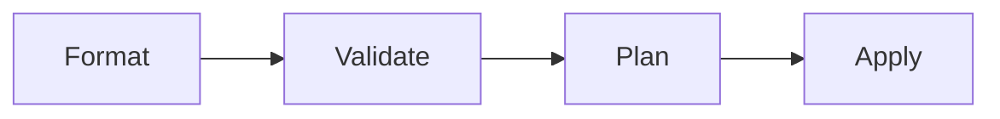

# Validation Is Not Deployment

The lab showed a local repair. This section explains the boundary behind the commands you ran.

:::info[Where this picks up]

Use the repaired module from the lab. Re-running the checks is safe because no apply occurs.

:::

## 1 — Three levels of proof

Formatting proves a consistent file shape. Validation proves local syntax and references. A plan asks a provider what it would change. Apply changes an environment. These are different proof levels.

## 2 — Provider locks are evidence too

Terraform and OpenTofu both validated the repair. OpenTofu rewrote the provider source in the generated lock file. That does not make either result wrong. It means the team must define a lock-file procedure before sharing one generated file across both tools.

:::tip[Where you will use this]

- **Validation is local proof, not deployment proof.** **Use it when:** reviewing an agent change — require the proof level that matches the requested action.
- **A generated lock file is a compatibility artifact.** **Use it when:** Terraform and OpenTofu work on the same repository — review provider-source changes explicitly.

:::

## Teardown

Keep the repaired module. No environment state was created by this page.
