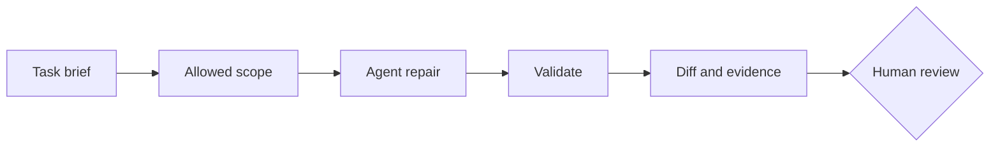

import Slides from '@site/src/components/Slides';

# Make Your First Governed Agentic IaC Change

An AI agent can inspect files, run tools, and edit a repository. That is useful, but it needs a boundary.

<Slides src="decks/m1-governed-agentic-iac.html" title="Module 1 — Governed Agentic IaC Change" />

## The safe working loop

An AI-assisted task gives advice. An agentic task can act inside a defined boundary. Autonomous work acts without a review gate. This course uses agentic work with human approval.

## Four parts of a safe task

1. **Objective** — state the needed result.
2. **Allowed scope** — name the files the agent may change.
3. **Evidence** — name the commands and records for review.
4. **Stop conditions** — state what must not happen.

For this lab, the stop condition is simple: do not run `terraform apply` or `tofu apply`. A passing `validate` command proves configuration references are valid. It does not create infrastructure.

## Preserve intent

The broken file refers to `random_id.platform.hex`, but does not declare the resource. The safe repair keeps the output and restores the missing provider and resource declaration. Replacing the output with a fixed value may make validation pass, but changes the behavior.

:::tip[Use evidence, not a plausible story]

Read the diff. Run the formatter and validators. Keep the result with the task record.

:::
