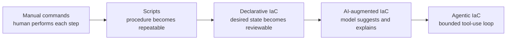
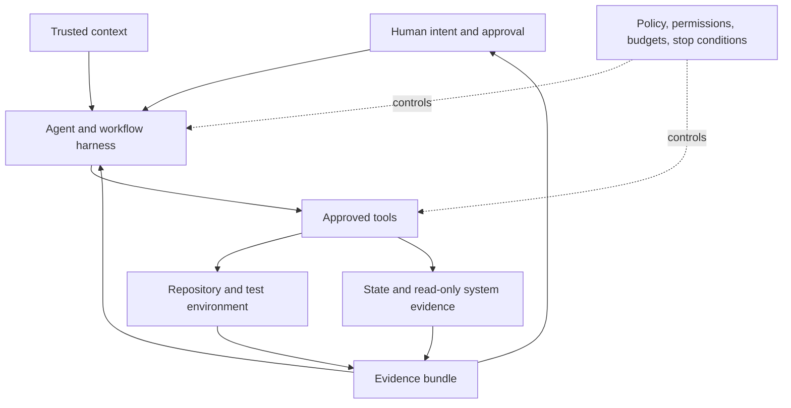
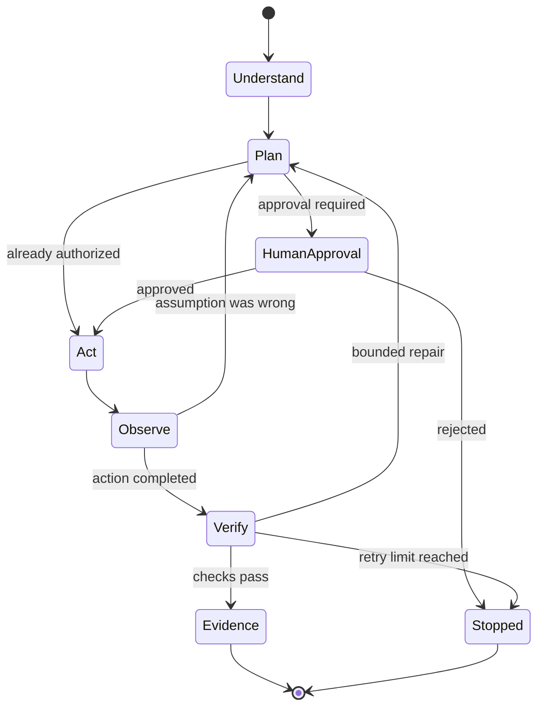

import Slides from '@site/src/components/Slides';

# Agentic Infrastructure as Code Fundamentals

Infrastructure automation has changed several times. We moved from manual commands to scripts, then from scripts to declarative Infrastructure as Code. AI is creating the next change. An agent can now inspect a repository, plan work, edit files, run tools, read the result, and continue until it reaches a defined checkpoint.

That capability is useful. It is also different from ordinary code completion. Infrastructure tools can create, replace, expose, or delete real resources. They also work with state, credentials, networks, and shared environments. An infrastructure agent therefore needs a clear operating model, not only a good prompt.

This section builds that model. Codex is used for instructor demonstrations. The engineering method works with any compatible coding agent.

<Slides src="decks/m1-agentic-iac-fundamentals.html" title="Section 1: Agentic Infrastructure as Code Fundamentals" />

## How infrastructure automation evolved

The story starts with manual work. An engineer reads a ticket, signs in to a system, runs commands, and records the result. Human judgment is available at every step, but the process is slow and difficult to repeat. Two engineers may complete the same request in two different ways.

Scripts improved repeatability. A shell script or Python program could run the same sequence again. Scripts made common work faster, but most scripts described *how* to perform every step. They also needed explicit error handling, ordering, retries, and cleanup. As environments grew, scripts became difficult to maintain as a complete infrastructure model.

Declarative Infrastructure as Code changed the control model. With Terraform or OpenTofu, you describe the desired resources and relationships. The tool compares configuration with known state, builds a dependency graph, and produces a plan. Kubernetes uses a related desired-state model through controllers and reconciliation.

Declarative IaC solved many repeatability and review problems. The configuration can be versioned. A plan can show proposed actions. Teams can test policy before delivery. But engineers still spend significant time finding context, writing repetitive configuration, reading large plans, fixing validation errors, and keeping documentation and code aligned.

AI-augmented IaC helps with those tasks. The engineer asks for an explanation, a code suggestion, a test, or a review. The model returns an answer, and the engineer decides the next step. The model may be useful, but the human still drives every action.

Agentic IaC adds a controlled action loop. The system can inspect files, choose an approved tool, run it, read the output, update its plan, and continue. This is the important change. The agent does not only generate HCL or YAML. It can perform a sequence of engineering steps and react to evidence.



Each stage keeps the useful parts of the previous stage. Agentic IaC does not replace declarative IaC. The agent still needs Terraform, OpenTofu, Helm, Kubernetes, Git, policy, and tests. The agent works through those deterministic systems.

## What is Agentic Infrastructure as Code?

**Agentic Infrastructure as Code** is the use of a goal-directed AI agent to inspect, plan, change, validate, and report on infrastructure code within defined tool, permission, evidence, and approval boundaries.

The definition contains several required behaviours:

1. A human or approved system provides an intent.
2. The agent gathers trusted context before changing files.
3. The agent forms a plan and identifies assumptions.
4. The agent uses only approved tools and permissions.
5. The agent observes tool output and infrastructure evidence.
6. The agent verifies the result against acceptance checks.
7. The agent stops, escalates, or returns evidence at the defined boundary.

If a model only writes a Terraform block in a chat window, that is AI-assisted generation. If a tool runs a fixed script with no reasoning or feedback, that is automation. If a system receives a goal, selects approved actions, uses feedback, and works toward a checkpoint, it has agentic behaviour.

This does not mean unlimited autonomy. Agency describes the ability to take goal-directed steps. Autonomy describes how much authority the system has. A useful agent can have strong agency and still operate with low autonomy.

## AI-augmented IaC and Agentic IaC

The difference is easier to see through one request: “Repair the missing provider declaration in this Terraform module.”

In an AI-augmented workflow, you copy the error into a chat. The model suggests a `required_providers` block. You edit the file, run `terraform validate`, copy the next error, and decide what to do.

In an agentic workflow, the agent receives a bounded task brief. It inspects the module and repository rules, reads the current validation failure, proposes the affected files, edits only the allowed file, formats it, runs the approved checks, reads the results, and returns the diff and evidence. It stops before `apply` because apply was not authorized.

| Question | AI-augmented IaC | Agentic IaC |
|---|---|---|
| Who starts each step? | The engineer | The agent, within the task boundary |
| Does it use tools? | The engineer usually runs them | The agent may run approved tools |
| Does it read feedback? | The engineer interprets it | The agent can observe and respond |
| Can it continue across steps? | Only when the engineer prompts again | Yes, until a checkpoint or stop condition |
| Who owns approval? | The engineer | The engineer or approved control system |
| What proves completion? | Often a copied answer | Repository artifacts and independent evidence |

The distinction matters because tool use creates consequences. A poor suggestion can be rejected before it changes anything. A poor action can modify a file, expose a secret, change state, or reach a live API. The controls must become stronger as action authority increases.

## Coding agents, operational agents, and autonomy

A **coding agent** works mainly with a repository. It reads code and documentation, edits files, runs development tools, and prepares a reviewable change. Codex, Claude Code, Goose, Cursor, GitHub Copilot, and VS Code agent modes can all support this pattern through different interfaces.

An **operational agent** works across time and current system evidence. It may run on a schedule, read status, compare desired and actual state, follow a runbook, or prepare a drift report. Hermes is the named operational agent used later in this course. Its course role remains read-only: observe, explain, and propose.

These agent types can use the same Skills and evidence model, but their risk is different. A coding agent normally works in an isolated branch or worktree. An operational agent may see live systems repeatedly. Stale memory, broad credentials, or an unsafe schedule can cause repeated bad decisions.

Use an autonomy ladder to make authority explicit:

| Level | Agent authority | Example |
|---:|---|---|
| 0 | No agent | Engineer writes and runs everything manually. |
| 1 | Suggest | Agent explains a plan or generates a draft. Human performs actions. |
| 2 | Inspect and plan | Agent reads approved context and proposes work. It cannot edit. |
| 3 | Bounded execution | Agent edits allowed files and runs non-destructive checks in isolation. |
| 4 | Approved delivery action | Agent can perform a specific state-changing action only after a separate approval. |
| 5 | Persistent observation | Agent runs on a schedule with read-only tools and prepares reports or proposals. |

Level numbers are not a maturity score. Higher is not automatically better. Choose the lowest level that can complete the work. This course uses Level 3 for most coding labs, a tightly controlled Level 4 boundary for delivery demonstrations, and Level 5 read-only observation with Hermes. It does not authorize autonomous production apply.

## Anatomy of an Agentic IaC system

An Agentic IaC system has six working parts.

### Intent

Intent describes the required outcome and why it matters. A useful intent includes acceptance criteria and non-goals. “Add asynchronous job handling without changing the public API” is clearer than “make the platform scalable.”

### Trusted context

Context gives the agent the facts and rules needed for this task. It can include repository instructions, module contracts, provider versions, architecture decisions, state ownership, policies, previous failures, and current runtime evidence. Context needs source, freshness, and precedence. More context is not automatically better context.

### Reasoning and plan

The agent breaks the intent into steps, identifies assumptions, selects relevant files and tools, and finds approval points. The plan is useful because another engineer can review the intended path before the agent makes a large change. A plan is not evidence that the work succeeded.

### Tools

Tools connect reasoning to the outside world. A tool may read a file, run `terraform validate`, render a Helm chart, query a read-only MCP resource, or inspect Kubernetes status. Tool schemas, arguments, permissions, timeouts, output handling, and network access define the real capability of the agent.

### Evidence

Evidence shows what happened. Examples include a Git diff, command and exit code, Terraform plan, test result, policy result, checksum, Kubernetes event, or runtime observation. Evidence must be linked to the exact artifact and version that was checked.

### Control

Control limits and reviews the work. It includes allowed files, forbidden actions, credentials, isolation, budgets, retry limits, policy, human approval, stop conditions, rollback, and audit records. Control is not a final approval button added after the agent finishes. It shapes every step.



The model is only one component. A stronger model cannot repair a missing permission boundary, an unsafe tool, stale context, or a validator that checks the wrong thing.

## The agent loop for infrastructure changes

The operating loop used in this course is:

`understand → plan → act → observe → verify → return evidence`

**Understand:** Read the task contract, repository rules, relevant architecture, and current failure. Mark unknown facts as assumptions.

**Plan:** State the intended files, tools, checks, risks, and stop conditions. Ask for approval when the task requires it.

**Act:** Make the smallest authorized change. Keep unrelated files untouched. Run actions inside the approved workspace and permission boundary.

**Observe:** Read the direct result. A tool may fail, return partial output, expose an unexpected replacement, or reveal that an assumption was wrong.

**Verify:** Run independent acceptance checks. The check must prove the requirement, not only confirm that the agent wrote syntactically valid text.

**Return evidence:** Present the diff, checks, unresolved risks, and the exact stopping point. Do not convert a failed check into a confident success summary.

The loop can return from observe or verify to plan, but retry is bounded. For example, a task may allow two repair attempts. After that, the agent stops and reports the repeated failure. A loop without a budget or stop condition can consume time, tokens, credentials, and infrastructure actions without improving the result.



## Why infrastructure agents need stronger guardrails

Infrastructure work has consequences that ordinary source-code generation may not have.

**State:** Terraform state binds resource addresses to real objects and can contain sensitive values. A careless state command can detach, rebind, or expose resources.

**Credentials:** A cloud, Kubernetes, GitHub, or secrets credential may allow actions far beyond the current repository. The agent should receive the smallest identity needed for the current task and for the shortest useful time.

**Network reach:** A tool that can call any endpoint can cross environment boundaries or send context to an untrusted service. Network access belongs in the task and tool policy.

**Destructive actions:** Delete, replace, force-unlock, state removal, secret rotation, and database migration need explicit handling. A plan must identify destruction before approval.

**Blast radius:** A two-line change can affect every environment if a shared module, provider configuration, workflow, or policy is involved. Review level should follow blast radius, not line count.

**Approval:** The agent that authors a change must not silently become the reviewer. Approval should bind to a known diff, plan, artifact, and commit.

**Rollback and observation:** A successful apply does not prove that the service works. Delivery needs observation and a recovery decision. Some failures require rollback; others are safer to correct with a new forward change.

A practical task contract turns these concerns into enforceable fields:

```yaml
objective: Repair the missing random provider declaration.
allowed_files:
  - fixtures/broken-module/main.tf
allowed_tools:
  - terraform fmt -check
  - terraform validate
  - tofu validate
forbidden_actions:
  - terraform apply
  - tofu apply
  - state commands
  - network calls other than provider initialization
required_evidence:
  - git diff -- fixtures/broken-module/main.tf
  - terraform validate output
  - tofu validate output
stop_conditions:
  - validation passes
  - two repair attempts fail
  - a required change falls outside allowed_files
```

## CLI, MCP, Agent Skills, and workflow harnesses

Agentic IaC uses several capability layers. They are related, but they are not interchangeable.

### CLI tools

CLI tools are the portable execution and evidence path in this course. Git, Terraform, OpenTofu, Helm, kubectl, linters, scanners, and test commands already expose stable inputs, exit codes, and output. A coding agent can use the same commands that a human engineer and CI system use.

### MCP

Model Context Protocol, or MCP, gives an agent structured access to tools and resources through a server. MCP is useful when the agent needs a narrow, typed interface, such as reading an approved architecture catalog or querying a controlled internal service. MCP does not make a capability safe by itself. The server's identity, permissions, network access, tool schema, and implementation still need review.

### Agent Skills

An Agent Skill is a reusable, versioned procedure. It can explain when to use a workflow, which references to load, which scripts to run, how to verify the result, and when to stop. A Skill is useful when a team repeats the same engineering method. It must have an owner, tests, permissions, versioning, and a revocation path because instructions and scripts can be wrong or malicious.

### Workflow harnesses

A harness controls the process around the agent. Superpowers is one example. The portable pattern is more important than the plugin name: clarify the requirement, write a plan, isolate the change, implement in small steps, run tests, request review, verify completion, and preserve recovery options.

| Need | Default choice | Reason |
|---|---|---|
| Run a deterministic engineering command | CLI | Portable, observable, and easy to reproduce |
| Read a narrow structured internal source | Read-only MCP resource | Typed access without exposing a broad system |
| Reuse a reviewed team procedure | Agent Skill | Versioned instructions, references, and scripts |
| Control the full engineering workflow | Harness | Coordinates planning, isolation, review, and recovery |
| Make a high-judgment or destructive decision | Human procedure | Accountability and context cannot be delegated safely |

Do not add MCP or a Skill only because an agent is present. Use the smallest capability that solves the task and produces reviewable evidence.

## A governed Agentic IaC change, end to end

Consider the missing provider repair used in this course.

1. **Requirement:** The Terraform fixture must validate with Terraform and OpenTofu. No infrastructure should be applied.
2. **Task contract:** Only `main.tf` may change. Formatting and validation commands are allowed. Apply and state commands are forbidden.
3. **Context:** The agent reads repository rules, the failing fixture, tool versions, and the current validation error.
4. **Plan:** Add the required provider declaration and the missing resource using the smallest valid configuration.
5. **Change:** The agent edits one file inside an isolated worktree.
6. **Observation:** Initial validation reports that the provider has not been installed. That is an environment state, not proof that the code is wrong.
7. **Verification:** Initialize without a backend, run Terraform validation, reinitialize the separate OpenTofu provider cache where required, and run OpenTofu validation.
8. **Review:** Inspect the exact diff and confirm that no generated cache or lock file is included.
9. **Stop:** Return the validation evidence. Do not apply.

This example shows why an agent summary is not enough. “The module is fixed” hides which tool ran, which version was checked, whether initialization happened, whether both Terraform and OpenTofu passed, and whether unrelated files changed.

The completed evidence record should answer those questions directly.

## The project and the course workflow

Across the course, you will grow a compact Production AI Workload Platform. A client submits a small text job. An API records it and places work on a queue. A worker processes the job with deterministic mock inference. The result goes to object storage, while job state records progress and failure.

Terraform and OpenTofu describe the cloud-shaped foundation. Kubernetes runs the API and worker. Helm packages the workload. Argo CD reconciles approved Kubernetes desired state. GitHub Actions provides the baseline Terraform plan and approval workflow. Hermes later observes current evidence and prepares a read-only drift report.

The core path needs no cloud account, model API key, GPU, or large model. Labs start only the profile needed for the current task. The course was tested with 7 GB RAM, four logical CPUs, 20 GB free disk, and at most 4 GiB of active container workload. These values are a reference profile, not a Section 1 admission gate. The preflight warns and continues when it detects less capacity.

Each section adds one project capability and one engineering control. You will not only build the platform. You will build the task contracts, context, Skills, evaluations, policies, evidence, delivery gates, and operational reports needed to change it safely.

## What to do next

Open the lab and verify your workspace. The lab shows your current directory, reports available tools and coding agents, and asks you to inspect the safe boundary for the first repair. It does not apply infrastructure.

After the lab, you will be ready for Section 2. There you will give a compatible coding agent its first bounded Terraform repair and review the evidence yourself.
