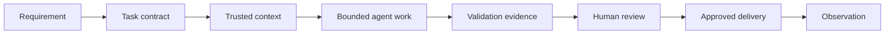

import Slides from '@site/src/components/Slides';

# Welcome to Agentic Infrastructure as Code

Infrastructure changes are valuable only when another engineer can understand, review, and safely repeat them. AI can speed up the work. It does not remove this responsibility.

<Slides src="decks/m1-welcome-agentic-iac.html" title="Section 1 — Welcome to Agentic IaC" />

## The project you will build

You will grow a compact local workload platform. It has Terraform and OpenTofu configuration, a small Kubernetes workload, Helm packaging, GitOps delivery, and a read-only operations observer. The project stays local-first, so its core path fits a 7 GB machine without a cloud account, GPU, or model API key.

Think of the repository as a working drawing set for a building. Terraform describes cloud-like resources. Helm describes an application release. GitOps describes the approved desired state. Evidence records show what was checked. An agent can help change the drawing set, but it must not quietly approve its own drawing.

## The governed workflow

At work, a request such as “add a queue” is not enough for safe implementation. You need a bounded task, trusted context, checks, review, and approval.

The important control is the boundary. A task contract states the goal, allowed files and tools, forbidden actions, required evidence, and stop conditions. A useful agent follows this contract. A response that sounds confident but does not produce evidence is not a completed infrastructure change.

## Choose an agent, keep the workflow portable

The course demonstrates Codex. Your hands-on work can use Codex, Claude Code, Goose, Cursor, GitHub Copilot, VS Code, or another compatible coding agent. The durable interface is the repository and its CLI checks: Git, Terraform/OpenTofu, Helm, Kubernetes, linters, scanners, and tests.

This design protects your learning from a tool change. You can move between agents without changing the task contract or the proof required for a result. Hermes is different: it is used later as the named hands-on option for persistent, read-only operational work.

## The local-first safety boundary

The first lab is intentionally small. It checks the workstation. It does not start Docker services, create a Kind cluster, or apply infrastructure. Starting every service “to test the setup” is a common mistake. It uses memory without proving the next task.

Use only the profile needed by the current lab. This is how a production team works as well: make the smallest safe change, gather the evidence, then continue.

:::tip[What good progress looks like]

A good lab result is easy to review: the command is visible, the output is captured, the change scope is clear, and no action happened outside the task boundary.

:::

## How the course is organized

Each section has short concept lessons, a task-led lab, a technical slide deck, a slide-aligned voiceover, a quiz, and an operator challenge. The project grows only after the current checkpoint is validated.

In the next section, you will make your first governed IaC repair. The technical change is small. The working method is the skill: inspect, propose, change within scope, validate, review, and stop.
