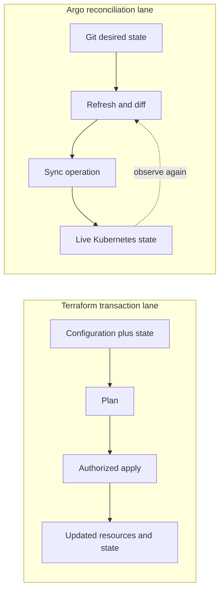
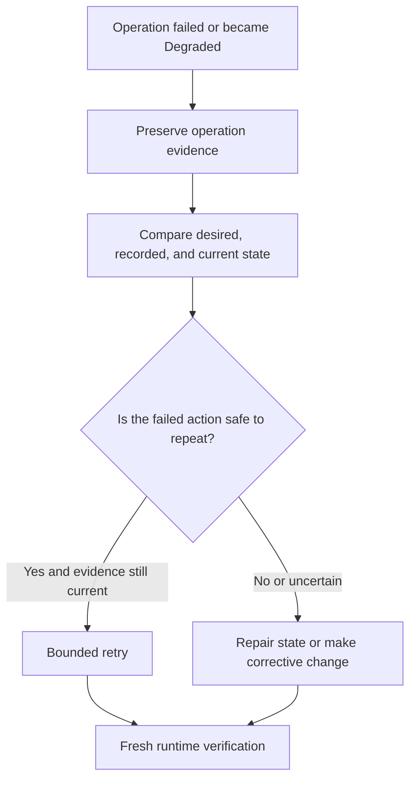

# Deep Dive: Terraform Transactions and Argo Reconciliation

The lab showed one reviewed commit moving through a plan-only Terraform lane
and a manually synchronized Argo CD lane. This Part 2 examines what happens
below those visible checkpoints. Use this model when a plan becomes stale, an
apply fails after changing some resources, an Argo operation succeeds but the
application remains broken, or a recovery choice must account for partial
state.

:::info[Where this picks up]

This is an explanatory deep dive, not a second runnable lab. It uses the
preserved Section 10 plan reports, Application snapshots, Git lineage, and
runtime observations. You do not need a running cluster. The validated learner
lab remains the source for copy-runnable commands and exact output.

:::

## 1 — The Two Lanes Have Different Clocks

A Terraform apply is a requested transaction against a set of providers and a
state model. Argo reconciliation is an ongoing loop around a desired Git
revision and live Kubernetes objects. Both compare intent with observation,
but their clocks, failure timing, and recovery paths are different.

Terraform usually starts when a person or workflow requests plan or apply. It
builds a dependency graph, refreshes selected remote facts, proposes actions,
and sends provider operations during apply. The transaction ends, although
the created infrastructure may continue changing outside Terraform.

Argo continues observing after an operation ends. It can report Synced at one
moment and OutOfSync later because a human or controller changed a tracked
field. Health can also change after the sync operation reports Succeeded. The
Application status is therefore a time-bound controller observation, not a
permanent delivery certificate.

| Question | Terraform transaction | Argo reconciliation |
|---|---|---|
| What begins work? | Explicit plan or apply request | Periodic/event refresh and explicit or automated sync |
| Main desired input | Configuration, variables, provider selection | Rendered manifests from a Git revision |
| Prior-state input | Terraform state plus refreshed remote objects | Live Kubernetes objects plus Argo cache |
| Action record | Plan resource actions and apply logs | Diff, sync operation, resource results |
| Completion view | Apply exit and updated state | Operation phase plus continuing sync/health |
| Later drift | Seen on a later refresh or plan | Seen by the continuing reconciliation loop |
| Recovery unit | Resource graph, state, provider operation | Git revision, live object, sync operation |

This difference changes the meaning of approval. A Terraform approval should
bind an exact saved plan or require a fresh plan under the same reviewed
conditions. An Argo approval should bind the desired revision, target
Application, environment, and sync purpose. Approval of v2 should not silently
authorize a later recovery commit, even when the recovery tree matches v1.

## 2 — Stale Evidence Appears at Different Boundaries

Evidence becomes stale when the facts needed for its claim change. The same
word, stale, covers different mechanisms in the two lanes.

For Terraform, a source-bound plan can become stale when the state, remote
resources, provider version, variable set, backend, target account, policy, or
workflow changes. A saved plan includes enough information for apply, but its
approval can still be invalid if the target or policy context changed outside
the artifact. A production consumer should revalidate the approved digest,
source revision, target identity, approval purpose, and allowed time window.

The Section 10 report binds source revision, workflow SHA-256, engine and exact
version, plan SHA-256, plan JSON SHA-256, resource addresses, resource actions,
gate results, and `apply_permitted: false`. Both Terraform 1.14.8 and OpenTofu
1.12.6 report only `terraform_data.reviewed_delivery` with a `create` action.
Different plan bytes are retained rather than incorrectly forced equal.

For Argo, the source revision can be current while a cached repository object,
live object, or status field describes another moment. Refresh asks Argo to
read again, but refresh is not approval. A hard refresh is stronger cache
renewal, but it is not a repair for a wrong commit. The local lab had to restart
repo-server after replacing an entire bare repository behind one URL. That is
a fixture-specific cache correction, not a normal production promotion step.

| Stale fact | Detection | Required response |
|---|---|---|
| Source moved after review | Compare current and reviewed full SHA | Stop and review the new diff |
| Plan artifact replaced | Recalculate digest and schema projection | Reject the artifact |
| Remote object changed after plan | Refresh under controlled policy | Create and review new evidence |
| Argo source cache has old object identity | Compare requested and resolved revision | Refresh cache; do not relabel old evidence |
| Application status trails desired change | Compare target revision and operation history | Wait or inspect controller error |
| Runtime observation names an old Pod | Compare UID, generation, image, and time | Capture evidence from current object |

Staleness cannot be solved by collecting more unbound logs. Every observation
needs subject identity and time. A Pod log without Pod UID and revision may be
true but irrelevant to the current rollout. A plan summary without the direct
plan JSON digest may describe a replaced artifact. Evidence volume is not
evidence quality. Preserve the smallest evidence set that can reproduce the
decision, and state which external facts the set did not capture.

## 3 — Partial State Changes Retry Safety

Neither lane guarantees that a failed high-level operation changed nothing.
A provider may create one resource before another fails. Kubernetes may accept
some objects while rejecting another. A rollout may create a new ReplicaSet
while old ready Pods continue serving. Recovery begins by locating this partial
state.

Terraform state records the last successfully recorded provider results. It is
not a complete audit of every external side effect. A provider can report an
error after an API accepted a request, or an external system can finish work
later. After failure, compare configuration, state, provider diagnostics, and
the real resource. The last successful apply is useful history, but it cannot
replace those current observations. Then decide whether refresh, import, state repair, targeted
provider cleanup, or a corrective roll forward is appropriate. The previous
plan is stale because current state has changed.

Argo applies a set of Kubernetes objects. An operation can fail after earlier
objects were accepted. Kubernetes controllers then continue their own work.
For example, a Deployment can retain two old available replicas while a new
Pod fails with `ErrImageNeverPull`. The safe response may be to preserve the
old replicas, stop promotion, and reconcile a reviewed recovery revision. A
blind retry of the same missing image cannot improve the result.

Hooks make partial state more complex because a hook can call an external
system. Retrying a failed migration hook may repeat a non-idempotent action.
Before using hooks, define a unique operation identity, idempotence rule,
timeout, retry limit, deletion policy, and recovery owner. Sync waves only
order resources; they do not make application or data operations atomic.

| Partial-state signal | Interpretation | Next question |
|---|---|---|
| Terraform state lacks a reported object | Record may be incomplete | Did the provider create it before the error? |
| Apply updated some addresses | Transaction made progress | Are remaining actions safe under new state? |
| Argo operation Failed | At least one resource action failed | Which prior actions succeeded? |
| Deployment Degraded with old ready Pods | New rollout failed but service capacity remains | Can recovery preserve available replicas? |
| Hook job failed after external write | Kubernetes job failed after a possible side effect | Is retry idempotent and externally detectable? |
| Synced but client result fails | Desired/live fields match while service path is wrong | Which runtime boundary is outside health assessment? |

## 4 — Recovery Must Respect the Active Owner

Rollback is not one universal operation. The correct mechanism depends on who
owns desired state and what irreversible changes already occurred.

In the course Argo lane, Git owns desired workload state. The durable recovery
is a Git revert followed by a separately approved explicit sync. The recovery
commit has the v1 tree but a new parent and a new purpose. Argo then reports
the recovery revision as Synced, Healthy, and Succeeded. The workload image
returns to `s10-v1`, and the application path needs fresh observation.

A direct Helm rollback is different. It writes Helm release history and live
objects. If Argo is the active owner, it can later restore Git intent and undo
that rollback. Use Helm rollback when Helm release history is the declared
owner, or as a documented emergency action with a prompt Git follow-up.

Terraform recovery also differs. There may be no earlier “release” to select.
Recovery can require a new plan against current state, import of an existing
object, correction of configuration, or a narrowly reviewed state operation.
These actions need stronger controls because state determines future resource
ownership.

A roll forward is safer than rollback when old application code cannot operate
with a migrated schema, a revoked credential must not return, or the earlier
artifact contains a known vulnerability. Roll forward creates new desired
state that works with the current world. It requires new checks and approval;
an earlier approval does not cover it.

| Current condition | Likely recovery shape | Evidence before proceeding |
|---|---|---|
| Wrong Git-only image change; old version compatible | Git revert and explicit sync | Reviewed revert, old artifact identity, rollout proof |
| Old version unsafe after data change | Corrective roll forward | Compatibility analysis, new tests, fresh approval |
| Direct Helm is release owner | Helm rollback or upgrade | Release history, values, hook and workload state |
| Terraform apply partially failed | Refresh and recovery decision | State, remote objects, provider operations, new plan |
| Emergency live patch reduced active harm | Durable Git/configuration follow-up | Incident record, live diff, reviewed source correction |

The lab also creates controlled scale drift. The Application becomes
OutOfSync, and two replicas remain because self-heal is absent. This proves the
specific drift observation. It does not show that automatic self-heal is bad.
Self-heal is valuable when source is trusted, ignored fields are narrow, and
automatic correction is acceptable for the resource class. It is dangerous
when a necessary emergency patch can be removed before the incident owner
captures and approves a durable correction.

## 5 — Proof Limits Remain after a Green Delivery

The final evidence graph should keep observations separate. The Section 10
replay reached Synced/Healthy/Succeeded, completed `job-0001` with `MOCK
INFERENCE: GITOPS DELIVERY`, sampled the named node at a 1.680 GiB peak below
the 4 GiB limit, and removed exact course-owned runtime resources. Each fact
answers one question.

| Observation | Supported claim | Remaining proof limit |
|---|---|---|
| Plan gates PASS | Named static and semantic checks accepted the exact report | Apply was neither authorized nor run |
| `apply_permitted: false` | Evidence explicitly closes the apply path | A separate production system could have other authority |
| Argo Synced | Managed desired and live fields matched then | Ignored fields and external systems remain outside diff |
| Argo Healthy | Resource health assessment was Healthy then | Business transaction and all dependencies need separate proof |
| Operation Succeeded | Explicit sync operation completed | Later drift or degradation can still occur |
| Application result | One deterministic request completed | Load, resilience, and every request are not proven |
| 1.680 GiB peak | Named-node observation stayed below the course ceiling | It is not minimum RAM or total host usage |
| Exact cleanup | Named course runtime was absent after the run | It says nothing about unrelated host resources |

Human approval is also bounded evidence. The lab retains the approval binding
in one foreground process, shows the current observations, receives exact
human input, revalidates the same identity, and then publishes the approval.
This demonstrates sequencing and revision binding. It does not prove an
external corporate identity provider, production segregation policy, or
resistance to a compromised reviewer account.

Use an append-only log to retain events, but do not treat the log as automatic
truth. A typed link from an observation to a claim is a reviewable statement.
It can be wrong, stale, or attached to the wrong subject. Re-evaluate current
policy and direct runtime evidence when making a new production decision.

:::tip[Where you will use this]

- **Terraform approval binds a planned transaction, not a general future apply.** **Use it when:** a plan waits in a queue or a partial apply changes current state—reject stale approval and produce evidence for the new state.
- **Argo status is a continuing controller observation.** **Use it when:** an operation succeeded but the Application later becomes OutOfSync or Degraded—inspect revision, diff, health, and operation history separately.
- **Partial state controls retry safety.** **Use it when:** a provider, hook, or rollout fails after making progress—preserve completed actions and decide whether repetition is idempotent.
- **Recovery follows the active owner and current state.** **Use it when:** choosing Git revert, Helm rollback, Terraform recovery, or roll forward—identify ownership and irreversible changes before acting.
- **Green delivery evidence has explicit proof limits.** **Use it when:** preparing an audit or production promotion—link commit, checks, approval, operation, and runtime observations without allowing one signal to stand for all of them.

:::
