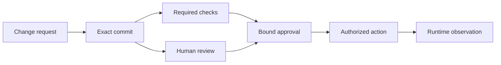
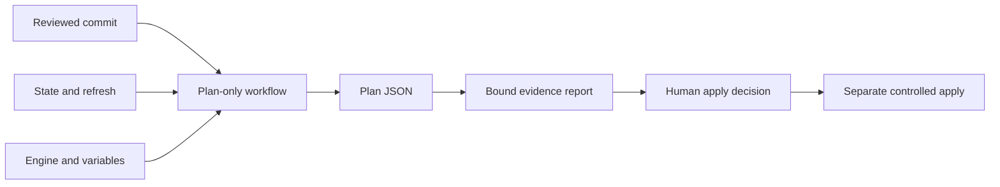
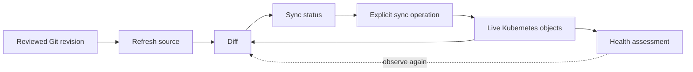
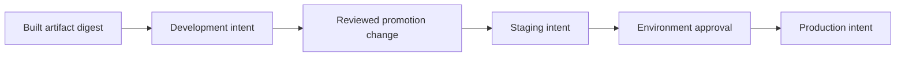
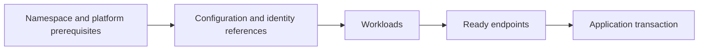
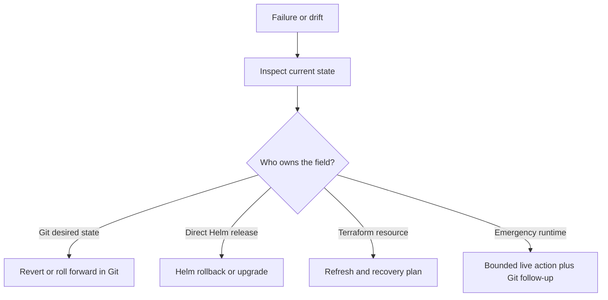
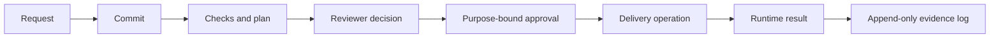

import Slides from '@site/src/components/Slides';

# Deliver Infrastructure Safely with GitOps and Human Approval

An infrastructure change is not safe because an agent produced valid code. It
is safe only when the organization can answer five questions: what changed,
who reviewed it, which checks ran, what action was authorized, and what the
runtime actually did. This section connects those answers to a delivery path.

We will follow one commit through two different lanes. The Terraform lane
creates a reviewable plan transaction and stops before apply. The Argo CD lane
continuously compares a Kubernetes environment with reviewed Git state. A
human approves each local commit and explicitly requests each sync. The agent
may inspect, propose, edit within scope, and run checks. It may not approve,
merge, apply, sync, or grant itself new authority.

<Slides src="decks/m10-deliver-infrastructure-gitops-human-approval.html" title="Section 10: Deliver Infrastructure Safely with GitOps and Human Approval" />

:::info[The tested local profile]

The final human replay used Terraform 1.14.8, OpenTofu 1.12.6, Argo CD chart
10.4.0, and Argo CD application 3.5.1. The named Kind node peaked at 1.680 GiB,
below the 4 GiB active-workload ceiling. The 7 GB learner profile is a reference
baseline, not a rejection rule. The lab used no cloud account, GitHub account,
GPU, model key, deployment credential, or Terraform/OpenTofu apply.

:::

## Git as a Change and Approval Boundary

**Lecture 1 · 5 minutes**

Git records content and lineage. A commit identifies one tree of files, its
parent, author metadata, and message. This gives reviewers a stable object to
inspect. It does not prove that the author was authorized, that the change is
correct, or that a deployment happened. Those claims need separate evidence.

The useful boundary is not simply “the code is in Git.” The useful boundary is
that the same source revision is named by the request, checks, review,
approval, delivery artifact, and delivery result. If a check runs on commit A
but the workflow later delivers commit B, the green result is stale even when
both commits look similar.



Four identities take part in this path. Keep them distinct even when a small
team uses the same platform account for more than one step.

| Identity | Normal responsibility | Authority it must not gain from its own change |
|---|---|---|
| Authoring identity | Propose Terraform, Helm, or workflow edits | Approve or deploy its proposal |
| Review identity | Inspect the diff and evidence | Approve its own privilege increase |
| Workflow identity | Run fixed checks and produce bounded artifacts | Rewrite its trusted workflow or grant itself secrets |
| Runtime identity | Execute the deployed workload | Review, merge, plan, sync, or apply infrastructure |

The **authoring identity** may be a person or a coding agent. The **review
identity** is the accountable human or team that accepts a defined risk. The
**workflow identity** receives only the permissions required for its job. The
**runtime identity** belongs to the deployed service, such as a Kubernetes
ServiceAccount. Combining these roles creates a self-approval path: the same
actor can change the control, declare it valid, and use the resulting
privilege.

The course lab makes the boundary visible with three commits. The first is the
reviewed v1 repair. The second changes only the image tag to v2. The third is a
Git revert of v2. The v1 tree and recovery tree are identical, while their
commits remain different because their history is different. That distinction
is useful during an audit: “same desired bytes” is not the same statement as
“same event in history.”

Git tags and signatures add identity evidence. An annotated approval tag can
record that `human-platform-reviewer` approved one exact commit for one stated
purpose. A cryptographic signature can show that a trusted key signed specific
bytes. Neither control proves that the content is safe. Key custody, identity
mapping, repository policy, and review quality still matter.

| Git fact | Strongest supported claim | Proof limit |
|---|---|---|
| Full commit SHA | Exact source object and lineage were named | Content can still be unsafe |
| Clean working tree | No uncommitted file change was present then | Ignored files and external inputs need their own checks |
| Annotated approval tag | A purpose and reviewer were attached to a commit | Local tag is not an enterprise identity provider |
| Valid signature | A trusted key signed the object | Signature does not evaluate engineering risk |
| Git revert commit | History records a reversal of an earlier change | Runtime may not yet have reconciled to it |

The local read-only Git daemon is transport evidence. It showed that Argo CD
could fetch the reviewed commit and that receive-pack was unavailable. It does
not prove production authentication or authorization. Production repository
access needs reviewed credentials, protected refs, audit logs, and repository
policy outside this course fixture.

**Operator takeaway:** bind every decision to the full commit. Keep authoring,
review, workflow, and runtime identities separate, and describe exactly what
each Git fact proves.

## Pull Requests, CODEOWNERS, and Branch Protection

**Lecture 2 · 7 minutes**

A pull request is a review workspace around a proposed Git change. It can show
the diff, discussions, checks, and approvals. It becomes an approval boundary
only when repository rules prevent the author from bypassing those signals.

Start by separating ownership. Terraform networking code, Helm workload code,
and a privileged workflow do not have the same risk or reviewers. CODEOWNERS
can request the right reviewers by path. Branch protection or repository rules
can then require approvals and required checks before a protected branch moves.
Availability and names differ across Git hosting plans, so verify the controls
on the platform you use rather than assuming one universal switch.

```text
# Illustrative ownership map
/terraform/network/        @platform-network
/helm/inference-platform/  @workload-platform
/.github/workflows/        @delivery-security
```

CODEOWNERS by itself usually requests review; it does not automatically block
every merge. A useful protected-branch policy combines ownership with the
appropriate host controls.

| Control | Question it answers | Important boundary |
|---|---|---|
| CODEOWNERS | Which reviewers should be requested for a path? | Confirm review is required, not only requested |
| Required approvals | Did enough eligible reviewers approve? | Dismiss stale approval when protected content changes |
| Required checks | Did named checks pass for the current commit? | Pin check identity and bind it to the head SHA |
| Restricted merge | Who may update the protected branch? | Administrators and automation need explicit policy |
| Conversation resolution | Were blocking review threads addressed? | Resolution does not prove the repair is correct |
| Signed commits or attestations | Is signed provenance available for these bytes? | Trust depends on key and identity policy |

Imagine a pull request with three files: a Terraform resource change, a Helm
image update, and an edit to the workflow that will later receive deployment
credentials. One combined approval lets the change modify both the payload and
its judge. The safe review move is to split the workflow change from the
infrastructure and workload changes. The workflow follows a higher-trust path,
with delivery-security ownership and no production credential exposed to the
untrusted candidate.

Required checks must run on the same head commit that is merged. A new push
after approval can invalidate the reviewed diff. Configure stale-approval
dismissal or require review of the latest push where the platform supports it.
Merge queues add another identity question: the tested merge candidate may be
a generated commit that combines the branch with the latest target. Preserve
the tested SHA and resulting merge SHA in delivery evidence.

Review quality is also part of the system. A reviewer should see the proposed
resource actions, policy results, workflow permission change, artifact hashes,
and proof limits. “All checks green” is not enough when a check never evaluated
the dangerous field. A changed workflow should be reviewed as executable code,
not as supporting YAML.

Available signed provenance can strengthen the link from source to artifact.
For example, an attestation may bind a plan artifact to a workflow identity and
source revision. It still does not replace branch policy, human review, or
runtime evidence. Provenance answers where an artifact came from; approval
answers whether a defined actor accepted a defined action.

**Operator takeaway:** use path ownership and protected-branch rules to make
review enforceable. Split changes when one pull request tries to change both
the delivery payload and the privileged system that judges it.

## GitHub Actions Trust and Workflow Security

**Lecture 3 · 8 minutes**

A GitHub Actions workflow executes code. Treat its event context, permissions,
inputs, dependencies, artifacts, and environments as security boundaries. The
workflow file is not harmless configuration.

The first boundary is the event. `pull_request` normally evaluates untrusted
fork content without giving it write access to the base repository secrets.
`pull_request_target` runs in the context of the base repository. It can be
useful for safe metadata operations, but checking out and executing untrusted
pull-request code in that context can expose a more trusted token or secrets.

```yaml
name: reviewed-plan
on:
  pull_request:
permissions:
  contents: read
concurrency:
  group: reviewed-plan-${{ github.event.pull_request.number }}
  cancel-in-progress: true
jobs:
  plan:
    runs-on: ubuntu-latest
    steps:
      - uses: actions/checkout@<full-commit-sha>
      - run: node section-10/scripts/run-reviewed-plan.mjs terraform
      - uses: actions/upload-artifact@<full-commit-sha>
        with:
          name: bounded-plan-evidence
          path: evidence/reviewed-plan.json
```

The example is intentionally read-only and plan-only. Exact action pins reduce
the risk that a mutable tag moves to new action code. Dependency review and
update work remain necessary because a pinned commit can still contain a
vulnerability. Token permissions should be set explicitly at workflow or job
level. Do not depend on changing repository defaults.

Untrusted fork input includes branch names, commit messages, issue text,
changed files, generated configuration, and repository content. Quoting a
value inside a shell command is not a complete boundary when the expression is
expanded into the script before the shell parses it. Prefer passing untrusted
values through a fixed environment field and validating them, or use an API
that does not invoke a shell.

Workflow-file injection is more direct. If the same pull request changes the
privileged workflow that evaluates it, the candidate can add permissions,
read secrets, replace checks, or upload a different artifact. The Section 10
starter is rejected for this exact reason before any deployment identity or
secret is available.

| Risk | Unsafe pattern | Safer boundary |
|---|---|---|
| Event context | Execute fork code under `pull_request_target` | Use `pull_request` for untrusted code; isolate privileged follow-up |
| Token scope | `permissions: write-all` | Explicit minimum read permissions for plan jobs |
| Action supply chain | Mutable version tag only | Full commit SHA plus update review |
| Expression injection | Insert event text into a shell script | Fixed command arguments plus input validation |
| Workflow self-change | Candidate edits its own privileged evaluator | Separate protected workflow change and owners |
| Secrets | Expose environment secret during untrusted build | Gate a later trusted job through a protected environment |
| Artifact | Upload an unbounded workspace | Allow-list files, record hashes, set retention |

GitHub environments can add reviewer gates and scope deployment secrets to a
later job. They should not be treated as a complete approval system. Confirm which actor
requested the deployment, which commit is waiting, what the reviewer sees,
whether administrators can bypass the rule, and whether approval remains bound
to the same artifact.

Artifacts carry data across jobs. A plan artifact should have a bounded path,
an expected schema, a digest, a source revision, and a short retention policy.
The consumer must validate those fields again. A name such as `approved-plan`
is not identity proof. If an attacker can replace the bytes under the same
name, the approval no longer binds the consumed artifact.

Saved binary plans can contain sensitive values in clear text. Plan JSON can
also expose sensitive values in clear text, even when terminal output marks
them as sensitive or redacts them. Hashing proves integrity; it does not
provide confidentiality. A correct digest can identify a leaked secret
perfectly.

Keep the protected saved-plan artifact in a restricted path for the controlled
consumer. Apply access control, minimum retention, encryption provided by the
artifact store, and audit access. Give reviewers a separate sanitized,
schema-bounded review summary containing approved addresses, actions, hashes,
and gate results. Never upload the complete workspace to make artifact
selection easier.

The local lab does not require a GitHub account or hosted runner. It examines a
real workflow file and runs the same fixed plan harness locally. That proves
the course evaluator and plan path. It does not prove hosted-runner identity,
GitHub environment policy, fork behaviour on another repository, or an actual
production credential path.

**Operator takeaway:** define the trust level of the event before executing
code. Minimize token permissions, pin executable dependencies, isolate
workflow changes, and bind every artifact consumer to the exact reviewed
bytes.

## Terraform Plan and Controlled Apply

**Lecture 4 · 8 minutes**

Terraform and OpenTofu use a transaction-shaped workflow. Configuration,
providers, variables, prior state, refreshed remote observations, and engine
version produce a plan. Apply consumes an action decision against the current
world. The plan is valuable evidence, but it is not permission.



The tested fixture is provider-free and proposes one create action for
`terraform_data.reviewed_delivery`. Both engines produce an evidence report
with `apply_permitted: false`. No apply is present in the workflow or lab.

```json
{
  "source_revision": "<full-reviewed-commit>",
  "engine": "terraform",
  "engine_version": "1.14.8",
  "plan_sha256": "<digest>",
  "plan_json_sha256": "<digest>",
  "resource_actions": [
    {"address":"terraform_data.reviewed_delivery","actions":["create"]}
  ],
  "apply_permitted": false
}
```

Commit binding is necessary because plans depend on more than source files.
Record the workflow hash, engine and version, variable source, state identity,
plan hash, plan JSON hash, addresses, actions, and gate results. Terraform and
OpenTofu may create different lock or plan bytes while agreeing on the same
semantic resource actions. Compare the semantics you require and retain the
byte differences honestly.

A stale plan is a plan whose important inputs or current infrastructure no
longer match the approved review. It can become stale because source moved,
variables changed, credentials point to another account, provider selection
changed, policy changed, or remote state changed. Before controlled apply, a
production workflow should verify the approved commit and artifact digest,
validate the target identity, enforce the approval lifetime, and either apply
the exact approved saved plan or require a fresh review for a new plan.

| Evidence | What to bind | Why it can become stale |
|---|---|---|
| Source | Full commit and clean tree | New commit changes intent |
| Workflow | Exact workflow digest | New workflow changes how evidence is produced |
| Engine | Product and exact version | Planning semantics can change |
| Inputs | Variable and backend identity | Same source can target another environment |
| Plan | Saved plan digest | Replaced bytes break approval binding |
| Plan JSON | Digest and canonical actions | Summary can omit or misstate actions |
| Policy | Rule bundle identity and results | Policy changes alter acceptance |
| Approval | Actor, purpose, target, time, digest | Broad approval can be replayed elsewhere |

Controlled apply is a separate human-authorized production concern. It should
use a narrowly scoped workflow identity, target one named environment, reject
unknown actions, serialize state-changing work, retain logs, and stop safely
when preconditions fail. A transaction can still fail after some provider
operations have completed. State, real infrastructure, and logs must then be
compared before retrying. Blindly rerunning apply can repeat a non-idempotent
external action or hide an import/recovery need.

**Operator takeaway:** a plan describes proposed actions for recorded inputs.
Bind it to the reviewed commit and workflow, reject stale evidence, and keep
apply in a separate, explicit authorization path.

## How Argo CD Reconciliation Works

**Lecture 5 · 8 minutes**

Argo CD uses a reconciliation loop rather than a one-time infrastructure
transaction. It reads desired manifests from a repository, compares them with
live Kubernetes objects, and reports sync and health. A sync operation asks it
to move live objects toward desired state.



These terms answer different questions:

| Term | Meaning | Does not prove |
|---|---|---|
| Refresh | Argo reads repository and cluster information again | Desired revision is approved |
| Diff | Desired and live representations are compared | Difference is unsafe or safe |
| `Synced` | Tracked live fields match desired state | Application request succeeds |
| `OutOfSync` | A tracked difference exists | The cause is Git, drift, mutation, or timing |
| Health | Resource-specific assessment such as Healthy or Degraded | Every dependency and user path works |
| Operation phase | Explicit operation is Running, Succeeded, Failed, or Error | Future reconciliation will remain healthy |
| Prune | Remove managed objects absent from desired state | Removal was business-approved |
| Self-heal | Automatically reconcile detected live drift | Source intent is correct |

The course Application has automated sync absent. Automatic prune and
self-heal are also absent. A human first approves the exact revision and then
requests explicit sync. This makes the learning boundary visible. Production
teams may choose automation after defining risk classes, promotion controls,
emergency policy, and evidence retention.

The replay reached `Synced`, `Healthy`, and `Succeeded` for v1, v2, and the
recovery revision. The exact request returned `job-0001`, `complete`, and
`MOCK INFERENCE: GITOPS DELIVERY`. The application result is separate evidence.
Synced/Healthy/Succeeded alone does not prove application correctness; it proves
the controller view and operation result for the observed objects.

Argo compares managed fields but Kubernetes also defaults and mutates objects.
Diff customization may ignore known controller-owned noise. Every ignore rule
reduces the fields covered by drift evidence, so review it like policy. A broad
ignore can hide a real image, identity, or security change.

In the local fixture, replacing an entire bare repository while keeping the
same URL required a visible repo-server restart so Argo discarded old object
cache identity. That is a course-fixture detail. Production Git repositories
normally keep stable identity and advance refs; restarting repo-server for
every promotion is not a production GitOps pattern.

**Operator takeaway:** read sync, health, and operation phase as separate
observations. Add an application-level result before claiming that delivery
worked.

## Promotion and Environment Boundaries

**Lecture 6 · 8 minutes**

Promotion moves a reviewed immutable version through environments. It should
not rebuild different bytes for each stage or depend on an operator typing a
mutable tag into a live cluster. The reviewed change should name the artifact
identity and environment-specific configuration clearly.



The lab uses `s10-v1` and `s10-v2` labels for a compact local demonstration,
but it records distinct Docker image identities. A tag alone is mutable and is
not immutability proof. In production, prefer a digest or signed artifact
identity and retain the relation between source, build, scan, and promoted
artifact.

Environment ownership defines who can change values and who can approve the
transition. Application teams may own the chart and version. A platform team
may own cluster policy and Argo projects. A security team may own workflow and
credential boundaries. Production approval should not be inherited silently
from development access.

```yaml
spec:
  source:
    repoURL: git://agentic-iac-s10-git:9418/delivery.git
    targetRevision: HEAD
    path: gitops/chart
  destination:
    server: https://kubernetes.default.svc
    namespace: inference
  syncPolicy: {}
```

This example is **fixture-specific**. The gated mirror advances `HEAD` only
after a human approved the exact full commit. It exposes one reviewed commit,
and the evidence compares Argo CD `.status.sync.revision` with that approved
SHA. A symbolic revision such as `HEAD` or a branch can move; the word `HEAD`
is not immutable evidence.

Production has two clear choices. Pin the Application to a full commit SHA, or
track a protected promotion ref and bind approval plus delivery evidence to
the resolved full commit. In both cases, promote an immutable workload artifact digest
and verify the resolved `.status.sync.revision` before accepting the
sync result.

The local Application demonstrates manual reconciliation from a reviewed Git
revision. The anonymous read-only daemon is not a production repository
boundary. A production Application should also constrain allowed repositories,
destinations, namespaces, resource kinds, and credentials through reviewed
Argo Project and platform policy.

| Promotion question | Evidence to require |
|---|---|
| Are the bytes unchanged? | Artifact digest and build provenance |
| Is this the reviewed version? | Commit-to-artifact link and promotion diff |
| Is this the intended environment? | Account, cluster, namespace, project identity |
| Are environment values allowed? | Schema, policy, secret reference, owner review |
| Is the promotion approved? | Actor, purpose, revision, artifact, environment |
| Did the environment converge? | Argo revision, sync, health, operation, runtime result |

Do not use a manual `kubectl set image` as durable promotion. It changes live
state without changing the reviewed source and will appear as drift. An
emergency live repair may sometimes be necessary, but record it, constrain it,
and follow with a reviewed Git correction so desired state again describes the
environment.

**Operator takeaway:** promote immutable artifact identity through reviewed
Git changes. Give each environment explicit owners, credentials, policy, and
approval rather than copying development authority forward.

## Sync Order, Health, and Failure Recovery

**Lecture 7 · 7 minutes**

Some resources have dependencies. A CustomResource may need its definition.
A workload may need a namespace, policy, and external Secret. Argo can order
resources by phase and sync wave, but ordering should express a real dependency
rather than hide weak readiness.



Sync waves are integer annotations that order groups inside a phase. Lower
waves run first. Hooks create resources at lifecycle points such as PreSync,
Sync, PostSync, SyncFail, or Skip. A hook is executable delivery logic. It needs
idempotence, timeout, cleanup, identity, and retry design. Do not add a database
migration hook only because ordering is available.

```yaml
metadata:
  annotations:
    argocd.argoproj.io/sync-wave: "10"
```

Health is the stop signal between promotion stages. If an Application is
Degraded, the next environment should not advance automatically. Inspect the
resource tree, operation message, rollout status, Pod conditions, events,
EndpointSlices, and application result. A Succeeded operation can still leave
a resource Degraded later; a Healthy summary can miss an external dependency
that Argo does not observe.

| Symptom | First evidence | Safe response |
|---|---|---|
| Source cannot refresh | Repository status and revision | Stop; repair access or source identity |
| Diff is unexpected | Desired/live field comparison | Stop; identify drift or render change |
| Sync operation fails | Operation phase and resource message | Preserve partial result; do not loop blindly |
| Rollout is Degraded | Deployment conditions, Pods, events | Stop promotion; locate current failing layer |
| Workload Healthy, request fails | Endpoint and application evidence | Diagnose outside controller health boundary |
| Hook repeats | Hook status, logs, deletion policy | Stop; verify idempotence before retry |

The diagnostic challenge in the lab stages a missing image while the served
mirror and Application remain on v2 and local Git contains a recovery commit.
The Application becomes OutOfSync and Degraded. The approval gate re-reads the
same Deployment identity and verifies that old replicas remain available
before allowing the human recovery decision. This is a bounded recovery
precondition, not a claim that every degraded deployment is safe.

Retry only when the failed step is safe to repeat and evidence still binds to
the intended revision. If a hook made an external change before failing, the
next run must understand that partial state. If a rollout is serving old ready
replicas, preserve them while repairing the new revision. If data migration is
not backward compatible, a simple image revert may be unsafe.

**Operator takeaway:** use waves and hooks only for real dependencies. Stop
progression on degraded evidence and decide whether a retry is safe from the
actual partial state.

## Rollback, Roll Forward, and Drift

**Lecture 8 · 7 minutes**

Recovery starts with current state, not with a preferred command. Git revert,
Helm rollback, Terraform recovery, and a corrective roll forward operate on
different histories and control systems.

| Option | Best fit | Main caution |
|---|---|---|
| Git revert | Desired Git change is wrong and earlier desired bytes remain safe | Controller still needs to reconcile the new revert commit |
| Corrective roll forward | Old version is unsafe or data/schema already moved forward | New change needs fresh review and evidence |
| Helm rollback | Direct Helm release history is the active owner | GitOps may later restore Git intent and undo it |
| Terraform recovery | State and real resources differ after a failed transaction | Never edit state or rerun blindly without inspection |
| Temporary live repair | Immediate risk requires bounded operational action | Record drift and follow with durable source correction |

The lab deliberately uses Git revert as the durable recovery. The revert
creates a new commit whose tree matches v1. After human approval and explicit
sync, Argo reports the recovery revision as Synced/Healthy/Succeeded and the
workloads again use `s10-v1`. The history shows both the failed promotion and
the corrective decision.

Helm rollback is appropriate when Helm directly owns release history. Under
Argo-managed Helm rendering, a direct Helm release rollback may create another
owner or be overwritten by reconciliation. Establish the active owner before
using the command.

Terraform recovery is transaction-specific. After a partial apply, compare
configuration, state, remote objects, provider errors, and completed actions.
The safe next action may be a refreshed plan, import, state repair under strict
procedure, provider-specific cleanup, or a forward correction. A previous
plan is stale after partial external changes.

Drift is a difference between expected and observed state. It is not always an
attack or an error; controllers default fields and emergency operators may
make intentional changes. The lab scales a Deployment to two replicas. Because
self-heal is absent, Argo reports OutOfSync and leaves two replicas after the
observation period. That proves drift detection without automatic correction.
It does not prove that every field is monitored or that self-heal is always
wrong.



**Operator takeaway:** choose recovery from system ownership and current
state. Preserve history, invalidate stale evidence, and prove the runtime after
the control system acts.

## Delivery Evidence and Separation of Duties

**Lecture 9 · 7 minutes**

A delivery evidence trail connects claims without pretending that one record
proves everything. The request states intent. The commit identifies source.
Checks report bounded observations. The reviewer accepts a defined risk. The
approval authorizes one action. The artifact identifies bytes. The controller
or apply workflow reports an operation. Runtime evidence shows an observed
result.



Typed evidence links are useful: `PLAN_DERIVED_FROM_COMMIT`,
`APPROVAL_AUTHORIZES_SYNC`, or `OBSERVATION_SUPPORTS_CLAIM`. They are not
automatic truth. A stale plan can still link to a commit. A reviewer can make a
bad decision. An observation can be attached to the wrong object. Current
policy and direct runtime evidence override a stale compiled record.

| Evidence record | Required identity | Bounded claim |
|---|---|---|
| Request | Change scope and requested outcome | Why work was proposed |
| Commit | Full SHA and parent | Exact source and lineage |
| Check result | Check identity, SHA, inputs, time | Named evaluator result |
| Plan report | Source, workflow, engine, plan hashes, actions | Proposed Terraform operations |
| Review | Reviewer and reviewed revision | Human considered the defined evidence |
| Approval | Actor, purpose, revision, artifact, environment | One action is authorized |
| Sync/apply result | Workflow/controller identity and target | Control operation outcome |
| Runtime observation | Object identity, time, command/probe | Observed system behaviour |
| Cleanup | Exact owned names and absence | Course-created runtime was removed |

The final human replay preserves all of these layers. The rejected starter has
three findings: Argo automation enabled, agent self-approval, and a changed
privileged workflow. The repair changes only three bounded files. Both plan
engines report one create action and `apply_permitted: false`. Human approval
precedes publication. Explicit Argo operations reach v1, v2, drift, and
recovery states. The application request proves one end-to-end result. Exact
cleanup proves the named course runtime is absent while the learner checkpoint
remains.

Separation of duties does not require a slow meeting for every change. It
requires that no actor can silently increase its authority and approve the
increase. Low-risk changes can use pre-approved policy and automated checks.
Higher-risk workflow, credential, deletion, apply, or production promotion
changes can require an independent human decision. The decision model should
be documented and testable.

:::tip[Section checkpoint]

You can now trace one commit through two delivery models. Terraform produces a
commit-bound plan transaction and stops before controlled apply. Argo CD
refreshes, diffs, syncs, assesses health, and continues to observe drift. In
both lanes, human approval remains separate from authoring, and runtime proof
remains separate from controller success.

The checkpoint is not “GitOps is safe.” It is a reviewable delivery package:
request, commit, required checks, plan actions, human reviewer, purpose-bound
approval, immutable artifact identity, delivery result, runtime observation,
recovery history, and cleanup evidence.

:::
