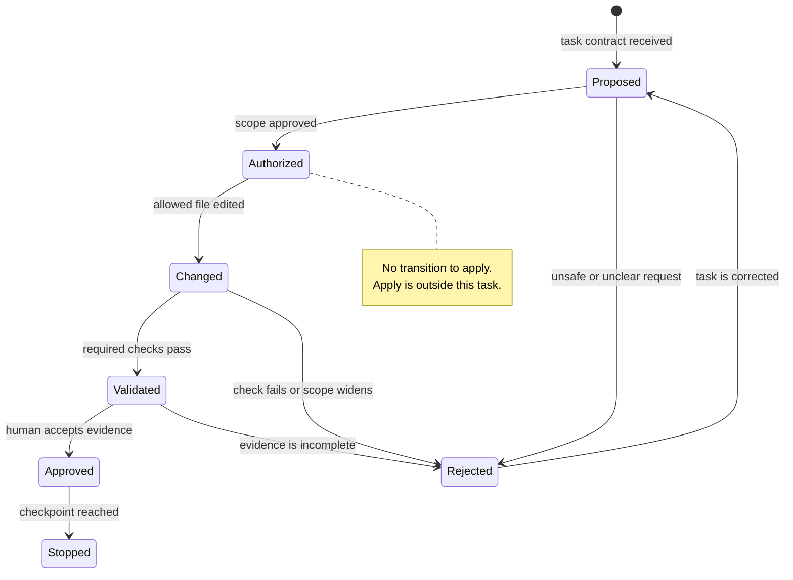

# Governed Agent Workflows for IaC

An infrastructure request often arrives as one sentence: “Fix the Terraform.” A capable coding agent can turn that sentence into a change very quickly. Speed is useful only when the agent also knows what it may inspect, what it may change, how it must prove the result, and where it must stop.

This section turns a vague request into a governed workflow. The example is small: repair one missing Terraform resource and validate it with Terraform and OpenTofu. The engineering pattern is much larger. You can use the same pattern for a module upgrade, Helm change, policy repair, or GitOps pull request.

## 1. From a request to an agent task

“Fix the Terraform” states a concern, not an executable task. It does not name the defect, the allowed files, the desired end state, or the actions that are too risky. Two engineers can read it differently. An agent can do the same, but much faster and across more files.

A useful task converts intent into a testable contract:

| Request question | Contract answer for this repair |
|---|---|
| What result is required? | Restore the missing `random_id.platform` declaration. |
| What must remain true? | `output.platform_name` still reads `random_id.platform.hex`. |
| What may change? | Only `section-2/starter/main.tf`. |
| What may the agent run? | Read-only inspection, formatting, initialization without a backend, and validation. |
| What must never run? | Apply, state commands, credential use, deletion, or destroy. |
| What proves completion? | One-file diff plus successful Terraform and OpenTofu checks. |
| When must the agent stop? | After validation, or sooner if the repair needs wider authority. |

This is more precise than a long prompt. The task is a repository artifact. A human can review it, an agent can follow it, and CI can reuse its deterministic checks.

## 2. Task contracts for infrastructure work

A strong infrastructure task contract has seven parts.

1. **Objective:** the observable result, not a preferred implementation.
2. **Inputs:** the files, failure output, versions, policies, and architecture facts the agent may trust.
3. **Work boundary:** the files, directories, environment, and time window the task owns.
4. **Allowed tools:** exact classes of commands and the permissions behind them.
5. **Forbidden actions:** concrete actions such as apply, destroy, state mutation, credential access, or network changes.
6. **Required evidence:** the diff, command output, exit status, plan, tests, or runtime observations needed for review.
7. **Stop conditions:** events that return control to a human instead of increasing authority.

The work boundary and tool boundary solve different problems. A one-file boundary does not make `terraform apply` safe. A read-only tool list does not prevent an agent from editing ten unrelated files. Both boundaries are required.

Write forbidden actions as explicit verbs. “Be careful” is not a control. “Do not run `terraform apply`, `tofu apply`, state commands, delete, or destroy” can be reviewed in a transcript and enforced in a tool policy.

Stop conditions are also part of normal success. If the only valid repair needs a second file, the correct result is not a creative workaround. The correct result is a short escalation that names the missing authority.

## 3. Inspect before you change

An agent should build a current view of the work before editing. For IaC, inspection normally covers five areas:

- **Repository rules:** `AGENTS.md`, contribution guidance, module ownership, and local conventions.
- **Configuration:** the affected HCL, YAML, tests, provider constraints, and lock strategy.
- **State boundary:** whether the task is local-only, connected to a backend, or able to reach a live API.
- **Current failure:** the exact command, output, and exit status that define the starting problem.
- **Working tree:** existing human changes that must not be overwritten or included.

Inspection prevents a common failure: solving the error message while violating the repository. An undeclared resource error may be fixed in one file, but a provider initialization error may come from a missing cache, blocked DNS, or a lock-file source difference. Those conditions need different responses.

For this section, the initial Terraform validation reports:

```text
Error: Reference to undeclared resource

  on main.tf line 6, in output "platform_name":
   6:   value = random_id.platform.hex

A managed resource "random_id" "platform" has not been declared in the root module.
```

The message supports a narrow hypothesis: the output references a resource declaration that is absent. It does not authorize changing the output, applying infrastructure, or adding a cloud provider.

## 4. Facts, assumptions, plans, and checkpoints

Agents work better when facts and assumptions are separated before the change.

| Type | Example | Treatment |
|---|---|---|
| Fact | `main.tf` references `random_id.platform.hex`. | Cite the file and line. |
| Fact | No `random_id.platform` resource exists. | Confirm through inspection. |
| Assumption | A four-byte identifier is the intended size. | Confirm from the task or ask. |
| Assumption | One lock file proves both tools are compatible. | Reject; validate each tool and record lock behaviour. |

A plan explains the next actions. It is useful evidence of intent, but it is not evidence of completion. A good plan for the repair is short:

1. Inspect the task, repository rules, starter, and current failure.
2. Add the smallest allowed `random_id.platform` declaration.
3. Run the six approved Terraform and OpenTofu checks.
4. Inspect the changed-file list and final diff.
5. Return evidence and stop without apply.

Place a human checkpoint before an action that changes the risk class. Editing one isolated file and validating locally is bounded execution. Applying to an environment, accessing credentials, widening the file scope, or accepting a replacement plan requires a separate decision. Do not hide that decision inside an earlier approval to “fix” the module.

## 5. The governed change loop

The working loop is `inspect → propose → change → validate → review → stop`. Each transition needs an allowed action and a result that can be observed.



Notice what is missing. There is no transition from `Authorized` or `Validated` to apply. The workflow cannot “accidentally” reach an unauthorized state-changing action because that action is not part of the task graph.

Validation can return to the change step, but retry must be bounded. A retry is reasonable when the error is in scope and the next change remains inside the approved file. Stop when the same failure repeats, the evidence conflicts, another file is required, a credential prompt appears, or a tool asks to contact an unapproved system.

## 6. Evidence is not an agent summary

An agent summary is a claim. Evidence lets another person test that claim.

| Claim | Stronger direct evidence | What it still does not prove |
|---|---|---|
| “The file is formatted.” | `terraform fmt -check` with exit `0` | The references or behaviour are correct. |
| “The configuration is valid.” | `terraform validate` and `tofu validate`, each with exit `0` | An apply is safe or the design meets policy. |
| “Only one file changed.” | `git diff --name-only` plus the exact diff | No untracked or ignored artifact exists. |
| “Nothing was applied.” | Command inventory, absent state files, and restricted tool policy | No other actor changed an external system. |
| “Both tools work.” | Separate initialization and validation output | One shared lock file is portable between registries. |

Evidence has identity and scope. Record the command, working directory, artifact revision, relevant tool version, output, and exit status. Without this context, a successful output may belong to another checkout or an older file.

The live proof for this repair exposed an important boundary. Codex made the correct one-file change, but its workspace sandbox could not resolve `registry.terraform.io`. It stopped. A host-side runner with registry access then completed the independent checks. The accurate conclusion is: the agent authored the scoped repair; the host runner proved Terraform and OpenTofu validation. Combining those into “Codex validated everything” would be false.

## 7. Recover from an unsafe proposal

Assume the agent proposes this next step after validation:

> The configuration is valid. I will run `terraform apply -auto-approve` to confirm the resource works.

Do not approve the command just because the code looks small. The proposal crosses from repository validation into state-changing infrastructure work. It also adds automatic approval and assumes access to a backend and credentials that the task never granted.

Use a controlled recovery:

1. **Reject the proposed action.** Name the exact boundary: apply is not authorized.
2. **Inspect current state.** Confirm which files changed and whether any forbidden command already ran.
3. **Preserve useful work.** Keep the valid one-file candidate in its isolated worktree.
4. **Restore the task.** Repeat the required validation and stop condition; do not widen permissions.
5. **Return evidence.** Include the rejected proposal as a review finding.
6. **Create a separate delivery task later.** If apply is needed, give it its own plan, environment, credentials, approval, and rollback controls.

Recovery does not mean deleting all agent work. It means returning to the last trusted checkpoint and preserving a reviewable lineage.

## 8. Codex demonstration with portable artifacts

The instructor demonstration uses Codex, but Codex is not the workflow contract. The portable artifacts are:

- `section-2/task.md`, which defines the objective and boundaries;
- `section-2/starter/main.tf`, which contains the current problem;
- the Terraform and OpenTofu CLI commands, which produce deterministic evidence;
- the Git diff, which records the proposed change.

The demonstration prompt tells Codex to read the task contract, inspect before editing, stay inside the allowed file, run only approved checks, and stop after validation. Claude Code, Goose, Cursor, GitHub Copilot, VS Code, or another compatible coding agent can receive the same contract. The interface changes; the engineering evidence does not.

The smallest accepted change is:

```hcl
resource "random_id" "platform" {
  byte_length = 4
}
```

The repair is accepted only when both tools validate and Git shows no unrelated file change. OpenTofu may rewrite provider source metadata in the disposable lock file after Terraform initialization. Record that warning. It does not mean that one shared lock file proves compatibility.

The next lab runs this complete workflow. You will reproduce the defect, give Codex the bounded contract, inspect its change, run independent checks, and stop with a reviewable evidence bundle. No infrastructure is applied.
