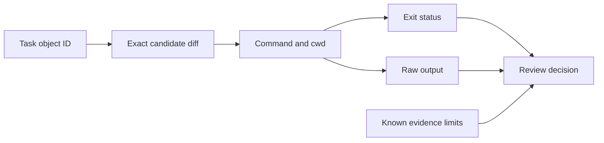

# Deep Dive — Build an Auditable IaC Evidence Chain

The lab proved one bounded repair with a diff and two IaC engines. This deep dive goes below the green messages. You will examine how evidence identity, command exit status, raw output, and evidence limits affect a production review. Use this layer when a pull request looks correct but the reviewer must decide exactly what was checked and what remains unknown.

:::info[Where this picks up]

Run this page from the learner repository root. It works whether your working copy still contains the repaired file or has returned to the committed broken starter. The commands use the committed starter as a stable reference and inspect a working-tree diff only when one exists. Re-running is safe.

Create one unique temporary evidence directory and copy the committed starter into it.

```bash
m2_tmpdir=$(mktemp -d /tmp/agentic-iac-m2-evidence.XXXXXX)
git show HEAD:section-2/starter/main.tf > "$m2_tmpdir/main.tf"
```

:::

## 1 — A green formatter is weak semantic evidence

A formatter is like a document layout check. It can confirm that the page follows the expected shape. It cannot confirm that the statements on the page are true.

Run the formatter against the committed broken starter and print its exit status.

```bash
terraform fmt -check "$m2_tmpdir/main.tf"
printf 'fmt exit: %s\n' "$?"
```

**Expected output**

```text
fmt exit: 0
```

The broken file is correctly formatted, so formatting can exit `0` while the configuration still contains an undeclared reference. In a review, treat `fmt` as a style gate, not a semantic gate.

Run validation against the same committed file and preserve the exit status.

```bash
terraform -chdir="$m2_tmpdir" validate -no-color
printf 'validate exit: %s\n' "$?"
```

**Expected output**

```text
Error: Reference to undeclared resource

  on main.tf line 6, in output "platform_name":
   6:   value = random_id.platform.hex

A managed resource "random_id" "platform" has not been declared in the root
module.
validate exit: 1
```

The error text explains the defect. The non-zero exit status makes the result usable by a shell, CI runner, or agent harness. Keep both: text without status is difficult to automate, while status without text is difficult to diagnose.

## 2 — Evidence needs artifact identity

A validation result is meaningful only when it can be linked to the exact input. Think of an artifact digest as the serial number on a calibrated instrument. A result without that serial number may belong to another instrument or another time.

Read the Git object identity of the committed task contract.

```bash
git rev-parse HEAD:section-2/task.md
```

**Expected output**

```text
e1e74c1b612c83566edad2917db8a78aba84d230
```

This object ID binds the review to the exact committed task. A working-tree file can differ from it, so a strong evidence record also identifies the commit or captures a checksum of the uncommitted candidate.

Check whether the working copy of the repair differs from the committed starter.

```bash
git diff HEAD --numstat -- section-2/starter/main.tf
```

**Expected output**

On the committed starter used for validation, Git prints no output because the
working file matches `HEAD`. After you complete the four-line repair in the lab,
the same command prints:

```text
4	0	section-2/starter/main.tf
```

After the lab, the expected repair reports four inserted lines and no deletions. On a fresh checkout, this command is silent. That silence means no working-tree diff; it does not mean a repair was validated elsewhere.

## 3 — A diff proves scope only within its view

`git diff --name-only HEAD` answers a narrow question: which tracked files differ from `HEAD`, including staged and unstaged edits? It does not include ignored provider caches or untracked artifacts.

The evidence path therefore has several linked observations:



Check the candidate diff for whitespace errors and print the status.

```bash
git diff --check HEAD -- section-2/starter/main.tf
printf 'diff-check exit: %s\n' "$?"
```

**Expected output**

```text
diff-check exit: 0
```

An exit status of `0` means Git found no whitespace error in this diff. It does not prove that only one file changed, that the HCL is valid, or that no ignored runtime artifact exists. Each claim needs its own observation.

## 4 — Raw logs and summaries have different jobs

An agent summary compresses a run so a reviewer can understand it quickly. A raw log preserves command order, output, errors, and stopping behaviour. Neither should replace the other.

| Artifact | Strong use | Important limit |
|---|---|---|
| Agent summary | Explain intent, result, and unresolved concerns. | The agent can omit or misread a failure. |
| Raw stdout/stderr | Audit commands, failures, warnings, and sequence. | A long log is hard to review and may contain secrets. |
| Exit status | Give automation a clear pass/fail signal. | It says only what that command defines as success. |
| Git diff | Review the exact tracked code proposal. | Its view depends on index and untracked-file state. |
| Checksum or object ID | Bind evidence to an exact artifact. | It does not say whether the artifact is correct. |

The live course proof keeps the boundary explicit. The Codex sandbox log shows inspection, the correct edit, and a DNS failure. A separate host log shows six successful Terraform/OpenTofu commands. The truthful summary links both records; it does not pretend the sandbox performed the host checks.

Before storing raw logs, scan for credentials, authorization headers, private keys, and environment values. Preserve the unedited stream when safe. If redaction is necessary, record what was removed and why.

:::tip[Where you will use this]

- **Formatting and validation support different claims**. **Use it when:** a pull request shows a green format check but still has invalid references — require the semantic validator and its exit status.
- **Artifact identity links a result to the exact input**. **Use it when:** evidence was collected in another worktree or CI job — compare the commit, object ID, or checksum before accepting it.
- **A Git diff has a defined visibility boundary**. **Use it when:** an agent claims “only one file changed” — inspect tracked, staged, untracked, and ignored views needed by the task.
- **Raw logs and summaries serve different reviewers**. **Use it when:** a run stops or crosses a boundary — preserve the raw sequence and write a short, evidence-linked conclusion.

:::

## Teardown

Remove only the temporary evidence directory created by this page.

```bash
rm -r "$m2_tmpdir"
```

**Expected output**

No output is expected. A successful `rm` command is silent.

This removes only the unique directory stored in `m2_tmpdir` during this terminal session.
Keep the Section 2 learner repository and your repaired `main.tf`. This page does not create infrastructure, state, or a provider cache.
