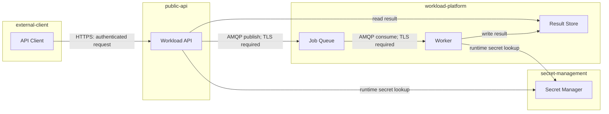

# Deep Dive: Architecture as Code and Design Evidence

The Section 3 lab produces two green checks for a completed design pack. The local validator checks course-specific ownership rules. The FINOS CALM CLI checks schema conformance.

This deep dive explains why both checks are useful, why neither is an approval, and how a bounded graph helps reviewers find missing relationships and trust-boundary crossings.

## Architecture as code and a diagram are different artifacts

A diagram gives people a fast visual explanation. Architecture as code gives tools a structured source that can be versioned, queried, validated, compared, and rendered.

| Capability | Diagram image | Architecture model |
| --- | --- | --- |
| Fast visual review | Strong | Needs a renderer or focused view |
| Exact node and relationship IDs | Often hidden | Explicit and queryable |
| Version diff | Pixel-level or manual | Structured text diff |
| Schema validation | Not normally available | Available for known structures |
| Human context and emphasis | Strong | Must be added through metadata and views |
| Automatic completeness checks | Weak | Possible for rules that are encoded |

Do not choose one and discard the other. Keep the model as the versioned source and generate or maintain small views for specific review questions. Link the view to the exact model revision so it does not become an unrelated picture.

For this course, the source is:

```text
section-3/starter/architecture/queue-feature.calm.json
```

The lesson graph shows the client, API, queue, worker, result store, and secret manager. It is intentionally bounded. A graph with every repository file, cloud resource, team, control, test, and runtime event would be harder to review.

## CALM core concepts in the learner model

[FINOS CALM core concepts](https://calm.finos.org/core-concepts/) include nodes, interfaces, relationships, controls, standards, flows, timelines, metadata, and other supporting elements. The learner model uses only the depth needed for the queue design.

### Nodes are the reviewable components

A node represents a component at a chosen level of abstraction. In this model:

- `api-client` is an actor;
- `workload-api` and `workload-worker` are services;
- `job-queue` is a message queue;
- `result-store` is a database;
- `secret-manager` is a system.

The model does not create a node for every pod or Terraform resource. That detail would not help this design review. The abstraction level should match the decision.

### Interfaces identify interaction points

The API exposes `jobs-api` over HTTPS. The queue exposes separate publisher and consumer interfaces over AMQP on port 5671. A separate security control requires TLS-protected transport. An interface can state host, port, protocol, and a logical path or queue.

The official [CALM interface tutorial](https://calm.finos.org/tutorials/beginner/05-interfaces/) explains inline interfaces and reusable external definitions. It also documents a current validation limit for external interface definitions. This course uses small inline interfaces so the relevant contract is visible in one file.

An interface definition still does not prove a listener exists, a certificate is valid, or authorization works. Those are implementation and runtime claims.

### Relationships turn a list into a graph

Nodes alone say what exists. Relationships say how nodes interact, connect, or depend on each other. The [CALM relationship model](https://calm.finos.org/core-concepts/relationships/) supports several relationship types.

The learner model uses:

- `interacts` for the client using the workload API;
- `connects` for API-to-queue, queue-to-worker, worker-to-result-store, API-to-result-store, and runtime secret lookups.

This excerpt comes from the completed learner model:

```json
{
  "unique-id": "api-publishes-job",
  "relationship-type": {
    "connects": {
      "source": { "node": "workload-api" },
      "destination": {
        "node": "job-queue",
        "interfaces": ["queue-publish"]
      }
    }
  },
  "protocol": "AMQP",
  "description": "The API publishes accepted job messages through the queue's encrypted publisher interface."
}
```

The relationship has a stable ID, direction, endpoints, target interface, protocol, and explanation. A tool can query it. A reviewer can compare it with application behaviour and access policy.

### Metadata adds ownership and trust context

Metadata gives the model organizational context. The course model records owner, version, review status, lifecycle owners, and trust boundaries.

```json
"metadata": {
  "owner": "platform-engineering",
  "version": "0.1.0",
  "status": "candidate-design-review",
  "trust-boundaries": [
    "external-client",
    "public-api",
    "workload-platform",
    "secret-management"
  ]
}
```

Metadata is flexible. Flexibility means a schema may accept organization-specific fields without understanding their engineering meaning. A local rule, policy engine, or human review must interpret them.

## Controls, standards, interfaces, and relationships are not synonyms

These concepts often appear together, but they answer different questions.

| Concept | Question | Queue example | What it does not prove |
| --- | --- | --- | --- |
| Interface | Where and how can interaction occur? | Queue publisher over AMQP on port 5671. | That TLS is enforced, or the endpoint is reachable and authorized. |
| Relationship | Which components interact or depend on each other? | API publishes to queue through `queue-publish`. | That the communication works at runtime. |
| Control | What domain requirement applies? | Protect queue traffic and authenticate producers. | That enforcement is deployed and effective. |
| Standard | What reusable organizational definition or constraint should elements follow? | Approved interface or security requirement shape. | That every implementation currently follows it. |

The learner model includes security and operational controls. The official [CALM controls documentation](https://calm.finos.org/core-concepts/controls/) describes controls as requirements within a domain. A declared control is therefore a design statement. Evidence of implementation may later include policy configuration, identity tests, TLS inspection, monitoring queries, and recovery exercises.

## Use the graph to review trust boundaries

Trust boundaries are useful only when reviewers examine the relationships that cross them.



Review each crossing:

1. What identity initiates it?
2. Which interface and protocol are used?
3. What data crosses?
4. Which control should apply?
5. What future evidence would prove enforcement?
6. What is the failure and recovery path?

The graph can reveal a missing API-to-result relationship even when all nodes are present. It can reveal that the API also needs a runtime secret lookup. It cannot decide whether the chosen identity or encryption design is acceptable to the organization.

## Four checks answer four different questions

Treat validation as a ladder, not one universal PASS.

| Gate | Queue question | Evidence | Limit |
| --- | --- | --- | --- |
| Schema check | Does the JSON conform to CALM 1.2? | Pinned CALM CLI output, model identity, zero errors and warnings. | Unsafe ownership can still conform. |
| Local semantic check | Are state and lifecycle rules satisfied? | `check-design-pack.mjs` output for the exact pack. | Only encoded course rules are checked. |
| Organizational policy | Does the design follow company security, cost, and platform policy? | Policy results and exceptions tied to model elements. | A policy set may be incomplete or stale. |
| Human approval | Are trade-offs and remaining risks acceptable? | Named review decision with scope and revision. | Approval does not prove deployment or runtime behaviour. |
| Runtime observation | Does the implemented system behave as designed? | Tests, telemetry, identity checks, queue signals, recovery exercise. | One observation is bounded by time and environment. |

The unsafe starter demonstrates the boundary. Its CALM JSON is schema-valid while test and production share state and Terraform state is assigned application job data. The local semantic validator rejects those decisions.

The completed candidate produces:

```text
Design pack: PASS (0 design problems found)
The local ownership and safety rules are satisfied.
```

The pinned CALM CLI separately produces:

```text
Summary
- Errors: no (0)
- Warnings: no (0)
- Info/Hints: 0

No issues found.
```

These results are complementary. They are not interchangeable.

## Version pinning and the network boundary

The model pins its schema:

```json
"$schema": "https://calm.finos.org/release/1.2/meta/calm.json"
```

The lab pins the CLI invocation:

```text
@finos/calm-cli@1.57.0
```

Pinning makes the evidence repeatable. It also creates maintenance work. A team must decide when to upgrade, read schema changes, rerun validation, review diffs, and preserve older evidence with its original version.

The first `npx` run needs npm registry access unless the package is cached. The current model also references control requirement URLs on the FINOS site. A blocked network is not a schema failure. Record:

```text
CALM schema validation: NOT RUN - package download unavailable
```

Then continue with the local design check. Do not report a PASS for a command that did not execute.

For stricter or disconnected environments, a team can review and pin packages, mirror approved artifacts, and use URL-to-local mappings where supported by the [CALM CLI](https://calm.finos.org/working-with-calm/cli/). The provenance and upgrade process must remain visible.

## Drift and versioning

Architecture drift has several forms:

- **Model-to-request drift:** the model omits a required business path.
- **Model-to-code drift:** implementation introduces a component or relationship that the model does not show.
- **Model-to-runtime drift:** deployment or configuration differs from both model and code.
- **Control drift:** a requirement remains declared while enforcement is missing or changed.
- **Ownership drift:** the named team no longer controls the lifecycle or access.

A versioned model makes drift detectable, but it does not detect itself. Connect checks to meaningful events:

- model validation on a model change;
- model-to-code or configuration checks on a pull request;
- rendered and policy checks before promotion;
- runtime topology and control observations after deployment;
- periodic ownership and exception review.

Store the evidence with artifact identity. A validation log without the model commit or checksum may describe another revision.

## What machines cannot decide

Machines can check that fields exist, references resolve, state paths differ, forbidden terms are absent, and required relationships appear. They can compare versions and apply encoded policy.

Machines cannot independently decide:

- whether the business value justifies operational cost;
- whether 500 milliseconds is the correct product target;
- whether the organization accepts the remaining security risk;
- whether a queue migration should pause during a customer event;
- whether draining, delaying, or failing accepted work is the least harmful rollback;
- whether an exception is ethically, legally, or commercially acceptable;
- whether the model contains the right abstraction for this decision.

An agent can propose answers and cite evidence. A named human remains accountable for the decision.

## Worked review matrix

Use this matrix before approving the design pack for implementation:

| Review item | Artifact or check | Candidate result | Reviewer decision still needed |
| --- | --- | --- | --- |
| Observable submission and result behaviour | Change brief | Defined with status, result, retry, and timing criteria. | Confirm product targets and failure semantics. |
| Environment isolation | State map plus local validator | Local, test, and production use distinct state paths. | Confirm backend, ownership, and recovery procedure. |
| Runtime data boundary | State map plus local validator | Job data and secret values are outside Terraform state. | Confirm storage retention and access design. |
| Component and relationship structure | CALM model plus CLI | Model conforms to CALM 1.2. | Confirm model completeness and abstraction. |
| Trust-boundary crossings | CALM graph | External, public, platform, and secret paths are visible. | Approve identities, protocols, data, and controls. |
| Rollback intent | ADR | Stop, drain or recover, restore, then remove. | Confirm operational feasibility and ownership. |
| Implementation authorization | Approval block | Pending. | Platform, application, and security reviewers approve or reject. |

The correct final status for Section 3 is **candidate design ready for human review**. It is not “implemented,” “deployed,” or “production safe.”

## Operator checklist

- Keep a small versioned architecture model and a readable focused view.
- Link nodes, relationships, controls, ownership, and ADRs to stable artifact IDs.
- Run schema, semantic, policy, approval, and runtime gates as separate checks.
- Pin versions and record network or package-resolution failures honestly.
- Review every trust-boundary crossing by identity, data, control, and recovery.
- Revalidate after model, code, policy, ownership, or schema changes.
- Keep implementation and deployment blocked until the named approval exists.

The lab ends before code generation because the design questions are now explicit. The next section can give an agent the correct context without asking it to invent the architecture.
