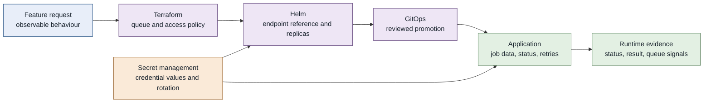
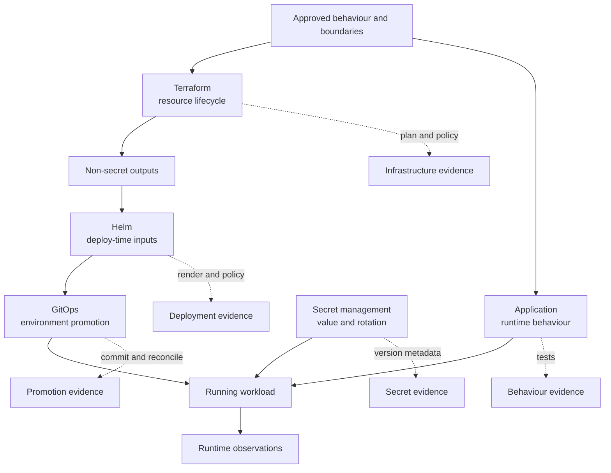
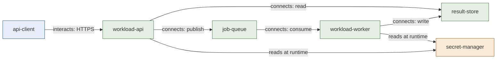

import Slides from '@site/src/components/Slides';

# Plan Your IaC Change Before the Agent Writes Code

A product team asks for asynchronous jobs. A client should submit work, receive a job ID, and return later for the result. An AI coding agent could generate Terraform, a Helm chart, application code, and GitOps configuration from that request. It could also make four different tools own the same setting, put runtime data into Terraform state, or replace a queue before accepted jobs are drained.

The problem is not that the agent writes too slowly. The problem is that important design decisions are still hidden inside one sentence.

In this section, you will make those decisions visible before code generation begins. You will build a change brief, an environment and state map, an architecture decision record, and a small FINOS CALM model. Together, these artifacts form a design pack that a coding agent can implement and a human can review.

<Slides src="decks/m3-plan-iac-before-agent-codes.html" title="Section 3: Plan Your IaC Change Before the Agent Writes Code" />

## 1. Requirements That an Agent Can Implement

### Start with the behaviour, not the tool

The queue request sounds clear:

> Add asynchronous processing to the Production AI Workload Platform.

It gives direction, but it does not define success. Should the API wait for the job? Where is status stored? How many retries are allowed? Which environments need separate queues? If these questions are unanswered, generated code will answer them by accident.

The first decision is simple: describe observable behaviour before describing an implementation.

An observable requirement tells a reviewer what enters the system, what event occurs, and what can be measured. An implementation choice tells the team how to produce that behaviour. Keep these separate.

| Requirement type | Queue example | Why it matters |
| --- | --- | --- |
| Observable behaviour | A valid submission returns HTTP 202 and a non-empty job ID within 500 milliseconds in the local test. | A test can observe the status, value, and time. |
| Business rule | A failed job is attempted no more than three times. | The team can test a bounded failure path. |
| Data boundary | Job payloads, status, and results remain outside Terraform state. | The design protects lifecycle ownership before code exists. |
| Implementation choice | Use an SQS-compatible queue. | The team may change this choice while keeping the behaviour. |
| Premature detail | Name the queue `prod-ai-jobs-v2`. | A name does not explain the user result or safety rule. |

The change brief uses Given/When/Then language where it makes the result clearer:

```text
Given a valid request,
when a client submits a workload,
then the API returns HTTP 202 and a non-empty job ID within 500 milliseconds.

Given that job ID,
when the client reads status,
then the API returns queued, running, succeeded, or failed.
```

Given/When/Then is useful because it separates starting conditions, the event, and the observable result. It is not required for every sentence. For example, “Terraform state never contains job payloads” is already direct and testable through state inspection and policy checks.

### Follow one request through its owners

The queue feature will evolve through five lifecycle owners. The arrows show the hand-offs. They do not mean one tool owns the entire path.



This visual starts with a requirement, then adds ownership. Later lectures will add environment boundaries, dependencies, risk, and approval.

### Common failure: asking the agent to “build the queue feature”

An agent may produce plausible code, but reviewers cannot tell which hidden assumptions became architecture. A green formatter does not repair this gap. Neither does a detailed prompt that mixes requirements with an unreviewed solution.

The evidence for this lecture is the change brief itself. A reviewer should be able to connect each important behaviour to a future test without reading generated code.

**Operator takeaway:** If a requirement cannot be observed, reviewed, or tested, it is not ready for an implementation agent.

**Next:** Observable requirements define the result. Acceptance criteria, assumptions, and non-goals define the boundary around that result.

## 2. Acceptance Criteria, Assumptions, and Non-Goals

### Make success and scope visible

The queue feature has a clear happy path, but several design questions remain. Does “fast response” mean 500 milliseconds or five seconds? Is a managed cloud queue required? Is multi-region recovery part of this change? If the agent must guess, it may add cost and scope that nobody approved.

Use three separate lists:

- **Acceptance criteria** describe evidence required for success.
- **Assumptions** name facts that the design currently depends on but has not proved here.
- **Non-goals** name reasonable work that this change intentionally excludes.

The lists solve different review problems.

| Design statement | Type | Review question |
| --- | --- | --- |
| The API returns HTTP 202 and a job ID within 500 milliseconds in the local test. | Acceptance criterion | What test and output will prove this? |
| The existing API already authenticates clients. | Assumption | Where is the current evidence, and what happens if it is false? |
| Choosing a cloud queue product is outside this section. | Non-goal | Does any proposed artifact make this choice anyway? |
| Local, test, and production use separate state and queues. | Acceptance criterion | Can the state map show unique owners and paths? |
| A local substitute can represent the queue during development. | Assumption | Does this preserve the behaviour that matters? |
| Multi-region disaster recovery is not designed here. | Non-goal | Is this risk recorded for later work? |

Acceptance criteria should cover more than the happy path. The final brief checks submission, status transitions, success, bounded retry, and environment isolation. It also requires the design pack to show ownership and keep reusable secrets outside state and Git.

### Do not turn assumptions into facts

An agent often receives old documents, partial repository context, and current command output at the same time. It must not treat all three as equally current. Mark an assumption explicitly and connect it to a confirmation step or a stop condition.

For example:

```text
Assumption: the existing API already authenticates clients.
Verification later: inspect the current API route and its contract test.
Stop if false: do not generate a public job endpoint without an approved identity design.
```

This makes uncertainty useful. It tells the agent what it may rely on now and when it must return to a human.

### Common failure: using non-goals as forgotten requirements

“Multi-region is out of scope” does not mean multi-region risk disappears. It means this design will not solve it. Record the consequence, avoid draft entries that pretend otherwise, and create separate future work if it becomes required.

Verification evidence is a review matrix. Each acceptance criterion should point to a planned artifact or check. Each assumption should name a source or later confirmation. Each non-goal should be absent from the implementation plan.

**Operator takeaway:** Acceptance criteria prevent vague completion. Assumptions prevent false certainty. Non-goals prevent silent expansion.

**Next:** The scope is now clear. The next decision is who owns each environment and each state operation.

## 3. Environment and State Ownership

### State is an operational boundary

The unsafe starter assigns test and production to the same state path:

```text
test        remote://platform/production
production  remote://platform/production
```

This is more than a naming mistake. A plan intended for test can read production resource identity. An apply can change the wrong environment. Recovery can restore the wrong snapshot. An agent that sees both environments in one state may not know which boundary the human intended.

Give every environment a distinct state path, owner, and resource boundary:

| Environment | State path | State owner | Queue boundary |
| --- | --- | --- | --- |
| local | `local/queue.tfstate` | Platform engineering | Local development only |
| test | `remote://platform/test/queue.tfstate` | Platform engineering | Test workloads only |
| production | `remote://platform/production/queue.tfstate` | Platform engineering | Production workloads only |

The path alone is not enough. State ownership includes rights and duties.

| State operation | Meaning | Typical authority |
| --- | --- | --- |
| Read | Inspect resource identity and stored attributes. | Narrow read access for planning and investigation. |
| Plan | Compare desired configuration with provider and state observations. | CI or operator role with read access and provider permissions. |
| Apply | Change infrastructure and write new state. | Controlled delivery role after review and approval. |
| Migrate | Move state between backends or change resource addresses. | Named platform operator with backup and reviewed procedure. |
| Recover | Restore or repair state after loss or corruption. | Restricted break-glass role with audit evidence. |

Do not give a coding agent all five rights because it needs to inspect HCL. Repository access and state authority are separate capabilities.

### Terraform state is not an application database

Terraform state records infrastructure identity and attributes needed to manage resources. It is not the lifecycle owner for job payloads, job status, job results, credentials, or reusable encryption keys.

The corrected design records:

```text
Terraform state: queue resource IDs, access-policy IDs,
and non-secret infrastructure configuration.

Application runtime storage: job payload, status, and result.
Secret manager: queue credentials and encryption keys.
```

This distinction matters even when a backend is encrypted. Encryption protects storage; it does not fix over-broad access, retention, accidental output, or the wrong update lifecycle. Runtime data changes per job. Terraform state changes during infrastructure operations. Mixing them creates a slow, sensitive, and unsafe control plane.

### Common failure: one “platform owner” with every permission

An owner name without an action matrix is weak. A team may own the backend but still separate routine plan access from apply, migration, and recovery. The design pack should name these operations before an agent or pipeline receives credentials.

Verification evidence includes unique state paths, one accountable owner per state, a rights matrix, backend protections, backup and recovery intent, and a check that runtime data and reusable secrets are absent.

**Operator takeaway:** Treat state as a protected control record. Separate environments, separate operations, and keep application data in the application lifecycle.

**Next:** State ownership covers infrastructure records. The feature still crosses Terraform, Helm, GitOps, application configuration, and secret management.

## 4. Terraform, Helm, GitOps, and Application Boundaries

### Place a setting where its lifecycle changes

The worker needs a queue endpoint, replicas, retry behaviour, a promoted application revision, and a credential. All are “configuration,” but they do not change for the same reason or under the same reviewer.

Choose the primary owner by lifecycle:

| Owner | Owns | Change event | Useful evidence |
| --- | --- | --- | --- |
| Terraform | Queue, dead-letter queue, access policies, resource identifiers | Infrastructure design or resource change | Plan, policy result, state-boundary review |
| Helm | Worker replicas, deploy-time environment variables, non-secret queue reference | Workload configuration change | Rendered manifests, schema and policy checks |
| GitOps | Reviewed chart, image, and values revision promoted to an environment | Promotion approval | Git commit, review, reconciliation status |
| Application configuration | Retry limit, idempotency, status transitions, runtime behaviour | Product or reliability decision | Unit, contract, and failure-path tests |
| Secret management | Credential and encryption-key values, rotation | Security event or rotation schedule | Secret version metadata and workload lookup test, without printing value |

The same value may cross boundaries without changing ownership. Terraform may output a non-secret queue identifier. Helm may place that identifier into the workload configuration. GitOps may promote the reviewed values file. The application may read it. Terraform still owns the resource; it does not own runtime job behaviour.

Secret references need the same care. A secret name or path may appear in versioned configuration. The reusable secret value should remain in secret management and be resolved at runtime. Do not render the value into a manifest, place it in Terraform state, or print it in validation output.

### Extend the ownership visual

The earlier flow now includes distinct change triggers and evidence:



No arrow gives GitOps ownership of Terraform state. No arrow gives Helm ownership of the secret value. The visual makes hand-offs visible without merging lifecycles.

### Common failure: “put everything in values.yaml”

A single values file feels simple, but it can combine resource creation, runtime behaviour, promotion, and secret values. Reviewers cannot tell which event should change each item. A values change can also bypass the owner that must approve a resource or security decision.

Verification evidence is the lifecycle-ownership table plus a repository review that checks where each item will be represented. Later, the operator challenge asks you to classify twelve realistic settings and defend nearby alternatives.

**Operator takeaway:** The tool that reads a value is not always the lifecycle owner. Place each setting where it is created, changed, reviewed, and recovered.

**Next:** Once ownership is clear, map dependencies and classify how risky each change can be.

## 5. Resource Dependencies and Change Classes

### Read the change as a graph

The queue feature is not a list of independent files. The API depends on a queue reference and permission. The worker depends on the queue, secret lookup, and result store. GitOps promotion depends on reviewed Helm inputs. Rollback depends on the state of accepted jobs.

This small graph is derived from the learner model at `section-3/starter/architecture/queue-feature.calm.json` and the environment map at `section-3/starter/environment-state-map.md`:



The source link matters. A diagram without a versioned source can drift away from the model. A model without a readable view can hide a risky relationship from human reviewers. Keep both connected.

### Classify the change before choosing the approval path

Use a small, explicit change vocabulary:

| Change class | Queue example | Main risk | Review level |
| --- | --- | --- | --- |
| Additive | Add a new queue and worker without changing current synchronous traffic. | New cost, permissions, and attack surface. | Platform, application, security as affected. |
| In-place | Change queue retention or worker replica count without replacing identity. | Behaviour, capacity, or cost changes. | Owner of resource plus operational reviewer. |
| Replacement | Change an attribute that forces a queue or policy replacement. | Data loss, broken references, downtime. | Explicit replacement review and recovery proof. |
| Migration | Move traffic or accepted jobs from the synchronous path to the queue path. | Mixed versions, duplicate work, stranded jobs. | Cross-team rollout and rollback approval. |
| Destructive | Remove the old route, queue, state, or stored results. | Irrecoverable loss or outage. | Named human approval after retention and drain evidence. |

A feature can contain more than one class. Creating a queue is additive. Moving production traffic is a migration. Removing the old synchronous path is destructive. A generated plan that says “1 to add, 0 to change, 0 to destroy” covers only the resources visible to that tool. It does not classify application traffic, data migration, GitOps promotion, or operational rollback.

### Common failure: treating an additive plan as low risk

Additive resources can create public access, broad identity permissions, unbounded cost, or a new trust-boundary crossing. Risk comes from effect, not from the word “add.”

Verification evidence should combine the dependency graph, the IaC plan when implementation exists, policy checks, data-flow review, cost estimate, and the approval matrix. In this section, implementation does not exist yet, so the design pack records the expected classes and reviewers without pretending a plan has run.

**Operator takeaway:** Map what depends on what, then classify each transition. Tool output is one input to risk review, not the complete risk decision.

**Next:** The graph shows what changes. An architecture decision record explains why this ownership was chosen and how to reverse it safely.

## 6. Architecture Decision Records and Rollback Intent

### Record the decision that code cannot explain

Generated code can show that Terraform creates a queue. It cannot reliably explain why the application must not create that queue, why secret values stay outside state, or why rollback must drain accepted jobs before infrastructure removal.

An architecture decision record, or ADR, preserves this reasoning near the code.

The queue ADR contains:

| ADR section | Queue decision |
| --- | --- |
| Status | Proposed; platform, application, and security review pending. |
| Context | Infrastructure, deployment, promotion, runtime data, and secrets have different lifecycles. |
| Decision | Assign Terraform, Helm, GitOps, application, and secret management one primary responsibility each. |
| Alternatives | Put everything in Terraform state; let the app create the queue; keep synchronous processing. |
| Consequences | Stable references and clear owners, plus new queue operations and runtime lookup duties. |
| Rollback intent | Stop new async submissions, drain or recover accepted jobs, restore the old route, then remove infrastructure only after approval. |

An ADR is not a long meeting record. It should explain the decision, serious alternatives, consequences, and conditions that would cause the team to revisit it.

### Rollback must respect data already accepted

“Revert the Git commit” is not a complete rollback for a stateful feature. The queue may contain accepted jobs. Workers may be processing messages. Results may exist under the new job IDs.

Use an ordered rollback intent:

1. Stop accepting new asynchronous jobs.
2. Observe queue depth and in-flight work.
3. Drain accepted jobs or move them through an approved recovery path.
4. Restore the synchronous API route.
5. Keep the queue and result data until retention and recovery checks pass.
6. Remove infrastructure only under a separate destructive approval.

The order is part of the design. Reversing infrastructure before draining work can turn a code rollback into data loss.

### Common failure: writing the ADR after implementation

An ADR written after the code often explains the chosen design as if no alternatives existed. Writing it before code exposes trade-offs while they can still change cheaply. The ADR remains proposed until the named humans approve it; an agent may draft it but must not approve its own design.

Verification evidence includes the versioned ADR, links to the affected model and request, named reviewers, and review comments. Runtime rollback evidence comes later from rehearsal or controlled execution.

**Operator takeaway:** Use an ADR to preserve why. Use rollback intent to preserve safe order. Neither one proves the rollback works until it is tested.

**Next:** The ADR is written for people. FINOS CALM adds a machine-checkable architecture record for nodes, interfaces, relationships, controls, and metadata.

## 7. FINOS CALM and Architecture as Code

### Turn the architecture into a versioned model

A diagram is useful for discussion, but a reviewer cannot reliably query every box, arrow, interface, owner, and control in a picture. Architecture as code stores those facts in a versioned structure that machines and humans can inspect together.

[FINOS CALM](https://calm.finos.org/introduction/what-is-calm/) is the Common Architecture Language Model. Its official documentation describes nodes, relationships, and metadata as primary architecture elements. The wider model also supports interfaces, controls, standards, flows, and other concepts. This course uses a small CALM 1.2 JSON document, not CALM Hub or a graph database.

| CALM concept | Queue model example | Review purpose |
| --- | --- | --- |
| Node | `workload-api`, `job-queue`, `workload-worker`, `result-store` | Name the components and their roles. |
| Interface | `jobs-api`, `queue-publish`, `queue-consume` | State where and how interaction occurs. |
| Relationship | API publishes to queue; worker consumes from queue. | Make connections and direction reviewable. |
| Metadata | Lifecycle owner, trust boundary, model version, status. | Add organizational context without changing the component type. |
| Control | Protect queue data flow; observe queue failures. | Record a design requirement and its configuration. |
| ADR reference | `../decisions/0001-queue-ownership.md` | Link machine structure to human reasoning. |

The [CALM core concepts](https://calm.finos.org/core-concepts/) distinguish these elements. The [relationship documentation](https://calm.finos.org/core-concepts/relationships/) explains that relationships can represent interaction, connection, deployment, or composition. The model uses `interacts` for client-to-service behaviour and `connects` for technical paths.

Here is a shortened excerpt from the completed learner model:

```json
{
  "$schema": "https://calm.finos.org/release/1.2/meta/calm.json",
  "nodes": [
    {
      "unique-id": "job-queue",
      "node-type": "message-queue",
      "metadata": {
        "lifecycle-owner": "terraform",
        "trust-boundary": "workload-platform"
      },
      "interfaces": [
        {
          "unique-id": "queue-publish",
          "protocol": "AMQP",
          "port": 5671
        }
      ]
    }
  ],
  "relationships": [
    {
      "unique-id": "api-publishes-job",
      "relationship-type": {
        "connects": {
          "source": { "node": "workload-api" },
          "destination": {
            "node": "job-queue",
            "interfaces": ["queue-publish"]
          }
        }
      }
    }
  ]
}
```

The interface records AMQP on port 5671. A separate security control requires TLS-protected transport and authenticated producers and consumers. The interface describes where communication occurs; the control describes the protection the design requires.

The `$schema` value pins the model to CALM 1.2. The official [CALM CLI documentation](https://calm.finos.org/working-with-calm/cli/) provides `validate` for checking an architecture. In the validated lab, the pinned CLI reports zero errors and warnings for the candidate model.

### Know what schema validation cannot prove

The unsafe starter also conforms to the CALM schema while test and production share state and application data is assigned to Terraform state. The JSON has the correct shape. The engineering decision is still unsafe.

The local course validator checks those ownership rules. CALM checks schema conformance. Policy can check organizational rules. Human approval decides whether the trade-off is acceptable. Runtime observations show what the deployed system actually does.

Controls have the same boundary. A control in the model records a requirement. It does not prove that TLS, identity, monitoring, or recovery is implemented and working. The official [CALM controls documentation](https://calm.finos.org/core-concepts/controls/) presents controls as domain requirements. Evidence of enforcement must come from implementation and runtime checks.

### Common failure: treating a valid model as an approved system

`No issues found` is narrow evidence. Record the model path, version, CLI version, exact output, and network boundary. Then keep approval pending. If the pinned package or referenced schemas cannot be downloaded, record CALM validation as not run; do not replace missing evidence with confidence.

**Operator takeaway:** Architecture as code makes structure queryable and reviewable. Schema validation proves conformance to a model shape, not correctness, approval, deployment, or runtime enforcement.

**Next:** The final lecture assembles all artifacts into one agent-ready approval pack.

## 8. The Agent-Ready Change Design Pack

### Give the agent decisions, not permission to invent them

The queue request is ready for implementation only when a reviewer can see the result, ownership, dependencies, risk, rollback, architecture, and unresolved decisions in one place.

The design pack contains:

| Artifact | Main question answered | Completion evidence |
| --- | --- | --- |
| Feature request | Why does the business need this change? | User flow, environments, constraints, and safety boundary. |
| Change brief | What behaviour must exist, and what is outside scope? | Acceptance criteria, assumptions, non-goals, class, rollback, pending approval. |
| Environment and state map | Who owns each state, operation, setting, and data type? | Unique environment state, lifecycle owners, trust boundaries. |
| ADR | Why was this ownership design selected? | Alternatives, consequences, rollback order, named reviewers. |
| CALM model | What components, interfaces, relationships, controls, and metadata form the design? | Versioned JSON plus successful schema validation when available. |
| Evidence record | What checks ran against which artifacts? | Local result, CALM result, commit or checksum, tool versions, known limits. |
| Approval gate | Who decides whether implementation may begin? | Explicit human decision; never inferred from automated PASS output. |

The pack is a hand-off contract. A coding agent may inspect it, propose an implementation plan, and name affected files. It must stop if requirements conflict, an assumption is false, the implementation needs a new owner, or the risk class changes.

### Use an approval matrix

| Review question | Machine support | Human decision |
| --- | --- | --- |
| Does the CALM JSON match the pinned schema? | CALM CLI validation. | Decide whether the selected schema and model depth are suitable. |
| Are state paths unique and runtime data outside state? | Local semantic rule check. | Decide whether ownership and recovery are acceptable. |
| Is each required relationship represented? | Graph query or deterministic validator. | Decide whether the architecture is complete enough. |
| Is the change safe to implement? | Risk signals, policy results, future plans and tests. | Weigh trade-offs and approve or reject implementation. |
| Is it safe to deploy? | Future plan, integration, security, cost, and rollout evidence. | Authorize the specific environment and action. |

Approval to design is not approval to implement. Approval to implement is not approval to apply. Keep these transitions explicit.

### Common failure: one green check unlocks the next stage

The completed candidate passes the local validator and the pinned CALM validator. It still has pending platform, application, and security approval. No Terraform, Helm, GitOps, or application implementation has been generated. No environment has changed.

That is the correct endpoint for this section.

The final evidence is the exact artifact diff, local validator result, CALM result, tool and schema versions, known network dependency, and the still-pending approval status. An agent summary may explain this bundle, but it must not replace the bundle.

**Operator takeaway:** A strong design pack reduces agent guesswork and makes review faster. It does not remove human responsibility for architecture, implementation, deployment, or recovery.

## Section Checkpoint

You can now answer the questions that were hidden inside “add asynchronous processing”:

- What observable behaviour defines success?
- Which assumptions and non-goals constrain the work?
- Who may read, plan, apply, migrate, and recover each state?
- Which lifecycle owns every resource, setting, promotion, runtime rule, and secret value?
- What depends on what, and what change classes are present?
- Why was this design selected, and in what order can it be reversed?
- What does the CALM model express, and what does its validation not prove?
- Which people must approve the next stage?

In the lab, you will correct the unsafe starter and complete this design pack before any implementation code is written.
