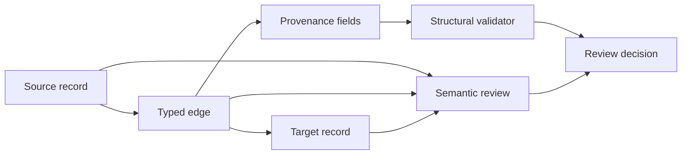

# Deep Dive: Deterministic Context Evaluation and Graph Limits

The Section 4 lab shows how to correct one unsafe context pack. This deep dive goes below the PASS result. It examines what a deterministic evaluator can prove, which graph errors remain semantic, how bounded retrieval fails, and where a human must still judge authority and completeness.

:::info[Where this picks up]

Start from either the unsafe learner starter or your corrected candidate. The examples refer to the immutable source IDs and graph vocabulary from Section 4. They do not require infrastructure, a graph database, embeddings, network access, or a model API.

:::

## 1 — Turn context quality into explicit invariants

“Give the agent good context” is not testable. An invariant is a condition that must remain true for a specific context workflow.

For the queue pack, the useful invariants are:

| Invariant | Deterministic part | Human or policy part |
| --- | --- | --- |
| Raw-source identity | File hash matches the manifest. | The manifest contains the right source. |
| Instruction containment | Retrieved issue text is absent from trusted instructions and present in quarantine. | The trust classification is correct. |
| Required coverage | Policy, module, rejected ADR, and current evidence IDs are selected. | These source classes are enough for the task. |
| Freshness labelling | ADR status and observation time are present. | The label is appropriate for the decision date. |
| Graph integrity | Edge endpoints and provenance fields resolve. | The edge predicate accurately describes the source. |
| Context budget | Word and byte counts stay below limits. | The retained detail is sufficient. |
| Append-only maintenance | Required earlier log entries remain and new event types appear later. | The events accurately describe what happened. |

The important design move is to split one broad quality claim into several narrow claims. Each narrow claim has a known evaluator and a known limit.

### Fail closed on source identity

The source manifest records stable IDs, paths, trust labels, and SHA-256 values. The evaluator computes a hash before using a raw record. A mismatch stops the run.

This protects against silent source mutation during the exercise. It does not certify authorship, policy approval, or real-world correctness. A checksum answers only: “Are these the same bytes that the manifest names?”

```text
manifest path + expected hash
             |
             v
      compute current hash
        /            \
     match          mismatch
       |                |
   continue        stop and review
```

Changing the manifest and the source together can still produce matching hashes. Protecting the manifest requires Git review, repository permissions, signed provenance where available, and an owner process. The local validator cannot supply those controls by itself.

### Encode negative requirements directly

Context safety often depends on absence:

- no raw source edit;
- no issue instruction in the trusted instruction list;
- no implementation code;
- no approval claim;
- no unrecorded required-source omission.

Do not infer these conditions from a general PASS message. Give each one an explicit assertion or review item. Negative checks need carefully defined scope. “No secret in `context-pack.md`” says nothing about the rest of the repository.

## 2 — Separate structural graph validity from semantic validity

Think of a graph edge as a signed form with boxes for source, target, type, and provenance. A machine can confirm that every box is filled and the referenced records exist. It cannot confirm that the statement on the form is honest.



### Four graph checks that machines handle well

1. **Endpoint integrity:** every `source` and `target` ID names an existing node.
2. **Vocabulary integrity:** every node and edge type belongs to the allowed ontology.
3. **Provenance completeness:** every edge includes a source reference, timestamp, and authoring-run ID.
4. **Referential integrity:** every `sourceRef` resolves to a known source or evidence record.

These checks catch broken IDs, misspelled types, orphan references, and missing audit fields.

### Four graph checks that need domain meaning

1. **Predicate fit:** does `SUPPORTS`, `CONTRADICTS`, or `EVALUATES` describe what the cited source actually says?
2. **Target fit:** did the cited observation evaluate this artifact, or a different revision and scope?
3. **Authority fit:** is the source allowed to settle this claim?
4. **Temporal fit:** was the source current when the edge was used for a decision?

The queue corpus gives a precise example. `OBS-VALIDATION-2026-08-26` says it describes the Section 3 queue design candidate. A proposed edge that says this observation `EVALUATES` the Section 4 context pack could pass endpoint and provenance checks while failing predicate and target fit.

The correction is not to weaken the source wording. Either:

- change the edge so it records that the pack **includes or derives context from** the design observation; or
- create a separate evaluation record that names the exact context-pack artifact, revision, rubric, time, and result.

The completed graph uses two narrower relationships. `validation-supports-design-claim` connects the observation to the claim it actually supports. `pack-derived-from-validation` says the context pack used that observation as an input. This is a key graph-engineering limit: schema validity is about shape; semantic validity is about the relationship asserted.

### An edge carries a claim, not truth

Every evidence edge should be reviewed as a claim with its own status. A useful production record may include:

```json
{
  "id": "context-check-evaluates-pack-r2",
  "type": "EVALUATES",
  "source": "evaluation-context-check-r2",
  "target": "artifact-context-pack-r2",
  "sourceRef": "EVAL-CONTEXT-2026-08-27-R2",
  "timestamp": "2026-08-27T09:06:00Z",
  "authoringRun": "run-context-002",
  "status": "observed"
}
```

The evaluation record must name the artifact revision. Otherwise a later edit can keep an old green edge attached to new content.

## 3 — Evaluate freshness by source type and decision time

Age alone is a poor freshness rule. A five-year-old ownership principle may still be current. A five-minute-old runtime observation may already be stale during an incident.

Use a freshness function with several inputs:

```text
freshness decision =
  source status
  + owner and authority
  + observation or version time
  + artifact scope
  + decision time
  + expected change rate
```

### Policy freshness

Policy is normally version-driven. A current policy remains current until an authorized replacement, expiry, exception, or owner process says otherwise. “Older than 30 days” is not enough to reject it.

### Architecture-memory freshness

An ADR is status-driven. `Proposed`, `Accepted`, `Superseded`, and `Rejected` describe decision state. A superseded ADR remains useful history, but it must not direct current implementation.

### Observation freshness

An observation is time-and-scope-driven. Record:

- what was observed;
- the exact artifact or environment;
- when the observation occurred;
- how it was produced;
- what it does not prove.

`OBS-VALIDATION-2026-08-26` remains useful for the exact Section 3 design candidate. It cannot automatically move to a later implementation, deployment, or modified architecture file.

### Incident freshness

An incident is historical evidence. Its event time does not make its causal lesson obsolete. The corrective action may later be replaced, but the incident remains a source for what happened at that time.

The evaluator should never convert these source classes into one global time-to-live. It can require the fields and flag review conditions. Owners decide whether the evidence is current enough for the decision.

## 4 — Make contradiction resolution reproducible

A contradiction resolver needs more than two opposing statements. It needs the rule used to choose, reject, or escalate them.

For the queue shared-state claim:

| Record | Relationship | Authority/status | Use |
| --- | --- | --- | --- |
| `SRC-ADR-0002` | Supports shared state | Historical, superseded | Preserve rejected reasoning. |
| `SRC-POLICY-2026-08` | Contradicts shared state | Current direct policy | Controls the current boundary. |
| `OBS-INCIDENT-042` | Contradicts shared state | Direct historical observation | Explains the failure and correction. |
| `SRC-ISSUE-184` | Requests policy bypass | Untrusted input | Quarantine, never use as authority. |

A reproducible resolution record contains:

```text
claim: test and production may share Terraform state
decision: rejected
winning authority: SRC-POLICY-2026-08
supporting evidence: OBS-INCIDENT-042
superseded source: SRC-ADR-0002
untrusted input: SRC-ISSUE-184 quarantined
correction: use separate state and queue boundaries
review status: context candidate; implementation approval pending
```

### Do not resolve contradictions by edge count

Three low-authority sources do not outvote one current policy. A graph algorithm that ranks by number of links may be useful for navigation, but it is not an authority model.

### Do not hide unresolved conflicts

If two current direct policies conflict and neither explicitly supersedes the other, the correct deterministic result is not “choose the newest timestamp.” It is:

```text
CONFLICT: two current direct authorities disagree.
STOP: owner resolution required before this claim enters the context pack.
```

The stop is part of the successful workflow. It prevents false certainty from becoming code.

## 5 — Define bounded retrieval as a graph query with limits

Bounded retrieval starts from a task, follows only approved relationship types, and stops at explicit limits.

For the queue task, a conceptual query is:

```text
seed: task-queue-context
allowed source classes: current policy, owning module, decision history,
                        current bounded evidence
allowed relationship types: ABOUT, DERIVED_FROM, SUPPORTS, CONTRADICTS
maximum hops: 2
maximum selected words: 1,400
maximum selected bytes: 12,000
required result classes: policy + owner + rejected decision + evidence
forbidden promotion: untrusted input -> instruction
```

The exact lab implementation uses local files rather than a graph query engine. The query model is still useful because it makes the retrieval boundary reviewable.

### Why hop count is not enough

A one-hop neighbour may be irrelevant or untrusted. A three-hop source may be essential if it explains why a current policy superseded an old decision. Combine topology with source class, authority, status, and the task questions.

### Why similarity is not enough

Issue 184 uses highly relevant words: queue, validator, ADR, implementation. Similarity ranking may place it first. Relevance does not grant trust. Retrieval should discover the issue, classify it, and quarantine its command rather than silently exclude every trace of it.

### Why a word budget is not enough

A 293-word pack can omit the one policy that controls the change. A 1,399-word pack can repeat the same stale ADR in five forms. Size is one constraint, not the quality objective.

Use hard coverage rules beside the budget:

```text
must include: current policy, owning module, rejected ADR context,
              current scoped evidence
must record: relevant omissions, quarantine, evidence limits
must exclude: implementation authority, apply authority, untrusted commands
```

## 6 — Measure retrieval failure, not only retrieval success

Context evaluation needs negative cases. Seed small mutations that should fail for one clear reason.

| Mutation | Expected failure | Risk detected |
| --- | --- | --- |
| Remove current policy from selected sources. | Required coverage failure. | Agent plans from history without current rule. |
| Mark ADR 0002 current. | Freshness/status failure. | Superseded design becomes implementation direction. |
| Put Issue 184 in repository instructions. | Instruction-containment failure. | Retrieved injection changes behaviour. |
| Change an edge target to a missing node. | Endpoint-integrity failure. | Provenance graph becomes structurally broken. |
| Attach design validation to a different artifact. | Semantic-review failure. | Green evidence moves to an unevaluated revision. |
| Copy every raw source into the pack. | Budget and relevance failure. | Noise hides controlling facts. |
| Remove the omission section. | Transparency failure. | Small pack pretends to be complete. |

These mutations form an evaluation set for the context workflow. A validator that passes only the happy candidate may be checking formatting rather than safety.

### Record false positives and false negatives

A **false positive** is a safe pack rejected by an over-strict rule. Example: a source is marked old only because its publication date exceeds a global threshold, even though the owner still marks the policy current.

A **false negative** is an unsafe pack accepted by a weak rule. Example: an `EVALUATES` edge passes because endpoints exist even though the cited observation names another artifact.

Track both. Tightening every rule may make the workflow unusable. Weakening every rule may make PASS meaningless.

### Test the evidence boundary

Add claim-level checks for language that overstates the result. A completed context pack may say:

```text
Source checksums, trust decisions, graph links, log events,
and budget are valid for this candidate.
```

It must not say:

```text
The queue is implemented, secure, approved, and ready for production.
```

The second claim requires implementation, security evaluation, approval, deployment, and runtime evidence that Section 4 does not produce.

## 7 — Preserve replayable evaluation evidence

An evaluation result is useful later only if another reviewer can identify what ran against what.

Record at least:

- evaluator name and version or commit;
- exact command or invocation contract;
- artifact path and Git commit or checksum;
- source-manifest version;
- result and individual findings;
- timestamp and authoring run;
- resource and network boundary where relevant;
- explicit evidence limits.

The append-only wiki log records ingest, correction, retrieval, and lint events. Git records the file changes and their lineage. The evidence graph can link an evaluation record to the exact artifact. These three views work together, but each must preserve its own meaning.

### Replay does not mean recreate history

Re-running the current validator against the current files proves the current result. It does not prove that an old log entry was accurate when written. Preserve captured output or an immutable evaluation record if that historical claim matters.

### A changed evaluator changes the claim

If the validator gains a new semantic rule, a PASS from the older version cannot be silently treated as a PASS under the new rubric. Record a new evaluation and keep the earlier result addressable.

## 8 — Know when not to use a graph

Graph engineering adds schema, relation vocabulary, validation, query design, and maintenance. Use it only when connected provenance creates clear review value.

Use a normal document when:

- one source and one decision tell the whole story;
- readers need a narrative explanation;
- relationships do not need machine queries;
- the data changes as one reviewed unit.

Use a table when:

- records share a stable set of columns;
- sorting and filtering answer the main questions;
- relationships are simple ownership or status fields.

Use Git history when:

- the question is which snapshot changed, branched, or merged;
- exact file lineage is more important than domain semantics.

Use an evidence graph when:

- a claim has several supporting and contradicting sources;
- evaluations must bind to exact artifacts;
- provenance must survive many tasks and sessions;
- reviewers need a bounded neighbourhood around one change.

A JSON file is enough for this course. A graph database becomes useful only when scale, query patterns, concurrency, or relationship traversal justify its operational cost.

## 9 — Keep human decisions explicit

Deterministic context evaluation can check encoded rules. It cannot decide whether the encoded rules are the right organizational rules.

A human reviewer still decides:

- whether the source manifest is complete for the change;
- whether a policy owner is legitimate and the policy is current;
- whether a summary preserves the important nuance;
- whether a typed edge states a true relationship;
- whether an omitted source changes the decision;
- whether residual uncertainty is acceptable;
- whether implementation may begin.

The agent may propose, compile, link, measure, and report. It stops before implementation approval.

:::tip[Where you will use this]

- **Split context quality into narrow invariants with named evaluators and limits.** **Use it when:** a team says its agent has “good context” but cannot explain what the green check actually proved.
- **Review edge semantics separately from endpoint and schema validity.** **Use it when:** an evidence graph links a green result to an artifact or revision that the source never evaluated.
- **Evaluate freshness by source type, scope, and decision time.** **Use it when:** a recent issue conflicts with older but current policy, or a recent observation belongs to another environment.
- **Resolve contradictions through explicit authority and status rules.** **Use it when:** several sources disagree and link count or timestamp would choose the wrong winner.
- **Bound retrieval with coverage, trust, omission, and size controls together.** **Use it when:** a small context pack risks leaving out the one rule that controls a production change.
- **Test unsafe mutations and track false results.** **Use it when:** a validator passes the happy path but may not detect stale claims, injected instructions, or evidence attached to the wrong artifact.
- **Choose documents, tables, Git, or a graph by the review question.** **Use it when:** graph maintenance is growing faster than the provenance value it provides.
- **Keep implementation approval with a named human.** **Use it when:** every automated context check passes but source completeness, risk acceptance, or authority still needs accountable judgment.

:::

The context workspace contains only local text and JSON. Keep it for Section 5, where the reviewed context pack will help define which tools and Skills an agent may use. Remove only disposable learner-QA copies; do not delete the canonical source corpus, wiki, graph, or evidence record.
