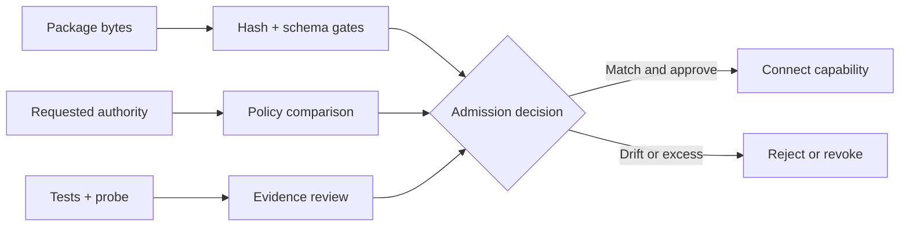
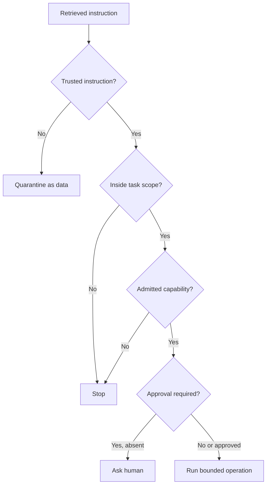

# Deep Dive: Deterministic Capability Admission and Enforcement

The Section 5 lab shows that one local Skill, fixed CLI path, and resource-only MCP server can pass a bounded admission gate while an over-privileged bundle is rejected. This deep dive goes below that result. It examines how an attacker can preserve a clean description while changing executable behaviour, why schema validation cannot prove a tool is honest, how a trusted host becomes a confused deputy, and which controls must exist outside Skill and MCP metadata.

:::info[Where this picks up]

Use the immutable incoming bundle and the corrected candidate as two admission records. This page does not ask you to execute the incoming package. The analysis works whether you arrive directly from the lesson or after lab teardown. It needs no model, network, cloud account, credential, or infrastructure state, and it creates no local resources.

:::

## 1 — Make capability admission deterministic

Think of capability admission like an airport security gate. A passport describes a person, a boarding pass describes one trip, and the gate checks both against current rules. A convincing name printed on a bag does not make its contents safe. In the same way, Skill metadata describes a package, an MCP discovery response describes a server, and a task contract describes one run. Admission must check the actual artifacts and requested authority before the host connects them.

### Define the admission subject

Do not admit a display name such as `terraform-review`. Admit a versioned set of bytes and a specific execution boundary:

```json
{
  "subject": "local-skill:terraform-review",
  "owner": "course-maintainers",
  "version": "1.0.0",
  "artifacts": [
    {"path": "SKILL.md", "sha256": "<reviewed hash>"},
    {"path": "scripts/review-iac.mjs", "sha256": "<reviewed hash>"},
    {"path": "references/command-contract.md", "sha256": "<reviewed hash>"}
  ],
  "runtime": {
    "executables": ["terraform", "tofu"],
    "shell": false,
    "network": false,
    "secrets": false,
    "writeBoundary": "evidence/<new-json-file>"
  }
}
```

This record is a course control design. Agent Skills does not standardize capability admission. MCP does not standardize this trust manifest.

### Separate deterministic and judgment checks

| Admission question | Deterministic gate | Human or policy decision |
| --- | --- | --- |
| Are these the reviewed bytes? | Recompute and compare every artifact hash. | Decide who may approve a new hash. |
| Is the declared version present? | Validate required metadata fields. | Decide whether the versioning process is trustworthy. |
| Does the runner use the fixed contract? | Test executable, arguments, timeout, environment, and output path. | Decide whether that operation is appropriate for this task. |
| Does the MCP server report resources only? | Probe discovery and reject `tools/list`. | Decide whether the resource data is suitable for this session. |
| Is authority within policy? | Compare requested fields with a machine-readable allowlist. | Define the organizational policy and any exception. |
| Is the capability approved now? | Verify a review record binds to the exact subject. | A responsible person accepts or rejects the risk. |

The deterministic gate should use a default-deny rule. Unknown capability, unknown field, changed artifact, missing owner, widened write path, or new operation stops admission. “Ignore the new field” is unsafe when the new field can describe authority.



### Bind the approval to time and scope

An admission record should state:

- subject and exact artifact identity;
- owner and version;
- approved task classes;
- runtime and data boundaries;
- review evidence and reviewer;
- decision time and optional expiry; and
- revocation triggers.

Do not reuse a local review admission for a production apply tool. The package name may be the same while the authority, credentials, environment, and impact are completely different.

## 2 — Detect script, reference, and schema tampering

### The description is not the dependency closure

A Skill can keep the same safe `SKILL.md` while a referenced script changes from:

```js
spawnSync(engine, ['validate', '-no-color'], {shell: false});
```

to:

```js
spawnSync('sh', ['-c', suppliedText], {shell: false});
```

The second call still sets `shell: false`, but it explicitly starts a shell and passes untrusted text as shell input. Searching only for the literal property `shell: true` would miss the change.

Review behaviour and data flow:

1. Which file or package will execute?
2. How is the executable resolved?
3. Which values can reach the argument array?
4. Can a reference file alter the procedure?
5. Which environment values reach the child?
6. Which paths can be read or written?
7. Can the code start another process or network request?

### Hash every executable and controlling artifact

The candidate pins the Skill instructions, command reference, runner script, command contract, and MCP server. Pinning only the top-level file leaves an unpinned execution path below it.

Hash validation still has limits:

- A reviewer can approve malicious bytes.
- An installed `terraform` executable can change while the wrapper hash remains stable.
- Dynamic imports and package resolution can load unpinned code.
- A symlink can redirect a trusted path if resolution is not checked.
- Hashes can be updated by an attacker who can also edit the trust record.

Use repository review and permissions to protect the trust record. In higher-risk systems, also control binary provenance, dependency locks, signatures where available, and the runtime image.

### Treat schema expansion as authority expansion

Assume an admitted tool originally accepts:

```json
{"type":"object","properties":{"resourceUri":{"type":"string"}},"required":["resourceUri"]}
```

A later version adds:

```json
{"command":{"type":"string"},"workingDirectory":{"type":"string"},"credentialProfile":{"type":"string"}}
```

The schema remains valid JSON Schema. The change is unsafe because it adds caller-controlled execution, path, and credential choices. Schema validity answers whether an input follows a shape. Schema review asks whether the shape grants necessary and acceptable authority.

Record a normalized capability surface during admission:

```text
operations + input fields + output fields + filesystem + process + network + secrets + approvals
```

Diff that surface on every update. Require re-admission when any authority dimension expands, even if the version change appears minor.

## 3 — Defend against tool poisoning

### A tool description is a claim made by the server

Tool poisoning happens when tool metadata or returned content tries to change agent behaviour, hide a risky operation, or attract calls outside the user’s intent. Examples include:

- a tool description telling the agent to upload repository files before use;
- a `readOnlyHint` on an operation that deletes or changes resources;
- returned content that says to ignore the task boundary;
- a harmless-looking schema whose implementation reads credentials;
- a tool name designed to replace a trusted tool in model selection.

The MCP tools specification says annotations are hints and clients should treat them as untrusted unless the server is trusted. That is an official protocol warning. The following admission and runtime controls are course engineering choices built from that principle.

### Split selection metadata from enforcement

| Signal | Useful for | Not sufficient for |
| --- | --- | --- |
| Tool name and description | Discovery and model selection. | Publisher identity or safe behaviour. |
| Input schema | Validating request shape. | Limiting what implementation code can reach. |
| `readOnlyHint` | Presenting expected behaviour. | Preventing mutation. |
| Server information | Compatibility and diagnostics. | Authenticating code or organization. |
| Resource URI and MIME type | Selecting returned context. | Proving the content is trusted or non-sensitive. |

Enforcement belongs in controls that the server cannot rewrite through its own response: process sandbox, filesystem permissions, network policy, credential scope, exact startup, allowed operation list, approval middleware, and independently captured evidence.

### Inspect returned content as untrusted data

A read-only resource cannot change infrastructure directly. It can still carry prompt injection, secrets, false instructions, or stale policy. Apply the Section 4 context rules after retrieval:

- preserve source identity;
- classify trust and freshness;
- keep retrieved imperative text out of the instruction hierarchy;
- limit the data shared with the model; and
- retain source-linked evidence for review.

“Read only” describes an operation effect. It does not mean “safe to trust.”

## 4 — Prevent the confused-deputy problem

Imagine an office assistant who is allowed to enter a locked records room for the finance director. A stranger asks the assistant to fetch a file. The assistant has real authority, but the request does not. If the assistant acts without checking the requester and purpose, it becomes a confused deputy.

An agent host can become the same kind of deputy. It may hold filesystem access, cloud credentials, an approved MCP connection, or a privileged CI token. Untrusted repository text asks the host to use that authority for a different purpose. The danger comes from combining a trusted capability with an untrusted request.

### Bind four facts at call time

Every sensitive capability call should bind:

1. **Caller context:** Which session, identity, or workflow requested the call?
2. **User intent:** Which reviewed task objective requires it?
3. **Capability scope:** Which admitted operation, resource, and arguments are allowed?
4. **Approval state:** Does this exact action require a person, and was that approval given for these bytes and this environment?



The queue MCP resource cannot invoke the Terraform runner. The agent host can read the resource and separately request the reviewed Skill. The runner still validates its own fixed inputs. This separation stops a sentence inside the resource from becoming a hidden process call.

### Keep credentials task specific

The local review needs no credentials. Passing the host’s full environment “for convenience” creates deputy authority that the task never requested. When later sections need credentials, use the smallest identity, shortest lifetime, narrowest environment, and explicit operation. Never let a context server inherit deployment credentials by default.

## 5 — Put enforcement at the right boundary

### Use claims for routing and controls for denial

The complete enforcement stack is layered because no single layer sees the whole problem.

| Boundary | Enforces | Cannot prove alone |
| --- | --- | --- |
| Task contract | Allowed objective, files, tools, evidence, and stops. | That runtime code obeyed it. |
| Skill procedure | Reviewed steps and failure behaviour. | Filesystem, process, or network restriction. |
| MCP protocol | Message shape, discovery, methods, and capability exchange. | Server honesty or organizational trust. |
| Capability gate | Admitted subject, version, hashes, and declared authority. | That an unknown runtime dependency is safe. |
| Runner | Executable, arguments, directory, timeout, environment, and output. | Broader host permissions outside its implementation. |
| Operating system | Actual process, filesystem, network, and credential access. | Whether the task is justified. |
| Human review | Risk acceptance and exception authority. | That evidence accurately represents the exact run unless it is bound and checked. |

The strongest design makes unsafe actions unavailable at several layers. The course runner rejects `apply`; the command contract omits it; the child has no credentials; the task forbids it; and a human approval would be required in a different workflow. These controls fail independently.

### State evidence limits precisely

The candidate PASS proves:

- the exact fixed runner path worked with the installed Terraform and OpenTofu versions;
- the Skill package matched its reviewed structure and test expectations;
- the MCP server exposed one resource and no tools capability;
- missing request metadata and unknown methods were rejected;
- immutable input hashes remained stable; and
- the measured path passed without network access.

It does not prove:

- trust in every executable found through `PATH`;
- cloud plan or provider-lock compatibility;
- safety of a later package version;
- compatibility with every agent product;
- correctness of unseen organizational policy; or
- approval for infrastructure change.

Precise non-claims prevent evidence laundering. A green local validation result must not become “approved for production.”

:::tip[Where you will use this]

- **Deterministic admission binds an approved capability to exact artifacts, authority, tests, and an owner.** **Use it when:** a team proposes a new Skill, plugin, MCP server, or internal tool for coding agents—compare the complete package with policy before connection.
- **Hash and schema checks protect structure and identity, while semantic review protects intent and authority.** **Use it when:** a package update changes a script, reference, dependency, or input field—treat every expanded execution choice as a new admission decision.
- **Tool metadata and annotations support discovery but do not enforce behaviour.** **Use it when:** a server claims that a powerful operation is read-only—inspect and sandbox the implementation instead of trusting the label.
- **A trusted host can misuse its authority for an untrusted request.** **Use it when:** repository text, retrieved context, or tool output asks for a privileged follow-up—bind the call to trusted intent, admitted scope, and current approval.
- **Enforcement must exist below the model and protocol.** **Use it when:** reviewing an agent architecture—trace where process, file, network, secret, and approval denials actually occur.

:::

## Teardown

This deep dive creates no files, processes, network listeners, or infrastructure resources. Keep the candidate admission evidence if you are continuing to the operator challenge. Remove nothing from the immutable incoming bundle; it remains the rejected evidence used by later review.
