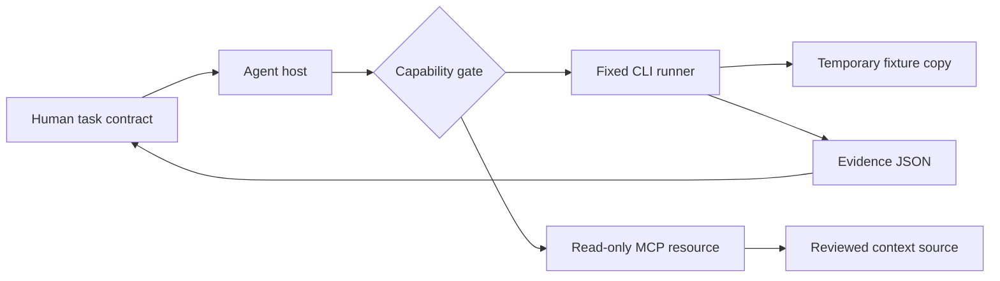
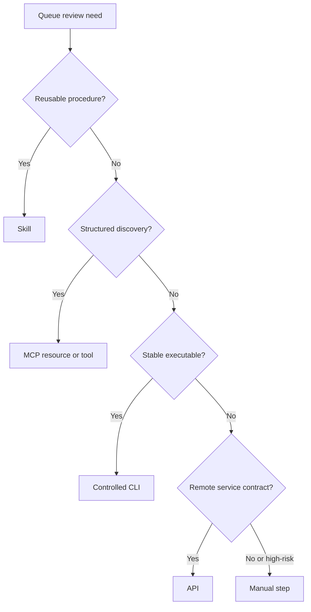
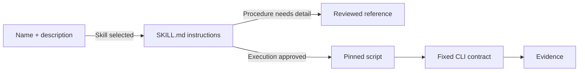
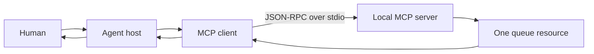
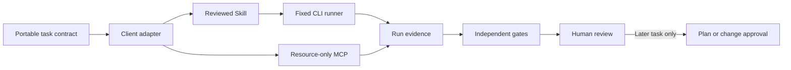

import Slides from '@site/src/components/Slides';

# Connect Your IaC Agent to Tools, Skills, and MCP

The queue design now has a bounded task and trusted context. The next question is practical: how should an agent use that context and run the checks? A model cannot validate Terraform by thinking about it. It needs a capability that reaches the Terraform or OpenTofu executable. That connection is also where a useful assistant can become an unsafe operator.

This section builds one controlled queue-review capability. You will compare five routes, place exact controls around the CLI, package the procedure as an Agent Skill, expose one read-only context resource through MCP, and make an admission decision about an unsafe third-party bundle. The workflow is agent neutral. Codex can demonstrate it, while Claude Code, Goose, Cursor, Copilot, VS Code, or another compatible client can use the same task contract and independent checks.

<Slides src="decks/m5-connect-iac-agent-tools-skills-mcp.html" title="Section 5: Connect Your IaC Agent to Tools, Skills, and MCP" />

## 1. Capability Boundaries for Agents

### The model describes work; a capability can perform work

Suppose the model says, “I will validate `main.tf`.” That sentence changes nothing. A runner, tool, or human must start the executable, choose its arguments, select a working directory, pass an environment, capture output, and decide what happens next.

Keep these layers separate:

| Layer | Queue-review responsibility | Security question |
| --- | --- | --- |
| Model | Interpret the task and propose the next step. | Can model text expand authority? It must not. |
| Agent host | Manage the session, context, approval, and capability calls. | Which capabilities may this session reach? |
| Capability adapter | Translate an approved request into a fixed operation. | Can untrusted input alter command, scope, or destination? |
| Operating-system boundary | Enforce process, file, network, and credential access. | What can the process actually reach? |
| Human approval | Accept risk for actions outside the pre-approved review scope. | Who may authorize a real infrastructure change? |

The queue-review task permits inspection and validation. It does not permit `plan`, `apply`, `destroy`, state access, network access, or credentials. A Skill file that says “review only” does not enforce this boundary. The runner and operating system must make the dangerous path unavailable.



### Authority is an intersection

The effective authority is the narrowest combination of four limits:

```text
effective authority = task scope ∩ admitted capability ∩ runtime permissions ∩ approval state
```

If the task permits validation but the process has cloud credentials and arbitrary shell access, the system is over-privileged. If a tool description claims read-only behaviour but its implementation can delete files, the description is not a control. If a human approves one evidence file, that approval does not authorize a later artifact with different bytes.

**Operator takeaway:** Review the connection between the model and the real system. A safe prompt cannot compensate for an unsafe execution boundary.

**Next:** Choose the smallest route that fits the work instead of using the most powerful integration by default.

## 2. CLI, API, MCP, Skill, or Manual Step?

### Start with the decision, not the technology

The same queue-review task can follow five routes. Each route solves a different problem.

| Route | Best fit | Structure | Network | Mutation risk | Normal approval point |
| --- | --- | --- | --- | --- | --- |
| CLI | Stable local command with portable evidence. | Arguments, exit code, stdout, stderr. | Not required for local checks. | Depends on command and permissions. | Before any command outside the allowlist. |
| API | Stable remote service with identity and a defined contract. | Request and response schema. | Usually required. | Depends on endpoint and token scope. | Before a mutating or costly request. |
| MCP | A client needs discoverable context or narrow tools from a server. | Protocol methods and schemas. | Transport dependent; stdio can stay local. | Resources may read; tools may act. | Before sensitive data access or tool execution. |
| Skill | A reusable procedure should be discovered and followed consistently. | Metadata, instructions, references, scripts, assets. | Depends on the procedure. | A Skill may direct other capabilities. | At admission and at any risky action. |
| Manual step | Judgment, legal authority, exception handling, or irreversible risk stays with a person. | Review record or approval. | Depends on the system. | Human-controlled. | The step itself is the gate. |

These routes can be combined. The course Skill explains the review procedure. Its script calls the CLI through a fixed runner. MCP supplies one reviewed Markdown resource. A human reviews the evidence. Combining routes does not combine their authority automatically.

### Apply five selection questions

1. **Is the operation stable and locally executable?** Prefer a controlled CLI when exact arguments and exit codes are valuable.
2. **Does the client need structured discovery?** Consider MCP when it must discover a resource or tool without vendor-specific wiring.
3. **Is the main need a reusable procedure?** Use a Skill to package instructions and supporting resources.
4. **Does the operation require remote identity, quota, or service semantics?** A narrow API may be clearer than wrapping it in a broad general-purpose connector.
5. **Does the decision carry authority that software should not hold?** Keep it manual.



### The five-route queue decision

For this section:

- Use the **CLI** for `fmt`, offline initialization, and validation because the commands and evidence are stable.
- Use a **Skill** for the reviewed procedure, stop conditions, and progressive loading.
- Use an **MCP resource** for source-linked queue context because the client needs structured, read-only retrieval.
- Do not add an **API** because no remote service is required.
- Keep **admission and later infrastructure change approval** manual.

**Operator takeaway:** Pick the least powerful route that gives the task enough structure and verifiable output.

**Next:** The CLI is portable, but only after we remove its hidden degrees of freedom.

## 3. CLI as the Portable Execution and Evidence Plane

### A CLI command is a capability contract

The unsafe pattern is “let the agent run Terraform.” That leaves the executable, subcommand, arguments, directory, environment, duration, output, and next step open to model-generated text.

The course runner replaces that open request with one reviewed contract:

```json
{
  "workingDirectory": "section-5/fixture",
  "shell": false,
  "timeoutMs": 30000,
  "allowedExecutables": ["terraform", "tofu"],
  "commands": [
    ["fmt", "-check", "-diff", "main.tf"],
    ["init", "-backend=false", "-input=false", "-no-color"],
    ["validate", "-no-color"]
  ],
  "forbiddenOperations": ["plan", "apply", "destroy", "state"]
}
```

This JSON is a **course engineering control**, not a Terraform, OpenTofu, Agent Skills, or MCP standard.

### Control every input to process creation

| Control | Queue-review implementation | Failure prevented |
| --- | --- | --- |
| Executable allowlist | Only `terraform` or `tofu`. | Prompt chooses `bash`, `curl`, or an unknown binary. |
| Fixed argument arrays | Three reviewed arrays; no extra arguments. | Injection adds `apply`, changes a directory, or loads a remote module. |
| No shell | Process starts with `shell: false`. | Metacharacters become a second command. |
| Bounded working copy | Runner copies one HCL file into a temporary directory. | Validation reads or writes unrelated repository files. |
| Timeout | Each command stops after 30 seconds. | A hung child keeps the agent loop alive. |
| Minimal child environment | Only required paths and automation flags are passed. | Ambient cloud and package credentials leak into the child. |
| Separate output streams | Standard output and error remain distinct. | A reviewer cannot identify warnings or failure details. |
| Redaction | Common secret-shaped values are masked before persistence. | Accidental sensitive output reaches the evidence file. |
| New-file-only evidence | One JSON name inside the evidence directory. | The runner overwrites a source or follows a link outside scope. |

The primary secret control is **not passing secrets**. Redaction is defense in depth because no pattern catches every secret.

### Evidence must bind to the exact run

A terminal `PASS` is convenient but incomplete. The evidence record should include:

- engine and reported version;
- exact argument arrays;
- working-directory policy;
- source and command-contract hashes;
- start or duration information;
- exit code and timeout result for each command;
- separate redacted stdout and stderr; and
- an overall result.

```text
task contract
    |
    v
fixed argv runner --> temporary fixture --> terraform/tofu
    |                                      |
    +---------- source + contract hashes --+
                       |
                       v
                  evidence JSON
```

The live candidate produced the same source and contract hashes with Terraform 1.14.8 and OpenTofu 1.12.6. All three exit codes were zero. This proves the exact provider-free review path for that candidate. It does not prove a cloud plan, provider-lock compatibility, deployment, or approval.

### Portability does not mean safety

Nearly every coding agent can ask a host to run a CLI command. That makes CLI a durable interface. It does not make arbitrary shell access safe. Portability is about availability. Safety comes from the exact runner contract and runtime boundary.

**Operator takeaway:** Treat process creation as an API. Fix every field you can, reject every field the task does not need, and preserve enough evidence for an independent replay.

**Next:** Package this reviewed procedure so an agent can discover it without loading every supporting file at session start.

## 4. Build an Agent Skill for Terraform Review

### A Skill packages procedure, not permission

The official [Agent Skills specification](https://agentskills.io/specification) defines a Skill as a directory with a required `SKILL.md`. The frontmatter requires `name` and `description`. `license`, `compatibility`, `metadata`, and `allowed-tools` are optional. Supporting `scripts/`, `references/`, and `assets/` directories are optional.

The course Skill uses this layout:

```text
terraform-review/
├── SKILL.md
├── references/
│   └── command-contract.md
├── scripts/
│   └── review-iac.mjs
└── tests/
    └── review-iac.test.mjs
```

`tests/` is a **course engineering addition**. It is not a required Agent Skills directory. We add it because a procedure that can start infrastructure tools must have regression evidence.

### Use progressive disclosure

Agent Skills uses three loading levels:

1. Clients can load the **name and description** at startup for discovery.
2. The agent reads the full **`SKILL.md` instructions** when the Skill becomes relevant.
3. It loads **references, scripts, and assets** only when the procedure needs them.

This reduces context cost and separates the stable procedure from detailed reference material. It is also a trust boundary: a useful description does not make every linked script safe. Admission must inspect the full reachable package.



### Make inputs and stops explicit

The queue-review Skill accepts only:

- one engine name: `terraform` or `tofu`;
- the fixed fixture already named by the repository; and
- one simple new JSON filename inside the evidence directory.

It does not accept a command, shell fragment, working directory, path, or extra Terraform argument. It stops if the task asks for network access, secrets, state access, a different directory, changed arguments, or infrastructure change.

The Skill also explains its outputs. An agent must return the engine, version, exit codes, hashes, and result instead of converting a successful process exit into a broad statement such as “the infrastructure is safe.”

### `allowed-tools` is not portable enforcement

The official specification labels `allowed-tools` as experimental and notes that support may vary between clients. It can help a compatible client understand intended tool use. It must not be treated as an operating-system permission boundary. The course enforces authority in the runner, process environment, filesystem boundary, and human approval step.

**Operator takeaway:** A Skill makes a procedure discoverable and repeatable. It grants no authority that the task, admitted capabilities, runtime, and human approval do not already provide.

**Next:** A useful Skill must have an owner, a tested release, and a clear removal path.

## 5. Test, Version, Own, and Revoke Skills

### Treat the complete reachable package as code

Reviewing only `SKILL.md` misses the most important risk. Its instructions can point to scripts, references, assets, package installers, and external endpoints. Review the dependency closure: every artifact the procedure may load or execute.

| Admission field | Why it matters | Queue-review value |
| --- | --- | --- |
| Owner | Someone answers for review and repair. | `course-maintainers` |
| Version | Reviews refer to a named release. | `1.0.0` |
| Artifact hashes | Execution binds to reviewed bytes. | SHA-256 for Skill, reference, runner, contract, and MCP server. |
| Compatibility | Unsupported runtime combinations are visible. | Node.js 20+, Terraform 1.14 or OpenTofu 1.12. |
| Tests | Changes can be checked against safety and function. | Eight candidate tests plus independent validator and probe. |
| Authority | The allowed process and write boundary are explicit. | Fixed review commands; one new evidence file. |
| Revocation | Trust can be removed when assumptions change. | Remove admission and rotate pins. |

Version and hash solve different problems. A version gives humans a release identity. A hash identifies exact bytes. A maintainer can accidentally reuse a version after changing a script; the hash exposes that drift.

### Test failures, not only the happy path

The candidate tests cover:

- required Skill structure and reviewed references;
- rejection of unknown engines and extra arguments;
- evidence path confinement and no-overwrite behaviour;
- output redaction and child-environment filtering;
- both real IaC engines;
- trust pins and admission decisions; and
- forbidden operations.

The no-network replay passed while macOS denied network access to Node and its children. That result matters because “the procedure does not need network” is weaker than “the measured path still passes when network is unavailable.”

### Revoke on changed assumptions

Revocation is the opposite of admission. Trigger it when:

- any pinned artifact hash drifts without review;
- ownership changes or no active owner remains;
- requested authority expands;
- a required test fails;
- a dependency or implementation vulnerability is reported; or
- the operating environment no longer supports the stated boundary.

Remove the admission before investigating an urgent trust failure. Re-admit a corrected release with new review evidence and new hashes. Do not silently update the trusted hash to make a gate green.

**Operator takeaway:** Skill validity means the package follows a format. Operational trust requires ownership, review, tests, exact artifact identity, bounded authority, and revocation.

**Next:** MCP gives clients a standard way to discover context and tools. We will use only the resource part of that boundary.

## 6. MCP for Narrow Context and Tool Access

### Separate host, client, and server

The official [MCP 2026-07-28 specification](https://modelcontextprotocol.io/specification/2026-07-28) defines a protocol for context exchange between hosts, clients, and servers. The [architecture documentation](https://modelcontextprotocol.io/docs/2026-07-28/learn/architecture) separates their responsibilities:

- The **host** is the AI application that coordinates the experience and security policy.
- An MCP **client** maintains the protocol relationship with a server on the host’s behalf.
- An MCP **server** exposes capabilities such as resources or tools.

This separation matters. Installing a server does not mean every agent session should reach it. The host decides which server connection and data become available to a session.



### Discover capabilities before using them

The current `2026-07-28` protocol revision uses [`server/discover`](https://modelcontextprotocol.io/specification/2026-07-28/server/discover) and required per-request metadata. The course server reports only a resources capability. It does not report tools or prompts.

The model-free probe checks this flow:

```text
server/discover
  -> supported version 2026-07-28
  -> capabilities: resources only

resources/list
  -> iac://course/queue-review

resources/read
  -> reviewed Markdown + source path + SHA-256 + byte count
```

The probe also sends an unknown resource URI, a request without required metadata, and `tools/list`. The server rejects them. These negative checks show that the boundary is narrow.

### Resources are context; tools can act

The official [resources specification](https://modelcontextprotocol.io/specification/2026-07-28/server/resources) describes server-exposed data that a client can list and read. The official [tools specification](https://modelcontextprotocol.io/specification/2026-07-28/server/tools) describes executable functions exposed by servers. A resource may still contain sensitive or hostile text. A tool may still be read-only in practice. The primitive tells you how the protocol represents the capability; it does not prove trust.

For the queue exercise, a resource is enough. It returns reviewed context. Terraform and OpenTofu execution remain behind the controlled local runner. This separation prevents a context connector from becoming a hidden command path.

### Protocol metadata supports compatibility, not authorization

Each course request includes the expected protocol revision, client information, and client capabilities in `_meta`. Each response includes server information and a complete-result marker. This supports compatibility and debugging.

Server identity, resource description, and tool annotations are self-reported protocol data. They do not prove publisher identity, code integrity, filesystem scope, or human approval. The course adds a separate trust manifest with startup arguments, hashes, owner, version, URI, source hash, no-network policy, and revocation. That manifest is explicitly a **course control artifact**, not part of the MCP standard.

### Consent stays visible

The MCP specification’s security principles require user consent and control, data privacy, tool safety, and care with sampling. In course terms:

- the learner knows which local server is connected;
- the host exposes only the admitted resource;
- the server receives no credentials;
- no tool is available through this server; and
- reading context does not approve an infrastructure action.

**Operator takeaway:** Use MCP to make a narrow capability discoverable. Admit the implementation separately, enforce the runtime boundary, and keep protocol claims distinct from trust decisions.

**Next:** Third-party packages can use valid metadata to hide an unsafe dependency or execution path.

## 7. Tool and Skill Supply-Chain Threats

### Valid format can carry unsafe instructions

The incoming Skill in the lab looks useful. It asks for broad repository writes, arbitrary shell execution, network access, credentials, and apply authority. The incoming server request starts an unpinned `latest` package, requests filesystem and secret access, and labels mutating operations as read-only.

Reject both. Do not repair the incoming files in place. Preserve them as evidence and build a bounded replacement under repository ownership.

| Threat | Queue-review example | Control |
| --- | --- | --- |
| Instruction poisoning | A reference says to ignore repository rules. | Classify package content as untrusted until admitted; higher rules remain in force. |
| Script tampering | Reviewed instructions point to a changed runner. | Pin every reachable executable artifact by hash and rerun tests. |
| Dependency substitution | Startup uses an unpinned `latest` package. | Pin source and version or vendor reviewed code; verify exact bytes. |
| Tool poisoning | A description says “read only” while the implementation can delete or apply. | Inspect schema and code; enforce actual OS and credential limits. |
| Secret collection | A tool requests cloud tokens for local validation. | Do not pass credentials; reject unnecessary secret authority. |
| Confused deputy | A trusted host uses its authority for an untrusted request. | Bind each call to task scope, user intent, caller, and approval state. |
| Evidence laundering | A green format check is reported as infrastructure safety. | Record exact check scope and explicit non-claims. |

### Tool annotations are hints

MCP tool annotations can describe behaviour to clients. A malicious or defective server can describe a mutating tool as read-only. The official tools specification warns clients to treat annotations as untrusted unless the server itself is trusted. Admission must evaluate the server package, startup, requested authority, and real execution path.

### Review the update path

Supply-chain review is not complete after installation. Ask:

- Who can publish the next version?
- Can startup resolution change without a repository diff?
- Which transitive packages execute?
- Can a schema add a new operation without review?
- Will a hash mismatch fail closed?
- How quickly can the capability be revoked?

The safest course path has no SDK install, remote package resolution, network listener, credentials, model API, cloud account, or provider download. It does not prove every real MCP server or Skill can work this way. It demonstrates how to reduce the trust surface when the task is local.

**Operator takeaway:** Admit code and authority, not labels. Preserve rejected packages, pin accepted bytes, test the failure paths, and remove trust when the package changes.

**Next:** Keep this engineering contract portable while each coding agent uses its own adapter.

## 8. Agent Adapters Without Vendor Lock-In

### Put the durable workflow in repository artifacts

Coding agents differ in instruction filenames, tool interfaces, approval prompts, Skill discovery, and MCP configuration. The queue-review result must not depend on one transcript or UI.

Keep these artifacts vendor neutral:

1. task contract;
2. reviewed context source;
3. Agent Skill package;
4. fixed CLI command contract and runner;
5. MCP resource server and model-free probe;
6. trust and admission records;
7. deterministic tests; and
8. evidence JSON.

An adapter should map a client to these artifacts. It should not create a second policy.

| Client path | Adapter responsibility | Independent completion evidence |
| --- | --- | --- |
| Codex | Discover repository instructions and invoke admitted local commands. | Same tests, validator, probe, diff, and hashes. |
| Claude Code | Map its project instructions and tool approvals to the same task. | Same artifacts and CLI evidence. |
| Goose | Configure the required local extension or command path narrowly. | Same validator and model-free probe. |
| Cursor / VS Code / Copilot | Use workspace guidance and approved terminal or connector access. | Same repository output and checks. |
| Another compatible agent | Translate only discovery and invocation details. | Same acceptance contract. |

Product features change. Verify the current client documentation before publishing installation steps. This section teaches the stable engineering interface: scope, artifacts, calls, evidence, and approval.

### Keep adapter authority smaller than the task

An adapter may:

- point the client to the repository contract;
- register the reviewed Skill directory;
- start the pinned local MCP server with exact arguments;
- expose the fixed runner; and
- display evidence for review.

It must not:

- add broad shell, network, secret, or filesystem permissions;
- convert the MCP resource server into a deployment server;
- auto-approve a later `plan` or `apply`;
- replace deterministic checks with a model’s opinion; or
- claim portability without running the common acceptance suite.

### The completed capability pack



The candidate gate passed the Skill tests, Terraform and OpenTofu review, resource-only MCP probe, immutable-input checks, no-network replay, and capability validator. Its measured validator path used about 46.1 MiB maximum RSS. Those results prove this exact local capability pack. They do not approve infrastructure change or establish compatibility with every client.

:::tip[Section checkpoint]

You can now distinguish reasoning from authority, select among CLI, API, MCP, Skill, and manual review, build a tested Agent Skill, read a narrow MCP resource, reject misleading capability claims, and preserve one acceptance contract across agent adapters.

:::

### Primary standards used in this section

- [Agent Skills specification](https://agentskills.io/specification)
- [MCP specification, revision 2026-07-28](https://modelcontextprotocol.io/specification/2026-07-28)
- [MCP architecture](https://modelcontextprotocol.io/docs/2026-07-28/learn/architecture)
- [MCP server discovery](https://modelcontextprotocol.io/specification/2026-07-28/server/discover)
- [MCP resources](https://modelcontextprotocol.io/specification/2026-07-28/server/resources)
- [MCP tools](https://modelcontextprotocol.io/specification/2026-07-28/server/tools)
