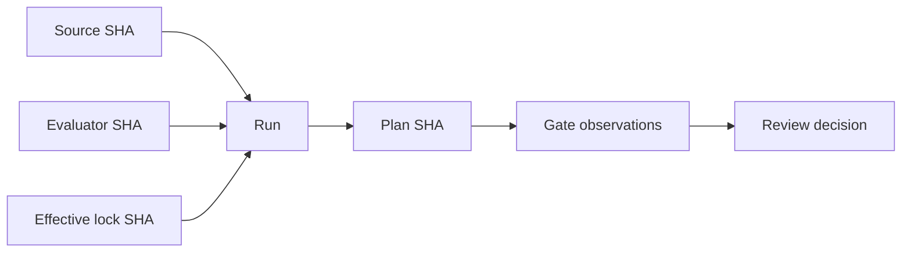

# Deep Dive: When Green IaC Checks Are Wrong

The lab showed a rejected starter, a repaired five-resource candidate, and a plan-only pipeline that stops at human review. This Part 2 goes below those gate labels. You will inspect why a policy can return success while checking nothing useful, how plan JSON represents unavailable and protected values, how scanner configuration changes the meaning of zero findings, and how source, evaluator, lock, and plan identities prevent stale evidence from being reused. These details matter during evaluator upgrades, disputed exceptions, provider migrations, and reviews where a green result conflicts with engineering judgment.

:::info[Where this picks up]

Begin at the labs repository after the Section 8 lab. Keep the rejected baseline and repaired Terraform evidence while you complete this page. If you already ran the lab teardown, repeat the lab's **Run the baseline with Terraform** and **Run the repaired pipeline** steps, then return here. Re-running is safe because the runner creates a new local evidence directory, uses `-refresh=false`, and performs no environment operation. Do not continue if your source is half-repaired; restore either the starter or the reviewed repaired candidate first.

:::

## 1 — A False Green Is an Evaluator Failure

A policy engine does not know the policy intent. It evaluates the rule it receives against the input it receives. If a Rego rule reads `change.after.acl` while the Terraform plan stores `change.after.block_public_acls`, the expression is undefined. The deny rule produces no result. Conftest then exits zero because it received no denial.

Think of this as a smoke detector installed in the wrong room. The detector can pass its own power check while smoke fills the kitchen. Engine health and control coverage are separate facts.

Inspect the real field paths in the rendered baseline plan.

```bash
jq '.resource_changes[] | select(.type == "aws_s3_bucket_public_access_block") | {address, after: .change.after, unknown: .change.after_unknown}' /tmp/agentic-iac-section-8-baseline/plan.json
```

**Validated output**

```text
{
  "address": "aws_s3_bucket_public_access_block.artifacts",
  "after": {
    "block_public_acls": false,
    "block_public_policy": false,
    "ignore_public_acls": false,
    "region": "us-east-1",
    "restrict_public_buckets": false,
    "skip_destroy": null
  },
  "unknown": {
    "bucket": true,
    "id": true
  }
}
```

Now query the faulty field directly. `null` here is not proof of a safe ACL. It is proof that this path does not contain the expected value.

```bash
jq '.resource_changes[] | select(.type == "aws_s3_bucket_public_access_block") | .change.after.acl' /tmp/agentic-iac-section-8-baseline/plan.json
```

**Validated output**

```text
null
```

The evaluator needs positive and negative contract fixtures. An allowed fixture should return no denial. Each unsafe field should have a fixture that returns a denial. Missing and unknown fields should produce the explicitly chosen fail-closed or indeterminate behaviour. Unrelated resource types should not produce noise.

The important distinction is:

- **engine success:** OPA or Conftest parsed and evaluated the policy;
- **rule result:** the policy returned a denial or allowed the input;
- **control coverage:** tests prove the rule observes each intended unsafe state;
- **decision fitness:** the policy version and input schema are appropriate for this review.

The first two can be green while the last two are broken. At work, use this distinction when a security check disagrees with a plan review or when a provider upgrade changes rendered fields.

## 2 — Unknown, Missing, Null, and Sensitive Are Different States

Terraform plan JSON has more information than the `after` object alone. A value can be known and present, explicitly null, absent because the schema does not use it, unknown until a later operation, or marked sensitive. Collapsing these cases into one falsy test creates incorrect policy decisions.

An airport departure board is a useful analogy. “Gate 12” is a known value. “Gate not assigned yet” is unknown. “This train journey has no gate” is not applicable. A restricted crew gate may exist but not be shown to every viewer. These states require different decisions.

Inspect unknown and sensitive markers alongside resource actions.

```bash
jq '[.resource_changes[] | select(.address == "aws_iam_role.worker" or .address == "aws_s3_bucket_public_access_block.artifacts") | {address, actions: .change.actions, after_unknown: .change.after_unknown, after_sensitive: .change.after_sensitive}]' /tmp/agentic-iac-section-8-repaired/plan.json
```

**Validated output**

```text
[
  {
    "address": "aws_iam_role.worker",
    "actions": ["create"],
    "after_unknown": {
      "arn": true,
      "create_date": true,
      "id": true,
      "inline_policy": true,
      "managed_policy_arns": true,
      "name_prefix": true,
      "tags_all": true,
      "unique_id": true
    },
    "after_sensitive": {
      "inline_policy": [],
      "managed_policy_arns": [],
      "tags_all": {}
    }
  },
  {
    "address": "aws_s3_bucket_public_access_block.artifacts",
    "actions": ["create"],
    "after_unknown": {"bucket": true, "id": true},
    "after_sensitive": {}
  }
]
```

For a policy control, classify the field before writing the rule:

| Plan state | Meaning | Typical security response |
|---|---|---|
| Known safe value | The plan supports the invariant | Allow this control |
| Known unsafe value | The plan violates the invariant | Deny with exact address and field |
| Unknown value | The final value is unavailable | Block or mark indeterminate based on risk |
| Missing field | Wrong schema path or unrelated resource | Treat schema mismatch separately; do not silently allow |
| Explicit null | The provider accepted no configured value | Evaluate against the resource contract |
| Sensitive marker | Display and retention need protection | Evaluate only required structure; restrict the artifact |

`after_unknown` is a parallel structure that marks unavailable paths. A resource identifier that is unknown can be harmless when it is only used as a description. The same unknown can block approval when it defines an IAM resource, network destination, deletion target, or replacement identity.

Sensitive markers are also not redaction. They tell clients which paths need protected treatment. The value may still exist in a saved plan or state. Do not send complete plan JSON to an agent simply because the terminal hides sensitive output. Select a bounded view, keep the protected artifact outside model context, and link it by hash.

At work, inspect these states when a policy unexpectedly allows an unknown authority boundary, when a plan renderer hides important detail, or when evidence storage could expose protected data.

## 3 — Scanner Trust Includes the Bundle and Every Suppression

A scanner result depends on more than its executable version. Trivy configuration scanning also depends on the check bundle, scanner flags, inspected path, ignore file, and any repository configuration. A zero-finding result from two machines can mean different things if their bundles differ.

Think of a security scanner as an inspection team using a checklist. Recording the team's name but not the checklist edition makes the report incomplete. A new checklist may add controls; an old one may miss them.

Inspect the reviewed suppression registry as structured data.

```bash
jq '.suppressions[] | {rule_id, scope, owner, reason, expires, compensating_evidence}' section-8/scanner/suppressions.json
```

**Validated output**

```text
{
  "rule_id": "AWS-0089",
  "scope": "course plan-only artifact bucket",
  "owner": "course-platform-team",
  "reason": "The lab has no real access-log destination and performs no remote operation.",
  "expires": "2027-08-28",
  "compensating_evidence": "No infrastructure operation is permitted by the Section 8 runner."
}
{
  "rule_id": "AWS-0090",
  "scope": "course plan-only artifact bucket",
  "owner": "course-platform-team",
  "reason": "Versioning lifecycle is proven in Section 7; this section isolates evidence-pipeline mechanics.",
  "expires": "2027-08-28",
  "compensating_evidence": "The plan is disposable and is never executed."
}
{
  "rule_id": "AWS-0132",
  "scope": "course plan-only artifact bucket",
  "owner": "course-platform-team",
  "reason": "A customer-managed KMS key would add unrelated identity and cost scope to this plan-only lab.",
  "expires": "2027-08-28",
  "compensating_evidence": "No data or remote bucket is created."
}
```

Then compare the simple ignore IDs with the registry IDs.

```bash
printf 'Ignore IDs:\n'; sed '/^#/d; /^$/d' section-8/scanner/trivy.ignore | sort; printf 'Registry IDs:\n'; jq -r '.suppressions[].rule_id' section-8/scanner/suppressions.json | sort
```

**Validated output**

```text
Ignore IDs:
AWS-0089
AWS-0090
AWS-0132
Registry IDs:
AWS-0089
AWS-0090
AWS-0132
```

The Section 8 pipeline requires an exact match. This prevents a quick ignore-line edit from bypassing the detailed review record. It also checks for scope, owner, reason, future expiry, and compensating evidence. These fields make the exception reviewable; they do not prove the exception is correct.

An evaluator should test at least these suppression mutations:

- add an ignore ID with no registry entry;
- add a registry entry with no ignore ID;
- remove the owner or reason;
- use an expired date;
- broaden the scope beyond the fixture;
- suppress a non-suppressible control such as public access or wildcard authority.

The final case needs policy, not only schema. A structurally complete exception can still violate organizational rules. The named control owner must decide whether a rule is suppressible and what compensating evidence is acceptable.

Scanner trust also requires failure handling. If the bundle download fails, a previous cache is missing, or output cannot be parsed, the gate should not convert that error into zero findings. Record “scanner unavailable” or fail the required gate. At work, use these checks when a security pipeline turns green after a tool upgrade, cache change, or large suppression diff.

## 4 — Mutate the Evaluator Before Trusting It

Evaluator mutation means making a small, known-bad change and confirming that a gate rejects it. It tests the detector, not the infrastructure feature. This is different from broad mutation-testing tools that change application code automatically; the principle here is narrow and reviewable.

Imagine testing a scale by placing a certified weight on it. Repeatedly weighing the same empty tray does not prove accuracy. A known input provides a reference response.

The Section 8 policy unit test is one mutation check: a false public-access field must produce a denial. The test suite also mutates suppression metadata and adversarial evidence. Review the mutation test names without executing an environment operation.

```bash
node --test section-8/tests/evaluator-mutations.test.mjs
```

**Validated result**

```text
✔ mutated evaluator inputs fail plan shape, suppression, redaction, and agent-safety gates
✔ runner rejects a source path that is not the Section 8 fixture
✔ runner rejects an output name outside its explicit namespace
✔ cleanup removes only a marked directory and rejects unmarked or symbolic-link targets
ℹ tests 4
ℹ pass 4
ℹ fail 0
```

Mutation results should answer four questions:

1. Which evaluator component was changed?
2. Which required gate should reject it?
3. Did rejection occur for the intended reason?
4. Was the original evaluator restored before generating accepted evidence?

Do not mutate the only copy of a canonical evaluator in place. Use a temporary copy or isolated branch. Hash the restored evaluator before the final run. Otherwise a test can prove that a mutation was rejected while the accepted evidence is generated by a different, unreviewed state.

Choose mutations from failure history and control risk. For policy, change a real field name, Boolean comparison, resource type, or unknown handling. For scanners, alter an ignore ID or bundle configuration. For redaction, inject a fake token in supported formats. For safety, request a forbidden file edit or environment command. For provenance, replace a source or plan hash.

A mutation score is not a complete quality measure. Ten easy mutations can miss the one schema drift that matters. Record the relationship between each control claim and its negative fixture. At work, run these checks during evaluator changes, provider or plan-schema upgrades, and investigations where a supposedly mandatory gate did not stop a defect.

## 5 — Evidence Provenance Prevents Correct Results from Being Reused Incorrectly

An evidence report is a graph of identities and relationships. The source was evaluated by a particular runner. That runner invoked particular tools and produced a particular plan. Policy and review observations refer to that plan. The final decision refers to all required gate results.



This resembles a chain of custody. A laboratory label does not prove that a sample is safe, but it prevents a result from being attached to the wrong sample. In the same way, SHA-256 identities do not prove correct code. They prevent accidental or dishonest substitution when the artifacts are preserved in trusted storage.

Inspect the core identities from both Section 8 reports.

```bash
jq '{engine, source_sha256, evaluator_sha256, plan_sha256, lockfile, decision}' /tmp/agentic-iac-section-8-baseline/evidence-report.json /tmp/agentic-iac-section-8-repaired/evidence-report.json
```

**Validated output**

```text
{
  "engine": "terraform",
  "source_sha256": "fb7eb906bfd6b1d7e14a5d06fbfb37bb2f248dbcdd0f53087185e873229d4d55",
  "evaluator_sha256": "a4fd12ba0f7c4c7d0bac129c32e6fcb64ce81c3509b3ca48c22341b24689075e",
  "plan_sha256": "bf113486c0116970e3ce26168b7a8056998e30c4f7f16842ffd6cca87eae262f",
  "decision": "REJECTED"
}
{
  "engine": "terraform",
  "source_sha256": "0b9fe15b59b876de3837aa7e94f8fc38000581f2d642fe4ed25f0b9b5cbe7a9f",
  "evaluator_sha256": "a4fd12ba0f7c4c7d0bac129c32e6fcb64ce81c3509b3ca48c22341b24689075e",
  "plan_sha256": "b47ef9a09442bc347931f2a31b85552b57f06232b622bad8ceb4c363dca4a042",
  "decision": "READY_FOR_HUMAN_REVIEW"
}
```

The repaired source hash should differ from the starter. The evaluator hash should remain the same if the pipeline itself was not changed. The plan hash should differ because the resource shape and values changed. If the evaluator hash changes during a repair limited to Terraform and policy inputs, stop and review the scope violation.

Provenance also needs repository identity: commit, branch or candidate reference, clean or dirty status, and the precise file scope included in the source hash. The Section 8 runner hashes the starter, policy, scanner, adversarial, and fixture inputs. It separately hashes its own evaluator source. Document exclusions such as generated `.terraform` directories and evidence output.

Time is part of applicability. A scanner result can become stale when a new rule bundle or vulnerability advisory arrives. A plan can become stale when source, dependencies, state, or environment facts change. Set rerun conditions rather than pretending every result has one universal expiry.

At work, use provenance when a reviewer asks whether a report matches the current commit, when a cached result is proposed for reuse, or when a supply-chain investigation needs exact tool and dependency identities.

## 6 — Compare Terraform and OpenTofu Semantics, Not Plan Bytes

Terraform and OpenTofu can evaluate the same HCL and propose the same resource actions while producing different lock entries and plan bytes. The engines can use different provider registry source addresses, package builds, metadata, timestamps, or serialization details. Byte-identical plans are therefore the wrong compatibility contract.

Compare stable observations from the separate evidence reports.

```bash
jq '{engine, decision, lockfile, addresses: .observations.managed_addresses, shape: .observations.plan_shape}' /tmp/agentic-iac-section-8-repaired/evidence-report.json /tmp/agentic-iac-section-8-tofu/evidence-report.json
```

**Validated output**

```text
{
  "engine": "terraform",
  "decision": "READY_FOR_HUMAN_REVIEW",
  "lockfile": {
    "source_sha256": "3db541e4cb8badc9efa955d8c58e27721d739a8cf11b6c6f7e8d6d3ac2fe57a7",
    "effective_sha256": "3db541e4cb8badc9efa955d8c58e27721d739a8cf11b6c6f7e8d6d3ac2fe57a7",
    "rewritten": false
  },
  "addresses": [
    "aws_iam_role.worker",
    "aws_iam_role_policy.worker",
    "aws_s3_bucket.artifacts",
    "aws_s3_bucket_public_access_block.artifacts",
    "aws_sqs_queue.jobs"
  ],
  "shape": "repaired"
}
{
  "engine": "tofu",
  "decision": "READY_FOR_HUMAN_REVIEW",
  "lockfile": {
    "source_sha256": "3db541e4cb8badc9efa955d8c58e27721d739a8cf11b6c6f7e8d6d3ac2fe57a7",
    "effective_sha256": "5be4dc3554f81d58ef69dfb1a5a32538b7eda34ab49c630b0e54ee449cb9298a",
    "rewritten": true
  },
  "addresses": [
    "aws_iam_role.worker",
    "aws_iam_role_policy.worker",
    "aws_s3_bucket.artifacts",
    "aws_s3_bucket_public_access_block.artifacts",
    "aws_sqs_queue.jobs"
  ],
  "shape": "repaired"
}
```

Review these layers separately:

- **language:** both engines load the required HCL features;
- **dependency resolution:** selected provider source, version, and checksum evidence is understood;
- **plan semantics:** managed addresses, actions, important values, unknowns, and replacement decisions match the contract;
- **evaluator compatibility:** tests, scanners, and plan policy support each engine's output;
- **state operations:** a production migration has an explicit one-writer policy, backup, lock, rollback, and direct evidence.

The Section 8 exercise proves only the plan-only fixture. It does not approve alternating writers against shared production state. A team choosing an engine needs a controlled dependency update, representative module tests, backend and state compatibility analysis, provider coverage, and an operational rollback record.

Plan hashes remain useful inside one run. They bind policy and review to an exact artifact. They are not the cross-engine equality assertion. If semantic observations differ, inspect configuration evaluation and provider planning before declaring compatibility.

:::tip[Where you will use this]

- **A green policy engine can be checking the wrong field.** **Use it when:** a plan review conflicts with a policy result — inspect the real JSON path and run a known-denied policy fixture.
- **Unknown, missing, null, and sensitive values carry different meanings.** **Use it when:** an authority, network, identity, replacement, or data boundary is unavailable at plan time — apply the control's explicit indeterminate rule.
- **Scanner identity includes its rules and exceptions.** **Use it when:** results change across machines or after an upgrade — compare bundle, flags, ignore IDs, and reviewed suppression records.
- **Evaluator mutation proves that a gate can reject.** **Use it when:** policy, scanner, redactor, or safety logic changes — insert a bounded known failure and confirm the intended rejection.
- **Provenance binds evidence to one candidate.** **Use it when:** a cached report is offered for a new commit — compare source, evaluator, plan, lock, tool, and time identities.
- **Cross-engine compatibility is semantic, not byte equality.** **Use it when:** comparing Terraform and OpenTofu — inspect stable actions and values while recording lock and serialization differences.

:::

## Teardown

This page creates no infrastructure. If you recreated marked evidence directories for these observations, remove only those exact directories with the Section 8 cleanup script. Keep the learner-owned source and reviewed candidate changes for the next section. Do not remove shared provider caches.
