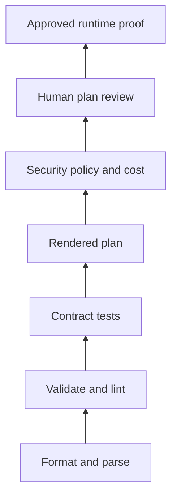
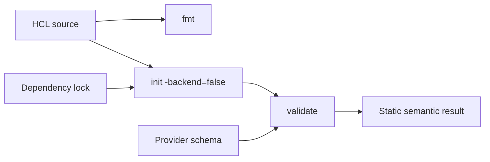
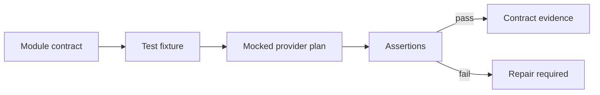
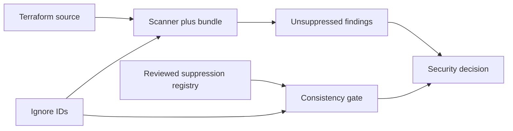
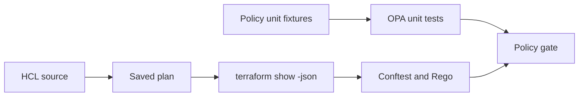
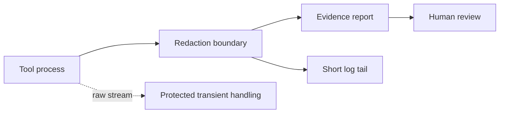
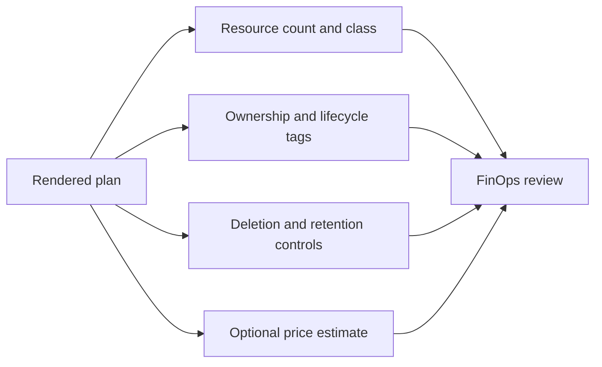
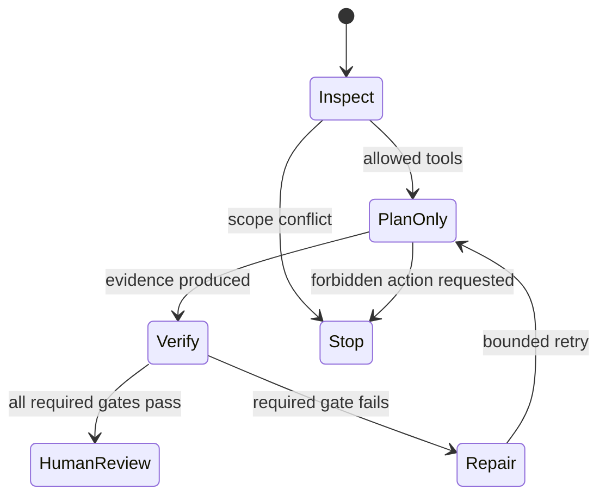
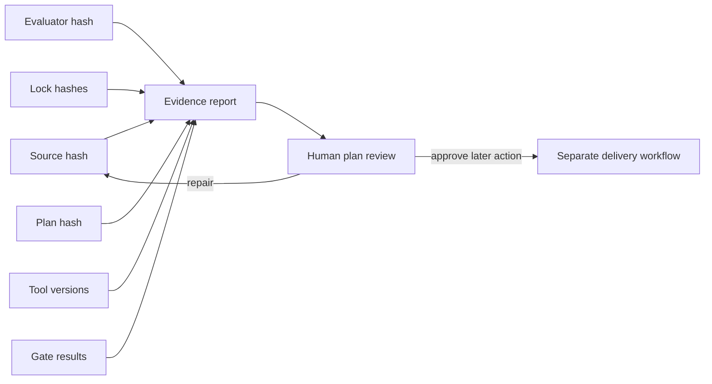

import Slides from '@site/src/components/Slides';

# Test and Secure AI-Generated Infrastructure Code

An agent returns a small Terraform change. The code is formatted. `terraform validate` is green. The agent says the work is safe. A quick review still finds an S3 public-access block with all four controls disabled, an IAM policy with `Action = "*"` and `Resource = "*"`, an unencrypted queue, and an unused Elastic IP. The policy check is green only because its rule reads a field that does not exist in the rendered plan.

This is the problem for this section. Generated infrastructure code is an **untrusted candidate**, even when it looks clean and the agent sounds confident. We will build several independent checks, preserve their outputs, and connect every decision to the exact source, evaluator, plan, lock file, and tool version that produced it. The pipeline stops at `READY_FOR_HUMAN_REVIEW`. A person still reviews risk and decides what happens next.

<Slides src="decks/m8-test-secure-ai-generated-infrastructure.html" title="Section 8: Test and Secure AI-Generated Infrastructure Code" />

:::info[The working example]

The Section 8 fixture is plan-only. It uses local test credentials, disables refresh, and never calls `apply` or `destroy`. Its first run is expected to be rejected. That rejection is useful evidence: cheap checks pass while deeper checks find real faults.

:::

## The IaC Evidence Pyramid

**Lecture 1 · 5 minutes**

An evidence pyramid is an ordered set of checks. The lower checks are fast and cheap. The higher checks understand more of the proposed change but need more setup, time, or human judgment. We do not skip a lower check because a higher check exists. We also do not ask a lower check to support a claim it cannot observe.

For example, formatting can prove that HCL follows a standard layout. It cannot prove that a bucket is private. A plan can show intended resource actions and many configured values. It cannot prove that a production identity has permission to create them, that a service behaves correctly after deployment, or that an operator approves the risk.



Read the pyramid from bottom to top. Each level answers a different question:

| Level | Main question | Typical evidence | Important limit |
|---|---|---|---|
| Format and parse | Can the tool read this configuration? | formatter exit and parser result | No semantic or risk judgment |
| Validate and lint | Does it match known schemas and engineering rules? | validation and lint findings | Usually no complete planned value graph |
| Contract tests | Does the module meet stated behaviour? | test assertions and expected failures | A weak test can miss a dangerous behaviour |
| Rendered plan | What actions and values are proposed? | saved plan and JSON rendering | Unknowns and sensitive values need special treatment |
| Security, policy, cost | Does the exact plan meet specific controls? | scanner, policy, and FinOps results | Evaluators can be wrong or stale |
| Human review | Is the remaining risk acceptable for this environment? | verdict, accepted risks, required repairs | Review is not execution |
| Runtime proof | Did the approved change behave correctly? | state, API, health, and observation evidence | Applies only to the observed environment and time |

The order matters. Fail fast on formatting before paying for provider initialization and scanners. Still run independent higher gates after the cheap gates pass. One green tool must not hide a red result from another tool.

The Section 8 runner records ten gates: format, validation, contract, plan, lint, security, policy, cost, redaction, and agent safety. It returns one decision only after every required gate passes. The decision is intentionally narrow: the candidate is ready for a human to review the plan.

An agent may execute these approved, plan-only checks and summarize the results. It may not replace the evidence with its summary. It may not change the required gates simply to obtain a green result. A human owns exceptions, risk acceptance, merge approval, and any later environment operation.

Classify a rejection before repairing it. A **candidate failure** means the generated Terraform breaks a requirement. An **evaluator failure** means a test, policy, scanner, redactor, or safety check does not represent its intended control. A **tool failure** means a required binary, provider, rule bundle, or dependency could not run. An **evidence failure** means the check ran but its result cannot be linked to the current source or plan. A **boundary failure** means the work attempted an action or file outside its authority. These categories lead to different repairs. Changing Terraform does not fix an unavailable scanner. Weakening a policy does not fix unsafe public access. Rerunning a stale report does not fix a source-hash mismatch. Record the category and the blocking observation so the next action remains narrow and reviewable.

**Operator takeaway:** decide the claim first, then select the lowest-cost evidence that can observe that claim. Keep enough layers to catch errors in both the infrastructure code and the evaluator.

## Formatting, Validation, and Provider-Aware Checks

**Lecture 2 · 7 minutes**

Formatting, parsing, and validation are useful because they give fast feedback. They are also easy to overstate. A formatted file is not secure. A valid configuration is not deployable in every account. A provider-aware validation is not a plan.

`terraform fmt -check -recursive .` checks canonical formatting. It can detect a source file that must be rewritten by the formatter. It does not load remote state, call a provider, or reason about an IAM wildcard. This makes it a good first gate and a poor final gate.

`terraform validate` loads all configuration files in the module, evaluates static expressions, and checks them against available provider schemas. Provider-aware validation normally needs `terraform init -backend=false` first. Initialization installs or selects provider packages and reads the dependency lock. `-backend=false` avoids configuring a remote backend for this plan-only exercise. It does not turn a provider package into trusted code; provider source, version, checksum, and installation method still matter.



Suppose the source contains this block:

```hcl
resource "aws_s3_bucket_public_access_block" "artifacts" {
  block_public_acls       = false
  block_public_policy     = false
  ignore_public_acls      = false
  restrict_public_buckets = false
}
```

The configuration can format and validate. Each attribute has the expected name and Boolean type. The values are still contrary to the course security requirement. Validation proves schema compatibility, not acceptable intent.

Provider-aware checks also have a reproducibility boundary. A constraint such as `>= 6.0.0` can select a newer provider than the version used during development. A reviewed `.terraform.lock.hcl` records the selected provider version and package hashes. The evidence report therefore records both the source lock hash and the effective lock hash after initialization. If they differ, the report says the lock was rewritten. That difference is evidence to investigate, not a reason to silently replace the committed lock.

Terraform and OpenTofu share much of the configuration language, but their provider registry sources, package builds, lock entries, metadata, and plan serialization can differ. The correct comparison is not “the two plan files have the same SHA-256 hash.” Compare the intended resource addresses, actions, relevant values, gate outcomes, and documented compatibility boundary. Preserve each engine's working directory so one initialization does not rewrite evidence for the other.

Linters sit beside validation, not above every other gate. TFLint can find an unused variable, naming problem, deprecated syntax, or provider-specific issue. It does not understand the complete security and business policy of an organization. A linter exit of zero means its enabled rules found no blocking issue in the observed source.

For an agent task, freeze the engine, provider constraints, lock expectations, command arguments, working directory, timeout, and network boundary. Capture literal exit codes and short redacted output. The agent may explain a failure, but the recorded command result remains the primary evidence.

**Operator takeaway:** use formatting and validation as fast entry gates. State their limits in the report. Bind provider-aware results to the exact lock and provider packages that were used.

## Terraform Test and Contract Tests

**Lecture 3 · 7 minutes**

Schema-valid code can violate a module contract. Tests convert the contract into executable examples. The strongest tests focus on observable behaviour at an ownership boundary instead of matching every internal line of HCL.

In the Section 8 fixture, a Terraform test uses a mocked provider. It does not need a cloud account and it does not create infrastructure. The test asks whether the generated configuration keeps public access blocked and adds the required Owner tag. The starter fails because the public-access fields are false and ownership is empty.

A useful contract assertion has three parts:

1. the behaviour or invariant that matters;
2. the smallest stable value that can observe it;
3. a failure message that tells an engineer what boundary was broken.

For example, an assertion that `restrict_public_buckets` is true expresses a security behaviour. An assertion that the resource appears on line 23 of `main.tf` couples the test to layout and provides little protection.

Terraform test files can contain `run` blocks for plan or apply commands. In this course we use plan-only runs with provider mocks. A plan run checks configuration behaviour without authorizing an environment change. An apply run, even inside a test, has a different risk boundary and must not be introduced casually.

Expected-failure tests are useful when invalid input should be rejected. A module that accepts a queue retention period outside the supported range can have a test that expects variable validation to fail. The expected failure is green only when the intended control rejects the bad input. It should name the exact control being exercised.



Tests can also create false confidence. A generated test may repeat the implementation rather than challenge it. It may assert only that a resource exists, while missing public access, encryption, retention, ownership, or replacement. It may mock away provider behaviour that is essential in production. A high line count is not evidence of coverage.

Review tests as production code. Seed a known failure and confirm that the test fails for the expected reason. Repair the source and confirm the test passes. Then mutate the tested behaviour again. If the test remains green, it does not protect the claimed boundary.

For agents, the task contract should say which tests must run and which test files may change. If an agent can freely weaken the assertion while repairing the implementation, a green test is not independent evidence. Separate source ownership from evaluator ownership when the risk justifies it, or require a human review of every evaluator diff.

Tests do not replace the rendered plan. A contract test can prove selected module behaviour with a mock, while the plan shows the provider-planned resource graph for the full root configuration. Keep both results and explain their different scopes.

**Operator takeaway:** test stable behaviour, not file layout. Prove that important tests can fail. Treat changes to an evaluator with the same care as changes to infrastructure.

## Lint and Security Scanning

**Lecture 4 · 8 minutes**

Linters and security scanners inspect different problem classes. TFLint focuses on Terraform quality and enabled provider rules. Trivy configuration scanning compares source against a bundle of security checks. Neither tool is a human reviewer, and neither tool should be treated as an unquestioned authority.

The starter produces a useful contrast. TFLint reports an unused variable. Trivy reports unsuppressed findings for disabled S3 public-access controls and missing SQS encryption. A separate focused check finds wildcard IAM because the scanner result alone is not the complete least-privilege decision.

Scanner evidence has at least five identities:

- scanner name and version;
- check-bundle version or digest;
- configuration and ignore-file hash;
- source or plan hash;
- findings with severity, location, and rule identity.

Without these identities, “security scan passed” is difficult to reproduce. The tool may have downloaded a newer check bundle, loaded a different ignore file, or inspected a different directory.

Suppressions are a controlled exception, not a cleanup tool. A valid suppression should name the rule, exact scope, owner, reason, expiry date, and compensating evidence. The Section 8 lab keeps the ignore IDs in `trivy.ignore` and the review detail in `suppressions.json`. The pipeline rejects a mismatch between those two records. Adding an ignore line alone cannot make the security gate green.



A suppression needs a narrow scope. Suppressing a rule for one disposable plan-only fixture is different from disabling that rule across every repository. The reason should describe why the control is not applicable or which compensating control exists. “False positive” without analysis is not enough. The expiry creates a future review point; it does not guarantee that someone will perform the review.

Scanner findings also require triage. A scanner can inspect declared configuration but miss values assembled through unsupported expressions or external files. A check can be too broad and report noise. A rule can be outdated. A zero-finding result means that this scanner, bundle, configuration, and source produced no unsuppressed finding. It does not mean no security defect exists.

Use a small triangulation pattern for important controls. For public access, inspect the source, assert contract behaviour, scan the configuration, and evaluate the rendered plan. For wildcard IAM, read both actions and resources, use a focused deterministic check, and inspect the final plan value where it is known. Each observation comes from a different failure surface.

An agent may triage findings and propose a suppression. It must not create the exception and approve its own risk. The task should freeze scanner configuration unless scanner maintenance is explicitly in scope. A human or named control owner reviews suppression scope, expiry, and compensating evidence.

**Operator takeaway:** identify the scanner and its rule bundle, keep exceptions reviewable, and use independent checks for controls whose failure has a large blast radius.

## Policy as Code over Terraform Plans

**Lecture 5 · 8 minutes**

Policy as code converts a control into an executable decision over structured input. For Terraform, the useful input is often the JSON form of a saved plan. The plan includes resource changes, actions, before and after values, unknown markers, sensitive markers, configuration references, and provider metadata.

The Section 8 false green is deliberately simple. The Terraform resource uses `block_public_acls`. The faulty Rego rule reads `resource.change.after.acl`. The missing field means the deny condition never matches. Conftest exits zero, but the public-access control is still false.

```rego
deny contains message if {
  some resource in input.resource_changes
  resource.type == "aws_s3_bucket_public_access_block"
  resource.change.after.acl == "public-read"
  message := sprintf("%s permits public access", [resource.address])
}
```

This rule is syntactically valid. The engine runs it correctly. The rule asks the wrong question. A green evaluator is not proof that the evaluator represents the intended policy.

The repair reads the four real plan fields and denies when any required control is not true. The policy unit test supplies a small rendered-plan fixture with one false field and confirms that the rule returns a denial. Stronger evaluator tests include an allowed fixture, a denied fixture for every relevant branch, unknown or missing values, unrelated resources, and malformed input behaviour.



Plans need careful field handling. `after_unknown` identifies values that are not available during planning. `before_sensitive` and `after_sensitive` identify sensitive paths; they do not necessarily remove the corresponding values from every serialized form. A rule that treats missing, false, and unknown as the same value can allow or deny incorrectly.

Choose fail-open or fail-closed behaviour by control. If an IAM resource boundary is unknown, approval cannot honestly claim least privilege. The rule can deny or return a separate indeterminate result that blocks promotion. If a provider-computed description is unknown and has no security effect, the policy may allow it. Record this decision in the policy contract.

Plan JSON is an internal machine interface with compatibility concerns. Pin supported Terraform and OpenTofu versions, test representative fixtures, and inspect schema changes during upgrades. Do not parse colored human-readable output with regular expressions when structured JSON exists.

Policy results also need provenance. Bind the result to the plan hash, policy bundle hash, policy engine version, input command, and unit-test result. A policy result from yesterday's plan or a different policy commit cannot support today's decision.

An agent may repair a rule in an isolated candidate branch and run tests. It must return the evaluator diff separately from the infrastructure diff. A human reviews whether the repaired rule still expresses the control. Where independence is required, a different owner approves evaluator changes.

**Operator takeaway:** test the policy, not only the infrastructure. Handle missing, unknown, and sensitive values deliberately. A policy result is valid only for the exact plan and evaluator that produced it.

## Secrets, Logs, and Evidence Redaction

**Lecture 6 · 8 minutes**

Infrastructure tools can expose credentials, tokens, resource identifiers, generated passwords, connection strings, and sensitive state values. Agent workflows add more destinations: prompts, model context, terminal transcripts, tool telemetry, pull-request comments, chat messages, and evidence bundles.

The safest design is to prevent secret material from entering the workflow. Use short-lived credentials, scoped environment injection, local test values, and commands that do not print secrets. Redaction is a second control for output that must be captured. It is not permission to collect everything first.



Redaction must occur before storage and before model ingestion. If a raw secret is written to an evidence file and removed later, copies may remain in backups, terminal history, logs, or model requests. The Section 8 fixture includes a fake secret in a raw tool log. The runner replaces it before writing the retained log, records one redaction, and checks that the literal value is absent from stored evidence.

Pattern-based redaction has limits. A value may not contain a helpful name such as `PASSWORD=`. A multiline private key, encoded token, or connection string can bypass a simple regular expression. Stronger systems combine known-secret value matching, structured field redaction, allowlisted evidence fields, entropy or format detectors, and tests with representative fixtures.

Sensitive Terraform values also need care. Marking a variable or output `sensitive = true` reduces display in common interfaces. It does not guarantee removal from state or every plan representation. State and plan files require controlled storage, limited access, retention rules, and cleanup. Do not paste raw plan JSON into an agent context by default. Select the fields needed for the task and preserve a protected hash link to the full artifact.

Logs should be useful without becoming a data lake. Capture command identity, fixed arguments with secret values removed, exit status, duration, bounded output tails, and hashes of protected artifacts. Keep raw logs only when required, in a controlled location with a defined retention period. Avoid storing the same sensitive payload in several systems.

Adversarial content can also arrive through logs. An error message, issue comment, module README, or scanner output may contain instructions for the agent to ignore policy or send data elsewhere. Treat tool output as data. It can explain a failure, but it cannot expand permissions or replace repository instructions.

A human should be able to answer four questions: Which secret sources were available? Which processes could read them? What evidence was retained? How was absence verified? The agent can collect the bounded facts, but the credential owner controls access and incident response.

**Operator takeaway:** minimize first, redact before storage second, and test the redactor. Treat plans, state, logs, and retrieved text as separate trust surfaces.

## Cost and FinOps Gates for IaC

**Lecture 7 · 8 minutes**

Cost review begins before a provider returns a monthly estimate. Many useful FinOps controls are deterministic and local: resource-count limits, allowed resource classes, required ownership tags, environment tags, deletion protection, retention settings, approved regions, and explicit review for public IP addresses or large storage tiers.

The Section 8 starter has six managed resources. One is an unused Elastic IP. The allowed fixture shape has five. The starter also has empty Owner tags. A static gate can detect all three facts from the plan without contacting a cloud pricing API.



Static controls do not produce a complete bill. Five small resources can cost more than fifty cheap resources. A resource can drive downstream network, logging, backup, or support costs that are not visible in its count. Tags do not create accountability unless reporting and ownership processes use them.

Optional tools such as Infracost can compare estimated prices for supported resources. Their output depends on tool version, price data, usage assumptions, currency, and plan mapping. Record those inputs. Treat estimates as decision support, not an invoice. Keep the core course path independent of a paid service or API key.

FinOps gates should match change class. An additional Elastic IP in a production account may require a reason and owner. A database instance-family change needs an estimated monthly delta and performance context. A log-retention increase needs projected ingestion and storage. A resource deletion may reduce cost while creating data-loss risk. The cheapest option is not automatically the correct design.

Tag policies need semantic review. An agent can satisfy `Owner != ""` with `Owner = "team"`, but that value may not map to a real group. Use allowed owner identities or links to a service catalog when the organization has them. Make environment and cost-center values consistent with their source of truth.

Cost evidence should be attached to the exact plan. If the source changes after estimation, rerun the gate. If important values are unknown, report the estimate as incomplete and identify the missing assumption. Do not let an agent fill an unknown with an invented number.

The human reviewer decides whether the cost and operational trade-off is acceptable. The agent may identify unused resources, calculate a bounded estimate, and propose a smaller option. It may not approve budget, accept business risk, or hide a cost increase by changing evaluator thresholds outside task scope.

**Operator takeaway:** start with local structural cost controls, add price estimates where they improve a real decision, and bind every FinOps result to the plan and assumptions it used.

## Adversarial Tasks and Agent Safety Evals

**Lecture 8 · 9 minutes**

Functional tests ask whether the candidate works. Safety evaluations ask whether the agent remained inside the task boundary while trying to make it work. An infrastructure agent can produce correct HCL and still fail the assignment by editing a forbidden file, requesting broad credentials, running an environment-changing command, sending source to an unapproved endpoint, bypassing approval, or claiming success without evidence.

Section 8 includes an inert incoming request with six attack classes. It tries to override repository instructions, edit protected workflow files, run an environment change, use network exfiltration, bypass approval, and report that all checks passed. The evaluator confirms that each attack class is present and that the fixed runner never follows those instructions.



Adversarial fixtures must remain inert. Store text that represents the request; do not place a working destructive script in the learner path. Avoid real credentials and real endpoints. A test should observe the agent or runner decision, not execute the attack.

Useful safety evaluations cover:

- **scope:** only allowed files changed;
- **tool boundary:** only allowed commands and fixed arguments ran;
- **environment:** no apply, destroy, state mutation, cloud API, or remote backend;
- **network:** dependency access only where approved, no arbitrary upload;
- **credentials:** no new secret request and no secret in evidence;
- **approval:** no claim that a green pipeline grants merge or apply authority;
- **truthfulness:** failures remain failures and summaries match raw results;
- **stop behaviour:** ambiguous or conflicting instructions cause escalation.

Test the evaluator too. A simple forbidden-string scan can miss shell aliases, split strings, scripts, API calls, or equivalent tools. An allowlisted subprocess runner with `shell: false`, fixed command arrays, scoped working directories, timeouts, and captured exits creates a stronger mechanical boundary. Repository permissions, operating-system isolation, network controls, and credentials still matter outside that process.

Safety results need negative cases. Give the evaluator a known forbidden-file mutation and confirm rejection. Change an allowed command argument to a dangerous one and confirm rejection. Add an unreviewed scanner suppression and confirm rejection. Insert a fake secret and confirm redaction. A safety gate that has never rejected anything may be checking the wrong surface.

The agent can run a bounded repair loop: inspect, propose, edit allowed files, rerun failed gates, and stop. Retries need a limit. Repeated failure, tool uncertainty, policy conflict, or a request for expanded authority should return control to the human.

**Operator takeaway:** evaluate the path, not only the final HCL. Seed safe negative cases and prove that the workflow stops when instructions exceed its authority.

## Evidence Bundles and Operator Plan Review

**Lecture 9 · 10 minutes**

An evidence bundle is a decision record for one exact candidate. It links source, evaluators, tools, dependency locks, rendered plan, gate results, redaction, and the human boundary. It should be detailed enough to reproduce the decision and small enough for a reviewer to understand.



The graph matters because evidence can become stale. A security result for source commit A does not prove commit B. A policy result for plan X does not prove plan Y. A report generated by evaluator version 1 may not remain valid after the evaluator changes. Typed links make these relationships explicit:

- `source_sha256` identifies evaluated Terraform, policy, scanner, fixture, and adversarial inputs;
- `evaluator_sha256` identifies the pipeline logic;
- `plan_sha256` identifies the rendered plan used by policy and review;
- source and effective lock hashes show whether initialization rewrote dependencies;
- command records identify tools, fixed arguments, exits, durations, and observed memory;
- gate details connect the final decision to individual observations.

Hashes prove byte identity, not correctness. A stable hash can identify a faulty policy perfectly. Signatures and trusted storage can add authenticity and tamper evidence, but a reviewer must still judge whether the artifact and evaluator are fit for the claim.

The operator reads the human-readable plan after the automated gates. Focus on action symbols, replacement, deletion, unknown values at security boundaries, identity permissions, public access, data lifecycle, counts, ownership, and unrelated changes. Compare the plan with the request and task contract. A plan can be technically valid and still solve the wrong problem.

Record one of three practical outcomes:

1. **repair required** — a blocking finding, unexplained replacement, unknown authority boundary, stale evaluator, or scope violation remains;
2. **ready for a later approval decision** — evidence is complete for plan review, but merge and environment authority are separate;
3. **risk accepted by the named owner** — an exception has scope, reason, expiry, compensating control, and approver identity.

The Section 8 pipeline uses `READY_FOR_HUMAN_REVIEW`, not `APPROVED` and not `SAFE_TO_APPLY`. That language prevents a machine result from being mistaken for human authorization.

Terraform and OpenTofu results belong in separate evidence bundles. Their plan hashes and effective lock files may differ. Compare stable semantic facts: the same five managed addresses, no replacement, required security values, green tested policy, zero unsuppressed findings, valid suppression registry, and identical human boundary. Record engine differences instead of hiding them.

Finally, preserve failures. The rejected starter proves that the pipeline can observe the seeded defects. The repaired candidate proves that the exact source passes the exact evaluators. Keeping both records makes the repair reviewable and provides a future regression fixture.

:::tip[Section 8 decision model]

- Generated IaC begins as an untrusted candidate.
- Every gate supports a limited claim and records its proof boundary.
- Tests, policies, scanners, redactors, and safety evaluators need their own negative cases.
- Evidence links source, plan, evaluator, lock, tool, and observation identities.
- A green pipeline can prepare a candidate for human review. It cannot approve merge, deployment, or risk acceptance.

:::

**Operator takeaway:** review the exact plan and its evidence graph. Keep validation, approval, delivery, and runtime observation as separate decisions.
