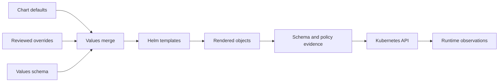
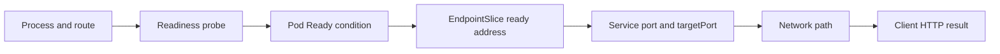

# Deep Dive: Rendered YAML and Runtime Evidence

The lab showed that the repaired chart can pass static review, install on one
Kind node, and complete the exact job flow. This Part 2 goes below those results.
It connects template input to rendered objects, controller status, Pod
conditions, EndpointSlices, configuration, token projection, resource
behaviour, and network evidence. Use this model when a valid render and a
running release tell different stories.

:::info[Where this picks up]

You can read this page after the static repair or after the local runtime. It
does not require a live cluster and does not create a second working set. The
examples use the preserved Task 5 and Task 6 evidence for candidate `718fd28`:
nine objects, a 10,617-byte render, 13 passing gates, and three cleaned Kind
lifecycles. If you repeat a diagnostic observation, use the exact lab release
and complete its teardown before leaving the module.

:::

## 1 — A Render Is the Output of a Build Pipeline

A Helm chart is not the workload sent to Kubernetes. The workload is the result
of values precedence, JSON Schema checks, helper evaluation, template branches,
and any later transformation. Treat this path like a compiler pipeline. Review
source for maintainability and review output for delivery facts.



Each edge creates a different question. Did a later override replace a safe
default? Did the schema reject unsupported input? Did a template branch render
token material only for one role? Did policy evaluate all nine objects? Did an
admission controller add or replace a field after rendering?

The accepted Section 9 evidence binds chart source and rendered output with
separate hashes:

| Artifact | Preserved observation | Meaning |
|---|---|---|
| Evaluated source | SHA-256 `ba361529...dcd6` | Exact bounded chart candidate |
| Rendered output | 10,617 bytes, SHA-256 `76be532...5eb9` | Exact nine-object static output |
| Evaluator report | 13 gates, no primary findings | Required static observations passed |
| Decision | `READY_FOR_HUMAN_REVIEW` | A person may review the candidate |

The hashes establish identity, not correctness. A wrong render can have a
perfectly stable hash. The 13 gates establish only their written claims. For
example, kubeconform observed schema compatibility; it did not observe a
kubelet probe. The limits gate observed 100m CPU and 64Mi memory limits; it did
not load-test the application.

Final delivery can differ from the saved Helm render. A GitOps controller may
run Kustomize after Helm. An admission webhook may default, inject, or reject
fields. Kubernetes may default fields when storing an object. A complete
production evidence path may therefore retain source, merged values, Helm
render, post-render output, and selected live-object views. Compare semantics,
not formatting noise.

This separation explains an important failure class. If the render contains a
wrong probe path, repair source or values. If the render contains `/readyz` but
the live Deployment contains another path, investigate live mutation,
admission, or a different delivery owner. Changing the application without
first locating that boundary can hide drift while leaving the source of it.

## 2 — Controller Status Is a Report about One Generation

Desired state lives mainly in `spec`. Observed state lives mainly in `status`,
but status is not one universal truth field. Each controller reports the facts
it owns. The Deployment controller reports ReplicaSet progress and availability.
The scheduler reports a Pod assignment. The kubelet reports container and Pod
conditions. EndpointSlice controllers report Service backend eligibility.

`metadata.generation` advances when desired fields change. A controller can set
`status.observedGeneration` after it has processed that generation. During a
change, the object can briefly show an old condition with a new spec. Read the
generation relationship before treating status as a report about the latest
intent.

```yaml
metadata:
  generation: 4
status:
  observedGeneration: 4
  conditions:
    - type: Progressing
      status: "True"
      reason: NewReplicaSetAvailable
    - type: Available
      status: "True"
      reason: MinimumReplicasAvailable
```

Conditions are named observations, not lifecycle steps. Several conditions can
be true together. `Available=True` can remain true because an old API Pod is
ready while the new Pod fails readiness. `Progressing=True` can indicate an
active rollout, and a later reason may show that the progress deadline was
exceeded. Read type, status, reason, message, generation, and time together.

Pod phase is also too broad for many diagnoses. A Pod can be `Running` while
its readiness condition is false. The process exists, but the Service should
not send it normal traffic. Container state and last termination state reveal
waiting reasons, OOM kills, exit codes, and restart history. A zero restart
count rules out repeated container failure but does not prove readiness.

Kubernetes supports custom `readinessGates` that add Pod conditions beyond
container readiness. They are useful when an external controller must declare
a Pod eligible, but they add another control loop and failure mode. The course
workload does not use readinessGates. Its ready state comes from container
readiness and normal Pod conditions. Do not claim a custom gate unless the Pod
spec and controller status show it.

Events explain controller decisions at a moment in time. They can show probe
HTTP 404, failed scheduling, image pulls, volume mounts, or backoff. They have
retention and aggregation limits. A missing old event is not proof that the
failure never happened. Preserve useful events during an incident and combine
them with current status.

## 3 — Readiness, EndpointSlices, and Client Paths Are Separate Layers

The Service path has several gates. A process listens on a container port. Its
readiness probe passes. Pod readiness becomes true. A matching EndpointSlice
marks its address ready. A Service selects that endpoint. Network routing
delivers traffic. The application handles the request. A host mapping or load
balancer may add another path outside the cluster.



The layers support different statements:

| Evidence | Strongest useful statement | Proof limit |
|---|---|---|
| Probe event HTTP 404 | Kubelet reached the configured route and received 404 | Does not identify why that route was configured |
| Pod `Ready=False` | Pod is not eligible through normal ready endpoints | Does not say whether process is dead |
| EndpointSlice `ready=true` | One selected backend is eligible | Does not prove host or external routing |
| Service shows NodePort 30080 | Live Service exposes that node port | Does not prove Kind host mapping agrees |
| Host request HTTP 200 | Exact host path reached a ready application response | Does not prove every route or future request |

Rolling updates make endpoint identity important. The old API Pod can remain
ready while the replacement is unready. An EndpointSlice can briefly contain
both addresses with `true,false` conditions. A terminating address can remain
visible for a short period. Listing only addresses without conditions can lead
an operator to call every backend healthy.

Probe success should reflect role readiness. The worker readiness endpoint
checks the dependency path because a worker that cannot poll has no useful role.
Its liveness path remains process-focused so a shared dependency outage does
not cause a restart storm. The API follows the same dependency-aware readiness
principle. Dependencies can report ready based on their own queue/result API.

Startup ordering explains why early logs and final status can disagree. In the
three proven lifecycles, worker logs retained bounded connection-refused
messages while the dependency endpoint came up. Later the Pods were ready,
both Services had ready endpoints, readiness returned HTTP 200, and the exact
job completed once. The old log line remains true history; it is not current
failure evidence.

Client paths need their own proof. Kind mapped host port 18080 to NodePort
30080. A healthy API Pod and ready EndpointSlice could coexist with a Service
on another NodePort, making the host path fail. This is why application health,
Service configuration, and host routing are separate observations.

## 4 — Configuration and Tokens Move through Different Channels

`BACKEND_URL` and the backend token are both application inputs, but they have
different confidentiality and lifecycle needs. The URL is ordinary
environment-local configuration. It comes from a ConfigMap and appears in the
render. The token is credential material. The chart contains only an external
Secret name and projected volume structure.

```yaml
env:
  - name: BACKEND_URL
    valueFrom:
      configMapKeyRef:
        name: inference-platform
        key: BACKEND_URL
  - name: BACKEND_TOKEN_FILE
    value: /var/run/secrets/inference/token
volumeMounts:
  - name: backend-token
    mountPath: /var/run/secrets/inference
    readOnly: true
```

The ConfigMap path has four observable states: the chart value, the rendered
ConfigMap, the live ConfigMap, and the environment captured when a Pod started.
Updating a ConfigMap does not automatically replace every environment value in
an existing process. A rollout or another reload design is needed. A live Pod
can therefore use old configuration while the current ConfigMap shows a new
value.

Projected volume behaviour differs. Kubelet can update mounted Secret content
after the source changes, with implementation and synchronization delay. An
application that reads the file only during startup still uses the old value.
Rotation proof needs a new credential, an observed file/application refresh,
successful authentication with the new value, and rejection or expiry of the
old value. The core run did not make that claim.

The external Secret boundary also separates render evidence from namespace
readiness. Static policy can prove that the chart does not create token material
and that the projected volume names one required key. Only the target namespace
can show that a Secret with that name and key exists and is available to the
kubelet. Neither fact proves an external secret manager, CSI driver, or rotation
controller because none ran in the core profile.

Agents should work with the reference shape and redacted evidence. A secret
name may be in model context; a live token should not be. Even base64-encoded
Secret data is still credential material. Avoid broad object dumps when a
metadata or key-name view answers the question.

## 5 — Resource Fields and Shutdown Need Runtime Interpretation

The static evaluator proved that every role rendered 10m CPU and 32Mi memory
requests with 100m CPU and 64Mi memory limits. This protects the package from a
missing-budget defect and keeps the deterministic workload bounded. It does
not prove production sizing.

Requests affect scheduler placement and, with limits, Pod quality-of-service
classification. CPU limits are normally enforced through throttling. Memory
limits can lead to termination when the container crosses its cgroup boundary.
Working-set observations at the node level do not reveal per-container CPU
throttling, queue delay, heap growth, or OOM risk.

The Task 5 sampler measured the named Kind node container, not each Pod and not
the whole host. Peaks were 656.2 MiB, 671.1 MiB, and 643.1 MiB. Docker's 7.744
GiB configured capacity is a different fact. The profile remained below the
4 GiB named-workload ceiling, but these runs used deterministic single-job
traffic. A production model server requires representative concurrency, model
memory, caches, sidecars, telemetry, and failure tests.

Shutdown adds a time relationship that a render cannot prove:

1. Kubernetes begins Pod termination and endpoint removal.
2. The worker stops accepting new jobs.
3. It finishes, checkpoints, or safely returns the current job.
4. It records a result or retryable state.
5. It exits before `terminationGracePeriodSeconds` ends.

A rendered grace period supports intended timing. Runtime proof needs an active
job during rollout or deletion, job-state evidence before and after, process
exit timing, and duplicate/loss checks. A completed quiet-cluster rollout does
not test graceful work handoff.

For long inference jobs, the queue contract may need a visibility timeout,
lease renewal, idempotency key, checkpoint, or cancellation signal. Kubernetes
termination alone cannot decide what happens to distributed work. Keep that
responsibility shared explicitly between application and platform.

## 6 — NetworkPolicy Proof Requires an Enforcing Data Plane

NetworkPolicy objects describe intended allow rules. The Kubernetes API stores
them, but enforcement belongs to the cluster network implementation. A valid
object on a cluster without an enforcing CNI provides no denial boundary.

The core Kind runs set NetworkPolicy off and make no enforcement claim. Their
successful API-to-dependency and worker-to-dependency traffic proves required
connectivity under default Kind networking. It does not prove that an
unapproved Pod would be denied.

A defensible policy test needs all of these layers:

| Layer | Required evidence | Why it matters |
|---|---|---|
| Intent | Final rendered NetworkPolicy and selectors | Shows the reviewed rule |
| Subjects | Namespace and Pod labels from live objects | Proves tests match selectors |
| Destination | Ready endpoint on the expected port | Rules out an absent service |
| Positive path | Approved source succeeds | Proves required traffic remains usable |
| Negative path | Unapproved source fails against same endpoint | Observes the denial effect |
| Data plane | Supported CNI identity, status, and useful decision evidence | Connects failure to enforcement |
| DNS | Approved name resolution plus blocked unrelated egress | Prevents accidental DNS outage |

DNS deserves an explicit rule because applications usually connect by Service
name. Selector details vary across distributions. A copied policy that allows
UDP 53 to one hard-coded label may fail where DNS uses different labels, TCP
fallback, or NodeLocal DNS. Inspect the supported cluster and test both lookup
and application traffic.

A timeout from the denied source is not enough by itself. The name could be
wrong, the Service could lack endpoints, or the client could have failed before
network access. Run the allowed and denied checks close together against the
same ready endpoint. CNI logs, metrics, or policy tracing can strengthen the
attribution.

Namespace boundaries do not replace NetworkPolicy, and NetworkPolicy does not
replace RBAC or identity. Namespace organizes names, quotas, and policy scope.
RBAC controls Kubernetes API calls. NetworkPolicy controls selected network
directions when enforced. Secret and cloud systems control their own access.
State the proof limit for each.

:::tip[Where you will use this]

- **A Helm render and a live object belong to different evidence layers.** **Use it when:** source looks correct but the cluster behaves differently — compare merged values, final render, generation, and live fields.
- **Controller status applies to a generation and owner.** **Use it when:** a rollout appears both available and stuck — relate conditions and Pod revisions to the latest desired state.
- **Readiness, EndpointSlices, Services, and client paths are separate gates.** **Use it when:** healthy Pods coexist with a failed request — locate the first broken hop.
- **Configuration and credential channels refresh differently.** **Use it when:** a ConfigMap or Secret changed but behaviour did not — verify the process view and reload contract.
- **Rendered resources prove a budget exists, not that it is correctly sized.** **Use it when:** throttling, OOM, or queue delay appears — combine container metrics with representative workload evidence.
- **NetworkPolicy needs positive, negative, DNS, and CNI evidence.** **Use it when:** a team claims isolation from accepted policy YAML — test enforcement against the same ready destination and state the proof limit.

:::

## Teardown

This page creates no resources. If you repeated a lab observation, remove only
the exact `inference-platform` release, `inference` namespace, and
`agentic-iac-s9` cluster by following the lab teardown. Keep the reviewed chart
changes and preserved evidence for the next section.
