import Slides from '@site/src/components/Slides';

# Deploy Applications with Kubernetes, Helm, and AI Agents

An AI coding agent returns a Helm chart for our inference workload. `helm lint`
passes. Kubernetes accepts the objects. The agent reports success. The worker
still has no limits, token material sits in committed values, and a new API Pod
never becomes ready. These are different failures at different boundaries. A
single green command cannot explain all of them.

This section builds the engineering model needed to review that package. We
will follow one exact request path throughout the section: **API → dependencies → worker → result**. The dependency role provides the small queue and result
store used by the deterministic course application. The API submits
`job-0001`, the worker processes it, and the client receives `MOCK INFERENCE:
HELLO PLATFORM`.

<Slides src="decks/m9-deploy-applications-kubernetes-helm-ai-agents.html" title="Section 9: Deploy Applications with Kubernetes, Helm, and AI Agents" />

:::info[The tested reference]

The repaired chart rendered nine objects and passed 13 gates before a human
reviewed it. The three real Kind lifecycles took 45.698 to 49.630 seconds,
including exact cleanup. The named Kind node peaked between 643.1 MiB and
671.1 MiB. These numbers are observations from the tested local arm64 profile,
not universal requirements and not cloud proof.

:::

## Kubernetes in the Agentic IaC Project

**Lecture 1 · 5 minutes**

The first decision is not how to write YAML. It is who owns each layer and how
that layer changes. Many generated repositories become hard to operate because
Terraform, Helm, application settings, and delivery policy all try to control
the same field.

In this project, Terraform or OpenTofu owns long-lived infrastructure such as a
managed cluster, network, registry, and cloud identity bindings. Helm owns the
versioned workload package installed into a cluster. The application owns the
meaning of settings such as the dependency URL, health endpoints, job states,
and shutdown behaviour. A later GitOps section will own promotion and ongoing
reconciliation from a reviewed Git revision.

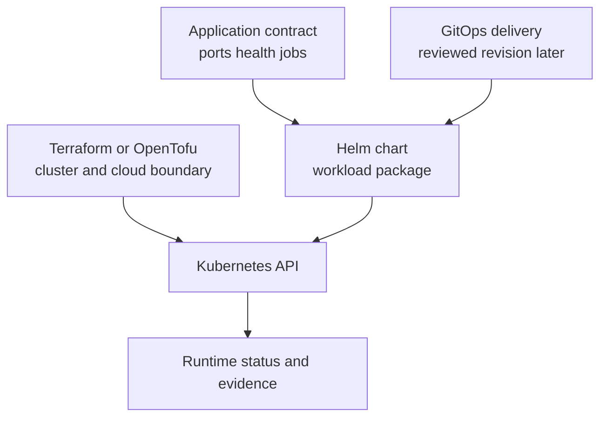

This separation does not mean the layers never refer to each other. Terraform
can return a cluster endpoint or workload-identity identifier. Helm can accept
that identifier as reviewed configuration. The important point is that only
one layer writes each setting. If Terraform and Helm both manage the same
Kubernetes Deployment, their control loops can continuously undo each other.

| Concern | Primary owner | Change rhythm | Evidence |
|---|---|---|---|
| Cluster, network, registry | Terraform/OpenTofu | Infrequent platform change | Plan, policy, approved apply |
| API, dependency, worker package | Helm chart | Application release | Rendered manifests and release record |
| Job and health behaviour | Application code | Application build | Tests, image identity, runtime responses |
| Token value | External secret system or approved operator | Credential lifecycle | Secret reference and access audit |
| Promotion | GitOps controller in Section 10 | Reviewed Git revision | Sync and health status |
| Runtime diagnosis | Kubernetes status plus app evidence | Continuous operation | Conditions, events, endpoints, logs |

Our local package uses three Deployments. `dependencies` exposes the compact
queue and result API on port 8081. `api` exposes HTTP on port 8080 and talks to
the dependency Service. `worker` polls the same dependency Service. Two
Services provide stable discovery: a NodePort Service for the learner-facing
API and a ClusterIP Service for internal dependency traffic.

An agent may inspect these contracts, propose the smallest chart repair, edit
the three allowed files, and run fixed validators. It may not decide that a
warning is acceptable, insert real credentials, approve installation into an
unreviewed cluster, or change delivery authority. `READY_FOR_HUMAN_REVIEW`
means the exact static candidate passed its required checks. It is a review
state, not an installation decision.

Keep the boundary visible in every pull request. A chart change that also
modifies cluster creation, an application protocol, and a delivery workflow is
not automatically wrong, but it needs separate owners, tests, and approval
paths. Small ownership slices let reviewers identify what each piece of
evidence can support.

**Operator takeaway:** place a setting in the layer that owns its lifecycle.
Let agents work inside a bounded package, while humans retain credential,
exception, promotion, and deployment authority.

## Desired State and Kubernetes Control Loops

**Lecture 2 · 7 minutes**

Kubernetes is a set of control loops around API objects. A client submits an
object with desired state in `spec`. The API server validates its shape,
authorizes the request, and stores it. Controllers observe that object and try
to make other objects match. The scheduler selects a node for each pending Pod.
The kubelet asks the container runtime to start containers and reports what it
observes back through `status`.

API acceptance is only the first step. Valid YAML can refer to a missing image,
an unavailable volume, a blocked dependency, a wrong probe path, or a Service
with no ready endpoints. These failures appear after the object is stored.

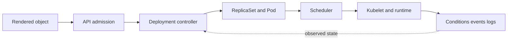

Consider the essential parts of the API Deployment:

```yaml
apiVersion: apps/v1
kind: Deployment
metadata:
  name: inference-platform-api
spec:                              # desired state written by the package
  replicas: 1
  selector:
    matchLabels:
      app.kubernetes.io/component: api
  template:
    metadata:
      labels:
        app.kubernetes.io/component: api
    spec:
      serviceAccountName: inference-platform-api
      containers:
        - name: api
          image: 309-agentic-iac/inference-platform:s9
          readinessProbe:
            httpGet:
              path: /readyz        # observed repeatedly by the kubelet
              port: 8080
```

The Deployment controller does not execute the application. It creates and
scales ReplicaSets. A ReplicaSet keeps the requested number of Pods. The
scheduler binds an unscheduled Pod to a node. The kubelet starts the container
and runs its probes. A Service controller and endpoint controller connect
label-selected ready Pods to Service discovery. Each component has a narrow
job and reports status that another component or operator can read.

Kubernetes metadata helps relate intent to observation. `metadata.generation`
changes when desired fields change. Many controller status objects report
`observedGeneration`. If status is behind generation, the controller has not
yet reported on the current desired state. Conditions add reason, message, and
transition time. They are more useful than treating one phase word as the
whole diagnosis.

| Observation | What it supports | What it does not prove |
|---|---|---|
| API request accepted | Object was authorized and structurally admitted | Container started or application works |
| Deployment `Available=True` | Minimum ready replicas satisfy its condition | Every route and dependency is correct |
| Pod `Running` | At least one container process is running | Pod is ready for Service traffic |
| Pod `Ready=True` | Configured readiness conditions currently pass | Client path outside the cluster works |
| EndpointSlice ready address | Service has an eligible backend address | Network path and request semantics work |
| Event | A component observed a time-bound fact | Current state without checking age |
| Application response | Exact observed request reached the application | Every request or future release works |

Desired state is continuous. A manual live patch changes desired state too,
but it can disagree with Helm's stored release intent. A later Helm upgrade may
restore the chart value. This is why diagnosis compares the rendered or stored
release with the live object. The difference tells us whether the fault begins
in source intent, release configuration, admission mutation, or live drift.

Events are useful but short-lived. Logs may be empty when a kubelet probe
receives HTTP 404 because the application handled the request without logging
it. Status conditions and EndpointSlices may show the effect even when logs do
not. Evidence-led operation combines these views instead of declaring that one
command is the source of all truth.

**Operator takeaway:** read Kubernetes as a chain of reconcilers. Separate
accepted desired state from controller progress, scheduled containers, ready
endpoints, and a successful client request.

## Workload Contracts for the API and Worker

**Lecture 3 · 8 minutes**

A workload contract tells the package what the application needs and tells the
application what the platform will provide. Images and ports are only the
start. A usable contract covers configuration, identity, dependency discovery,
health, resources, shutdown, retry behaviour, and observable results.

The tested course application deliberately separates three roles while using
one small image. `ROLE` selects `dependencies`, `api`, or `worker`. This keeps
the image build compact while preserving production-shaped boundaries.

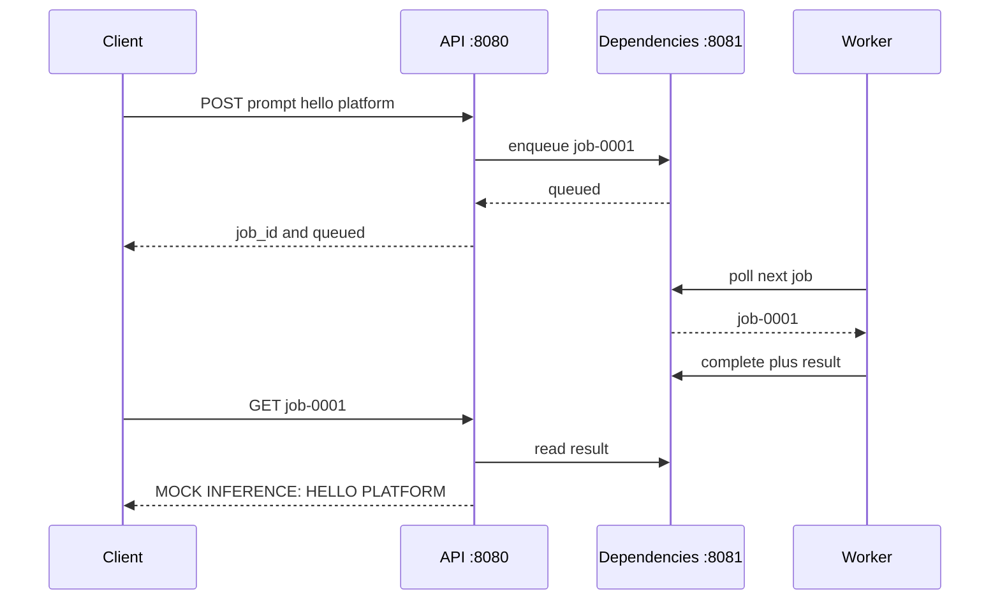

The API is the synchronous client boundary. It validates the request, creates a
job through the dependency service, and returns a job identifier. It does not
perform inference work inside the request. The worker is the asynchronous
processing boundary. It polls, processes, and records a result. The dependency
role is the local stand-in for queue and result storage. The split teaches a
contract that can later map to managed services without requiring a cloud
account in the core path.

```yaml
containers:
  - name: worker
    image: 309-agentic-iac/inference-platform:s9
    env:
      - name: ROLE
        value: worker
      - name: BACKEND_URL
        valueFrom:
          configMapKeyRef:
            name: inference-platform
            key: BACKEND_URL
      - name: BACKEND_TOKEN_FILE
        value: /var/run/secrets/inference/token
    volumeMounts:
      - name: backend-token
        mountPath: /var/run/secrets/inference
        readOnly: true
```

The Service URL is configuration because it identifies an environment-local
endpoint. The token is not ordinary configuration. The chart references a
pre-existing Secret and mounts a file read-only. The application reads the file
at runtime. Neither the default values nor the rendered manifest contains the
credential value.

| Contract area | API role | Worker role | Dependency role |
|---|---|---|---|
| Client port | 8080 | None | Internal 8081 |
| Dependency | Queue/result Service | Queue/result Service | Local state |
| Readiness | Own health plus dependency | Own health plus dependency | Own health |
| Job action | Submit and read | Poll and complete | Store transition |
| Identity | Separate ServiceAccount | Separate ServiceAccount | Separate ServiceAccount |
| Token | Read-only mounted file | Read-only mounted file | Read-only mounted file |
| Failure policy | Return bounded status | Retry without duplicate completion | Preserve deterministic state |

Failure behaviour belongs in the contract. If the dependency starts after the
worker, bounded connection-refused messages are expected. The worker should
retry and remain unready until its dependency works. It must not crash forever,
claim readiness, or complete the same job twice. During shutdown it should stop
taking new work, finish or safely return the current job, and exit before the
grace period ends.

The API needs separate health and readiness meanings. `/healthz` answers
whether the process is alive enough to keep running. `/readyz` answers whether
the process can serve its role now. A healthy process can be unready because a
dependency is unavailable. Treating these endpoints as the same signal either
sends traffic too early or restarts a process for a dependency problem.

Configuration ownership must be explicit. `BACKEND_URL` comes from one
ConfigMap key and becomes a versioned release input. A token reference comes
from the chart, while the token value comes from an external system. Ports and
paths are shared contracts across application code, templates, probes,
Services, policies, and tests. A generated change to one side needs checks
against all consumers.

Storage semantics matter even in a compact mock. A real queue can deliver more
than once. A worker should use an idempotency key such as `job-0001`, make state
transitions explicit, and record completion before acknowledging work where
the queue supports it. A real result store needs retention, access control, and
failure recovery. The local dependency role proves the delivery shape, not
those managed-service guarantees.

**Operator takeaway:** define the workload as a contract across code and
platform. Ports, health, dependency semantics, identity, resources, and
shutdown are part of the application interface, not chart decoration.

## Helm Chart Structure and Values Contracts

**Lecture 4 · 8 minutes**

Helm packages related Kubernetes objects into a versioned chart. A chart is
valuable when several installations need the same resource design with a
small, reviewed set of inputs. It becomes dangerous when every YAML field is
turned into an untyped value and reviewers can no longer see the supported
contract.

A maintainable chart has clear roles:

| Artifact | Purpose | Review question |
|---|---|---|
| `Chart.yaml` | Chart identity, chart version, application version | Which package and app release is this? |
| `values.yaml` | Safe defaults and documented inputs | Are defaults usable and non-secret? |
| `values.schema.json` | Type, range, enum, and required-field contract | Will invalid inputs fail before render? |
| `templates/` | Kubernetes resource design | Do all rendered branches remain safe? |
| `_helpers.tpl` | Reused names and labels | Are selectors stable and consistent? |
| `templates/tests/` | Optional release smoke tests | What narrow live claim does each test support? |

The course chart groups role-specific images, resources, probes, and service
settings. The repaired defaults keep the external Secret name but remove the
token value:

```yaml
backend:
  url: http://inference-platform-dependencies:8081
  existingSecret: inference-platform-backend-token

resources:
  worker:
    requests: {cpu: 10m, memory: 32Mi}
    limits: {cpu: 100m, memory: 64Mi}

service:
  api:
    type: NodePort
    port: 8080
    nodePort: 30080
```

`values.schema.json` should require supported structure before templates use
it. Types catch a string where an integer is expected. Minimum and maximum
constraints bound ports, replicas, timeouts, and resource settings where JSON
Schema can represent the rule. Enums constrain known modes. Required fields
prevent a template from silently selecting an unsafe empty value.

Schema is not the whole policy. JSON Schema can require a non-empty Secret
name, but it cannot prove that the Secret exists in the target namespace or
that an approved secret system created it. It can require worker limits but
cannot decide whether 64Mi is enough under production load. Template and
policy tests still need to reject inline token material and missing hardening.

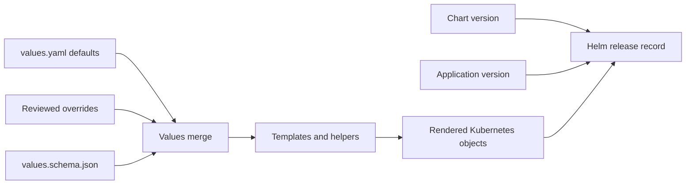

Helm merges values from defaults, values files, and command-line overrides.
Later inputs usually win. This precedence is useful but can hide intent if a
pipeline passes many `--set` flags. Keep durable environment configuration in
reviewed files or a delivery system. Reserve command-line values for narrow,
visible cases such as the core lab's explicit `networkPolicy.enabled=false`.

Chart version and application version answer different questions. A chart
version changes when templates, defaults, or packaging change. An application
version identifies the software being packaged. The same image can be
repackaged with a probe repair, and a new image can use an unchanged chart
structure. Record both, plus an immutable image digest for a production
release.

Helm also keeps release history and the values used for each revision. That
history supports comparison and rollback, but rollback is not guaranteed safe.
A new application may write incompatible data. A Secret or external dependency
may have changed outside Helm. Hooks may have side effects. Define application
and data rollback before treating `helm rollback` as a complete recovery plan.

Template helpers should reduce repeated naming and labels, not hide important
security choices in complex functions. Reviewers need to connect a value to
the objects and fields it changes. If a generated template uses nested loops,
dynamic dictionaries, and broad `tpl` evaluation for simple Deployments, the
review cost may exceed the reuse benefit.

**Operator takeaway:** make values a small product interface with safe
defaults and a schema. Version chart and application separately, and preserve
the rendered result that reviewers actually approve.

## Helm Templates versus Kustomize Overlays

**Lecture 5 · 8 minutes**

Helm and Kustomize solve related but different problems. Helm creates a package
from templates and values. Kustomize starts with complete Kubernetes resources
and applies declared overlays. Neither tool is automatically more production
ready. Choose the model that makes ownership and review easiest for the change.

| Decision | Helm is usually stronger | Kustomize is usually stronger |
|---|---|---|
| Reusable product package | One chart supports many installations | Bases can work, but product metadata is limited |
| Input contract | Values plus JSON Schema | Patch structure; no direct values schema |
| Release history | Helm release revisions | Supplied by GitOps or another delivery layer |
| Small environment differences | Values can express supported choices | Focused overlays show exact field patches |
| Arbitrary resource edits | Templates can become hard to follow | Patches keep base objects visible |
| Third-party application | Established chart ecosystem | Useful for adapting vendor YAML without forking |
| Review risk | Too many switches and template branches | Fragile patches against changing bases |

For our API, dependency, and worker package, Helm is a good fit. The three
roles form one versioned application product. Installations need a bounded set
of inputs: image identity, replicas, resource budgets, probe timing, Service
settings, an external Secret name, and optional NetworkPolicy. The schema can
reject unsupported value shapes before rendering.

A Kustomize overlay can be clearer for an environment-owned change to complete
resources:

```yaml
# overlays/dev/api-replicas.yaml
apiVersion: apps/v1
kind: Deployment
metadata:
  name: inference-platform-api
spec:
  replicas: 1
```

The patch shows one difference without introducing a template branch. However,
the overlay depends on matching the intended object and field. A base rename or
structural change can break the patch or make it apply differently. The final
render still needs schema and policy checks.

Avoid stacking tools without a reason. Rendering a large Helm chart and then
applying several Kustomize patches can be valid when separate teams own package
and environment policy. It also creates two transformation stages and a larger
debugging surface. Reviewers must preserve the chart inputs, intermediate
render, patches, and final render.

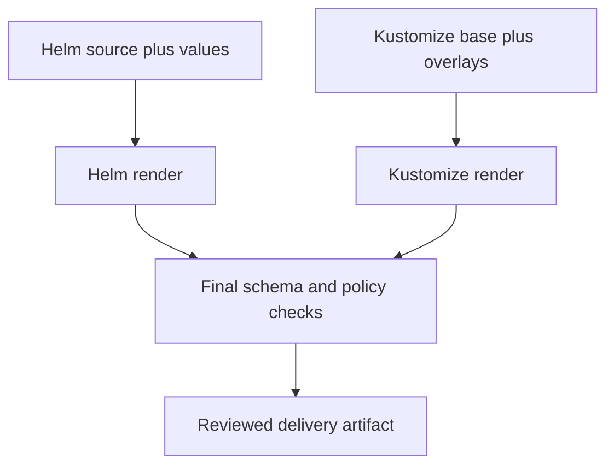

The honest boundary is ownership. A platform team may publish a chart as a
supported product. An application team supplies a few values. An environment
team may use GitOps and Kustomize to add namespace-specific labels or policy.
If the environment overlay changes an application-owned probe or port, that is
an ownership conflict even if the patch applies cleanly.

Do not choose Helm only because a package has variables. Plain YAML with a
small Kustomize overlay may be easier to review for one internal workload. Do
not choose Kustomize only to avoid template syntax if many consumers need a
stable input contract and release metadata. Count supported installations,
types of variation, ownership layers, and the evidence needed to reproduce the
final objects.

An agent can help compare the final renders from both approaches. It should
not migrate a delivery model as an incidental repair. A Helm-to-Kustomize
change affects release history, rollback, values ownership, automation, and
operator practice. Treat it as a design decision with its own plan.

**Operator takeaway:** use Helm for a reusable package with a bounded values
contract. Use Kustomize for visible patches over complete resources. Always
review and test the final rendered objects.

## Render-First Validation and Chart Tests

**Lecture 6 · 8 minutes**

Generated templates are source code. Kubernetes never runs the template; it
runs the objects produced after values merge and template execution. Review
must therefore begin with source and end with the exact render intended for
delivery.

The Section 9 starter demonstrates why. Helm lint and template rendering can
both exit zero while the chart contains committed token material and omits
worker limits. The YAML is structurally valid. The unsafe design is still
visible in the rendered objects.

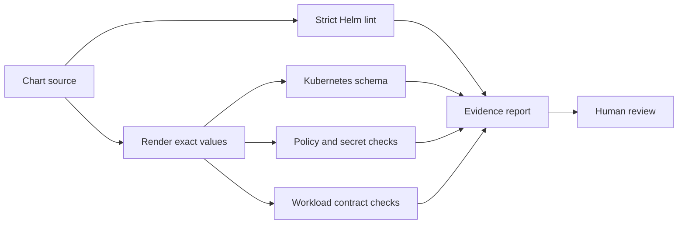

The trusted evaluator used 13 gates: application tests, strict Helm lint,
render, schema, kubeconform, secret scan, exact limits, Conftest, workload
contract, security context, probes, role boundaries, and allowed source scope.
The repaired candidate rendered nine objects in 10,617 bytes. Its source and
render received separate SHA-256 identities. All gates passed with no primary
finding, producing `READY_FOR_HUMAN_REVIEW`.

| Gate | Main observation | Proof limit |
|---|---|---|
| Application tests | Role and job behaviour under test | Not a cluster or network observation |
| Helm lint | Chart structure and template use | Not security or runtime proof |
| Render | Exact generated objects for chosen inputs | Not API acceptance or controller success |
| Values schema | Input types and required fields | Not target-cluster facts |
| kubeconform | Kubernetes schema compatibility | Not admission policy or health |
| Secret scan | Forbidden token-shaped material absent | Not Secret availability or rotation |
| Resource gate | Exact requests and limits exist | Not production sizing proof |
| Conftest | Render meets written policy rules | Policy may still have missing coverage |
| Security context | Required hardening fields rendered | Runtime implementation still matters |
| Probe gate | Paths, ports, and timing match contract | Endpoint may fail in a live Pod |
| Role boundary | Separate identities and role settings | Not external identity authorization |
| Source scope | Only allowed files changed | Not business approval |

Schema validation should use the Kubernetes versions you support. Custom
resources need matching CRD schemas or an explicit skip record. Silently
skipping an unknown kind creates a false green. Server-side dry-run can add
admission and defaulting evidence when a trusted representative cluster is
available, but it is not the same as installing and observing a release.

Golden tests compare rendered output with a reviewed file. They catch
unexpected drift and are useful for stable, important resources. They can also
create noisy updates for harmless ordering or metadata changes. A reviewer may
approve a large golden-file replacement without seeing the one security field
that changed. Combine focused semantic assertions with a readable render diff.

```diff
-          resources:
-            requests: {cpu: 10m, memory: 32Mi}
+          resources:
+            requests: {cpu: 10m, memory: 32Mi}
+            limits: {cpu: 100m, memory: 64Mi}
```

Chart tests run after installation, often as short-lived Pods. They can verify
a Service response or dependency connection. They are runtime evidence, but
only for the assertions they execute. A hook that returns HTTP 200 does not
prove safe shutdown, NetworkPolicy denial, resource sizing, or sustained queue
processing. Keep live tests small and attach their exact release and image
identity.

An agent may run this validation chain and explain each finding. It should not
edit the evaluator or policy unless that work is explicitly owned. If source
and evaluator change together, present separate diffs and prove the evaluator
still rejects a known-bad fixture.

**Operator takeaway:** lint early, then inspect and test the exact rendered
objects. Keep static review evidence separate from API, controller, and client
runtime evidence.

## Service Accounts, RBAC, and Secrets

**Lecture 7 · 7 minutes**

Every Pod receives an identity boundary, even when the application never calls
the Kubernetes API. Using the namespace default ServiceAccount for all roles
makes later permission changes hard to review. Separate ServiceAccounts express
which role would receive an identity binding and prevent one broad binding from
quietly covering every workload.

The course package creates ServiceAccounts for dependencies, API, and worker.
It sets `automountServiceAccountToken: false` because none of the three roles
needs Kubernetes API credentials.

```yaml
apiVersion: v1
kind: ServiceAccount
metadata:
  name: inference-platform-worker
automountServiceAccountToken: false
---
spec:
  template:
    spec:
      serviceAccountName: inference-platform-worker
      automountServiceAccountToken: false
```

This is least privilege through absence. There is no reason to create Role or
RoleBinding objects when the workload makes no API request. If a later feature
needs to read one ConfigMap, add a namespaced Role for that resource name and
verb, bind only the role that needs it, and test both allowed and denied calls.
Do not begin with `cluster-admin` and promise to narrow it later.

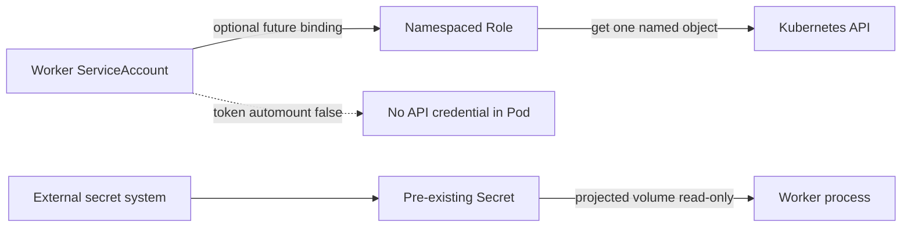

RBAC controls Kubernetes API authorization. It does not control traffic to the
dependency Service, access to a mounted file after the kubelet projects it, or
cloud API permission obtained through workload identity. These need network,
filesystem, application, and cloud identity controls.

Secret values do not belong in `values.yaml`, chart defaults, template source,
rendered evidence, command history, or agent prompts. The repaired chart takes
an external Secret name. The lab creates a disposable value through redacted
standard input after the namespace exists. The chart mounts only the named key:

```yaml
volumes:
  - name: backend-token
    projected:
      defaultMode: 0440
      sources:
        - secret:
            name: inference-platform-backend-token
            items:
              - key: token
                path: token
```

A projected volume avoids placing the token in an environment variable, where
it is easier to expose through process inspection and diagnostics. It also
allows kubelet-managed refresh for many Secret updates, though the application
must reread the file or reopen it to observe a new value. Rotation behaviour
needs a direct test. Mounting a Secret does not prove the application used the
new credential.

Production platforms usually connect a secret manager through a CSI driver,
external-secrets controller, or another approved integration. That adds a
controller identity, provider permissions, sync status, failure behaviour, and
rotation path. The core lab avoids claiming those mechanisms. It proves only
that Helm does not create token material and that the exact pre-existing
Secret key is mounted read-only.

Cloud workload identity is another later boundary. A Kubernetes ServiceAccount
may map to a cloud role without a long-lived cloud key. This improves key
handling but does not make the role least privileged. Review the trust policy,
subject match, audience, token lifetime, cloud permissions, and denied cases.

Agents should receive redacted object shapes and Secret references, not live
credential values. A task that needs a new secret must stop at the interface
and ask the credential owner or approved automation to create it. Repository
trust is not credential approval.

**Operator takeaway:** give each role a separate identity, mount no Kubernetes
API token when none is needed, and keep secret values outside Helm and Git.
Prove external integrations separately.

## Probes, Resources, and Graceful Shutdown

**Lecture 8 · 8 minutes**

Probes answer different questions. A startup probe asks whether a slow process
has completed initialization. A readiness probe asks whether the Pod should
receive new Service traffic now. A liveness probe asks whether restarting the container is a
reasonable recovery action. Reusing one shallow endpoint for all three hides
these decisions.

| Probe | Failure effect | Good question | Common mistake |
|---|---|---|---|
| Startup | Holds other probes until success; may restart after threshold | Has initialization completed? | Using it to hide permanent dependency failure |
| Readiness | Removes Pod from ready Service endpoints | Can this role serve new work now? | Checking only that the process exists |
| Liveness | Restarts the container after threshold | Is the process stuck beyond self-recovery? | Restarting on a shared dependency outage |

The dependency role can report ready when its local queue API works. The API
and worker use dependency-aware readiness because they cannot perform their
roles without that Service. Their liveness endpoint should remain focused on
the process. During the real run, the worker briefly logged connection refused
while dependencies started, then became ready and completed the exact job.
That sequence is expected recovery, not a reason for a liveness restart loop.

```yaml
readinessProbe:
  httpGet: {path: /readyz, port: 8080}
  initialDelaySeconds: 1
  periodSeconds: 3
  timeoutSeconds: 1
  failureThreshold: 3
livenessProbe:
  httpGet: {path: /healthz, port: 8080}
  initialDelaySeconds: 2
  periodSeconds: 5
  timeoutSeconds: 1
  failureThreshold: 3
```

Probe timing creates a detection window. With a three-second readiness period
and failure threshold of three, removal normally needs several observations;
network and scheduler timing add variation. Use startup measurements and
failure objectives to set values. Copying probe numbers from another service
without its startup and recovery profile is not engineering.

Resource requests guide scheduling. A scheduler reserves node capacity based
on requests. Limits create an upper control enforced differently for CPU and
memory: CPU is throttled, while memory pressure can end in an OOM kill. The
course roles each request 10m CPU and 32Mi memory and limit at 100m CPU and
64Mi memory. These exact values are suitable for the deterministic mock. They
are not sizing advice for a real model server.

Quality of service depends on requests and limits across all containers. A
sidecar without resources changes the Pod class. A low memory limit can turn a
healthy process into repeated restarts. A high request can make a small cluster
unschedulable. Use metrics from representative traffic, then test saturation,
queue growth, throttling, OOM behaviour, and recovery.

Graceful shutdown is essential for a worker. Kubernetes first marks a Pod for
termination and removes it from normal endpoints. The kubelet can run a
`preStop` hook, sends the termination signal, waits up to
`terminationGracePeriodSeconds`, and then forces exit. Application logic should
stop polling for new jobs, finish or safely return current work, flush the
result, and exit.

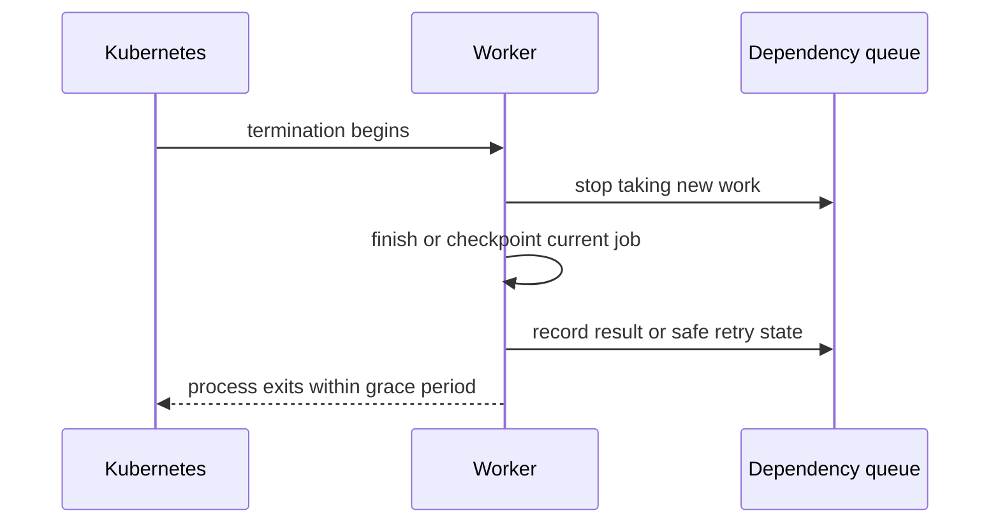

`terminationGracePeriodSeconds` must cover the chosen shutdown contract. If a
job can run longer, use checkpointing, visibility timeouts, leases, or another
safe handoff. Extending the grace period without making work idempotent only
delays force termination. Test a real rollout while jobs are active.

**Operator takeaway:** design probes around recovery decisions, size resources
from observations, and make worker termination part of the queue contract.

## Network Policy and Namespace Boundaries

**Lecture 9 · 7 minutes**

NetworkPolicy begins with required flows, not with a long generated YAML file.
For this project the client reaches the API, the API and worker reach the
dependency Service, and Pods need DNS. The dependency role does not need to
initiate traffic to the API. A default-deny design can allow only these paths
when the cluster network implementation enforces NetworkPolicy.

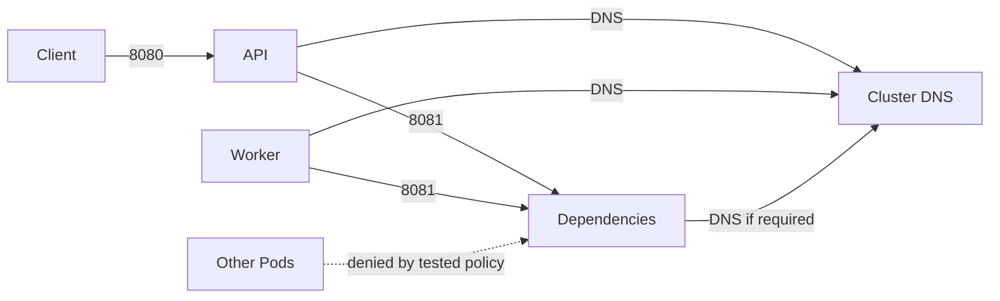

Namespace labels and Pod labels select policy subjects. Ingress rules select
who may reach a Pod. Egress rules select where a Pod may connect. Once a Pod is
selected for a direction, traffic not allowed for that direction is denied by
an enforcing implementation. Policies are additive; one broad allow can undo
the intended restriction even if another policy looks strict.

```yaml
apiVersion: networking.k8s.io/v1
kind: NetworkPolicy
metadata:
  name: dependencies-from-api-and-worker
spec:
  podSelector:
    matchLabels:
      app.kubernetes.io/component: dependencies
  policyTypes: [Ingress]
  ingress:
    - from:
        - podSelector:
            matchExpressions:
              - {key: app.kubernetes.io/component, operator: In, values: [api, worker]}
      ports:
        - {protocol: TCP, port: 8081}
```

This fragment expresses one required ingress flow. It is not a complete
default-deny set. Egress policy must account for DNS, including the actual DNS
namespace and labels used by the cluster. Some applications also need time,
telemetry, identity, or external APIs. Add each destination from an observed
contract, not from an unrestricted `0.0.0.0/0` escape hatch.

NetworkPolicy does not name Services as destinations in the portable API. Pod
and namespace selectors normally match endpoints, while `ipBlock` has routing
and translation details that vary by environment. CNI implementations differ
in support, logging, named ports, and pre/post-NAT behaviour. Test on the actual
supported cluster network.

The low-resource Kind lifecycle ran with NetworkPolicy disabled. Therefore it
makes **no enforcement claim**. Default Kind connectivity proves only that the
required paths worked without enforcement. The chart can render policies and
static checks can inspect them, but a real policy claim needs an enforcing CNI
and direct positive and negative traffic tests.

| Required proof | Positive test | Negative test | Additional evidence |
|---|---|---|---|
| API can reach dependency | Request to port 8081 succeeds | Unrelated port fails | Selected policy and endpoint labels |
| Worker can reach dependency | Poll succeeds | Unselected Pod fails | Worker identity and CNI decision log |
| DNS remains available | Service name resolves | Unapproved egress fails | DNS namespace/Pod selectors |
| Namespace isolation | Approved namespace succeeds | Other namespace fails | Namespace labels and policy inventory |

A timeout alone is weak denial evidence. The destination may be absent, DNS
may be wrong, or the test Pod may not match the intended labels. First prove
the destination works from an allowed source. Then run the denied source
against the same ready destination and capture CNI or policy evidence where
available.

Namespace is an administrative boundary, not a universal security boundary.
RBAC, secrets, quotas, Pod security, admission, network enforcement, node
isolation, and cloud identity all contribute. Do not describe “separate
namespace” as complete tenant isolation.

**Operator takeaway:** draw required flows first, account for DNS, and test
allow plus deny on the target CNI. Rendered policy without enforcement evidence
is only intended configuration.

## Run the Workload on a Small Kind Cluster

**Lecture 10 · 7 minutes**

The local lifecycle exists to observe the exact package after static review.
It does not imitate a complete cloud platform. Kind gives us a real Kubernetes
API, scheduler, controllers, kubelet, container runtime, Services, probes,
events, and Helm release on one bounded local node.

The frozen lifecycle uses cluster `agentic-iac-s9`, context
`kind-agentic-iac-s9`, namespace `inference`, release `inference-platform`, and
node `agentic-iac-s9-control-plane`. It builds the local arm64 image
`309-agentic-iac/inference-platform:s9`, which measured 3,241,788 bytes, and
loads it into the node. The API host path maps `127.0.0.1:18080` to NodePort
30080.

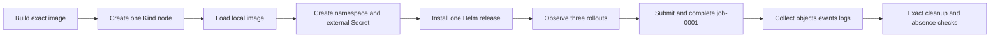

The runtime order matters. Reject the starter before creating a cluster. Build
and load the image before installation so the Pods do not depend on a remote
registry. Create the external Secret without recording its value. Install one
release and wait for all three Deployments. Then test health, readiness, job
flow, and diagnostic views.

| Measurement | Cold run | Warm run 1 | Warm run 2 |
|---|---:|---:|---:|
| Image build | 2.501 s | 2.629 s | 1.452 s |
| Kind create | 27.920 s | 27.414 s | 28.131 s |
| Helm install and wait | 7.815 s | 4.279 s | 7.771 s |
| API and evidence verification | 0.495 s | 0.530 s | 0.535 s |
| Cleanup | 8.194 s | 8.097 s | 7.905 s |
| Total | 49.630 s | 45.698 s | 48.547 s |
| Peak named-node memory | 656.2 MiB | 671.1 MiB | 643.1 MiB |

Docker was configured with 5 CPUs and 7.744 GiB memory. That is capacity made
available to Docker, not measured working-set usage. The sampler observed only
the named Kind node container from before its appearance through post-delete
absence. It did not measure the macOS host or the Docker Desktop Linux VM. Keep
this boundary when comparing machines.

All three runs produced three `1/1 Running` Pods with zero restarts, three
available Deployments, two Services, and ready endpoints. Health and readiness
returned HTTP 200. Every run directly observed `job-0001` queued and then
complete with `MOCK INFERENCE: HELLO PLATFORM`. The intermediate running state
completed between 50 ms polls, so it was not directly observed. Evidence must
say exactly that.

The lifecycle also observed brief worker connection errors during dependency
startup. Final readiness and job completion showed recovery. Deleting that log
line would hide useful startup behaviour; treating it as a persistent incident
would ignore current status. Time and final state give log lines their meaning.

Cleanup is part of the experiment. The release is uninstalled, the namespace
is deleted, the exact cluster is deleted, and the named node container and
context are checked absent. Unrelated clusters are neither a failure nor a
cleanup target. A broad delete would violate the task even if the Section 9
cluster disappeared.

Learners below the tested 7 GB reference profile receive a warning rather than
an automatic rejection. Continue unless Docker or a required tool reports a
real failure. Do not run several course profiles at once while measuring this
one.

**Operator takeaway:** use Kind to observe real control loops and request flow
inside a small boundary. Report the exact machine, measured component, runtime
result, and cleanup instead of generalizing to cloud production.

## Diagnose Generated Kubernetes Failures

**Lecture 11 · 7 minutes**

Kubernetes failures often share the same top-level symptom: the release is not
usable. Diagnosis becomes faster when we move through evidence layers in a
fixed order instead of asking an agent to guess from one log line.

Start with intended output. Inspect chart source, merged values, and the exact
render. Then inspect API and controller status: generations, conditions,
rollout progress, and events. Inspect Pod state and probe results. Inspect
EndpointSlices to learn which addresses are eligible for Service traffic.
Inspect the live Deployment, ConfigMap, Secret reference, and Service. Read
role-specific logs. Finally, execute the smallest client request that crosses
the suspected path.

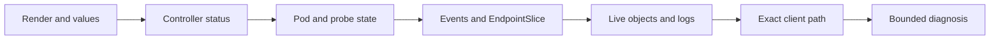

| Evidence pattern | What it narrows | Next comparison |
|---|---|---|
| New Pod running but `0/1`, event shows probe HTTP 404 | Container runs; readiness path is failing | Live probe path versus Helm render and app route |
| Worker `0/1`, readiness HTTP 503, DNS error in new Pod log | Worker cannot use its configured dependency | Live environment versus ConfigMap and ready dependency endpoint |
| Pod and EndpointSlice ready, host request fails | Failure is outside Pod readiness | Helm values, rendered Service, live Service, Kind port mapping |
| Render contains unsafe field | Source or values produce unsafe intent | Template branch, values precedence, policy result |
| Render is correct but live object differs | Runtime drift or admission mutation | Managed fields, release history, controller owner |
| Events show image or mount failure | Pod cannot reach a running application state | Image identity, pull policy, Secret/volume status |

The sequence prevents category errors. A readiness HTTP 404 is not fixed by
adding RBAC. A ready dependency EndpointSlice does not help a worker configured
with another DNS name. Healthy Pods do not prove that a host port still maps to
the Service's NodePort. Each repair should change the smallest boundary that
the evidence identifies.

Compare old and new Pods during a rolling update. A Deployment can remain
available because the old Pod is ready while the new Pod is `0/1`. Looking at
only the first Pod or only `Available=True` hides the failed candidate. Use
labels and Pod identities to keep evidence attached to the correct revision.

EndpointSlices add important detail. An address can be present with
`ready=false`, and a terminating address can remain briefly. Service discovery
is not just a list of IPs. Check conditions and connect each endpoint to the
Pod revision you are diagnosing.

Logs need role and time boundaries. Use the API logs for request handling, the
worker logs for polling and dependency errors, and dependency logs for queue
state. Empty application logs are a valid observation when a kubelet probe
fails without application logging. Do not invent a log message to complete a
story.

Render-versus-live comparison also establishes ownership. If Helm intent and
live state differ after a manual patch, the smallest recovery may restore the
live field or reconcile the release. If stored Helm values and the live Service
agree on a wrong value, the fault belongs to release intent, not drift. Preserve
both facts before changing either one.

For each incident, write five parts:

1. the user-visible symptom;
2. the earliest layer that is healthy;
3. the first layer with direct failing evidence;
4. the source, release, or live field that explains the difference;
5. the smallest repair and a recovery request that proves the path again.

The independent challenge runs three incidents sequentially. Complete recovery
and obtain HTTP 200 or a ready worker before injecting the next incident. This
keeps each evidence trail independent and prevents one failure from masking
another.

An agent can collect these bounded facts and propose a diagnosis. The operator
checks evidence age, object identity, command scope, and proof limits. A repair
is not complete because the agent says it is; rerun the failing observation and
the end-to-end path.

:::tip[Section 9 decision model]

- Generated Kubernetes and Helm artifacts begin as an untrusted candidate.
- Render evidence proves facts about generated objects, not running behaviour.
- Runtime evidence belongs to one release, cluster, time, and observed path.
- Identity, secrets, health, resources, shutdown, and networking are workload contracts.
- Agents may inspect, propose, edit within scope, and verify. Humans approve credentials, exceptions, promotion, and deployment.

:::

**Operator takeaway:** diagnose from render to runtime in a fixed order. Attach
every conclusion to the exact object, revision, event, endpoint, log, and client
request that supports it.
